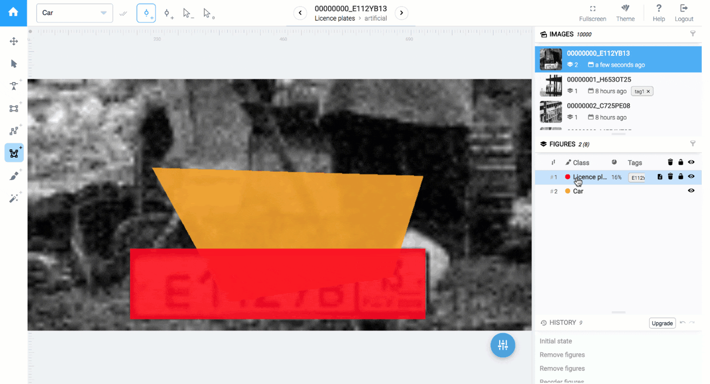
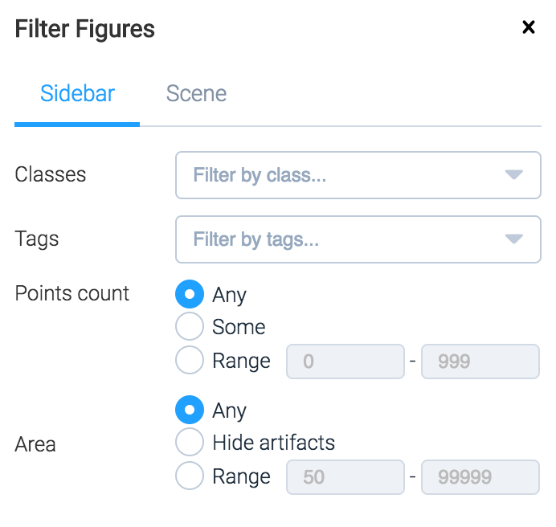

Also known as *objects*, figures are annotations that you create to show particular things on image.

Figures panel shows all annotations for a currently selected [image](images.md).

## Overview

1. Total number of figures on current image
2. [Filter of figures](#filters)
3. Batch [actions](#actions)
4. Example of a [hole inside the figure](#holes)
5. [Order of the figure](#order) on the image
6. Class of the figure
7. Percentage of total image area
8. Figure actions

## Actions

 — Delete figure

 — Hide figure from scene

## Selection

Click on a figure row in the figures panel to select the annotation for editing.


Hover mouse cursor over a row in the figures panel to highlight it on the main scene.


## Order

In some cases annotations can overlap each other.

For example, in road scene segmentation, you may want to annotate road first and then annotate cars and pedestrians. If you plan to use [DTL](../../data-manipulation/dtl/index.md) to generate segmentation masks, it's important to maintain the order of figures and keep cars above the road.

Figure order controls which annotations are on top of others. Figures that comes first in [figures panel](#overview) (have smaller order number) would be shown on top on scene (like layers in Photoshop)

You can use drag and drop in [figures panel](#overview) to change that order.


Figures preserve order during [export](../../data-organization/import-export.md).


## Holes

It is possible to create holes inside polygons. It can be useful to exclude unnecessary parts from main figure, for example, exclude windows from a car. Some popular open datasets use this approach.

Every hole is just yet another polygon that is internally connected to the main polygon. In the [figures panel](#overview) holes are shown below the main polygon and will be shown / hidden by pressing on the little triangle on the left.

You can create multiple holes inside the same figure.

To read more on how to create holes please refer to the documentation on [polygons](instruments.md#polygon-tool).

## Filters

If there are a lot of annotations on image, you can use filter popup to leave only figures that pass certain conditions.

Open filter popup by clicking Filter icon (see [overview](#overview) above).


You can hide unwanted small annotations that have less than 10 pixels.


## Tags

Figures tags visibility depends on seleted tool:

* Move scene tool - visibility depends on "Tags show mode" in [scene controls](scene.md#controls).

* Tag figures tool - tags always visible.

Figure tags works the same way, as [image tags](images.md#tags). Please refer corresponding documentation.


There are different lists of tags for images and figures.



To add tag on the figure you can select or hover on it from scene or figures sidebar and press tag hotkey



Say, you want to build a person detection application and you also want to predict gender. Create tag `Man` and `Women` and assign them hotkeys `M` and `W`. Now you can quickly label figures by pressing corresponding button on a keyboard.

