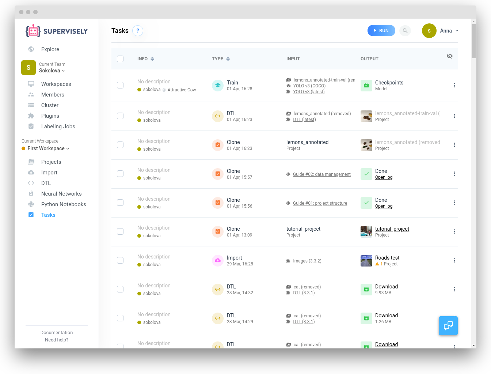
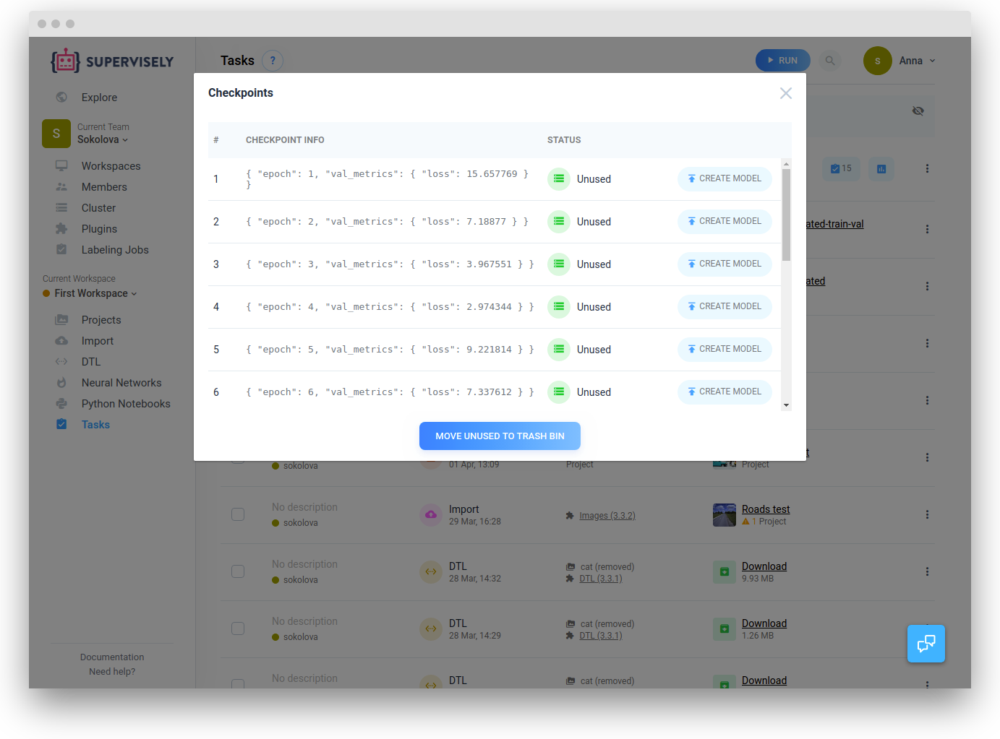
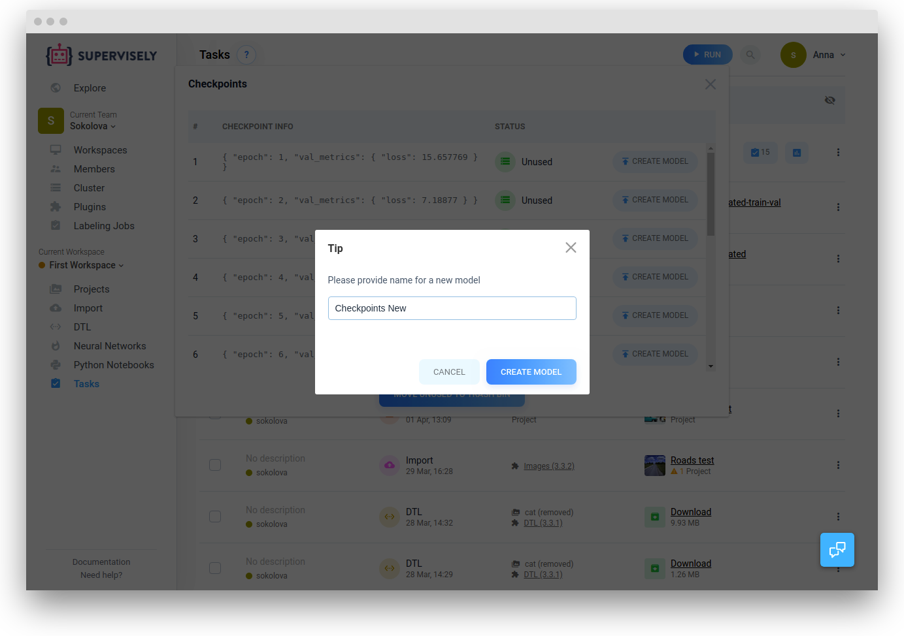
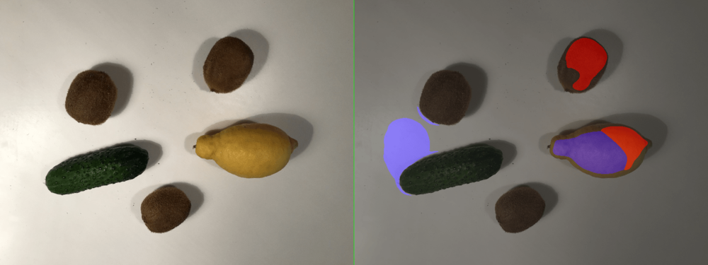
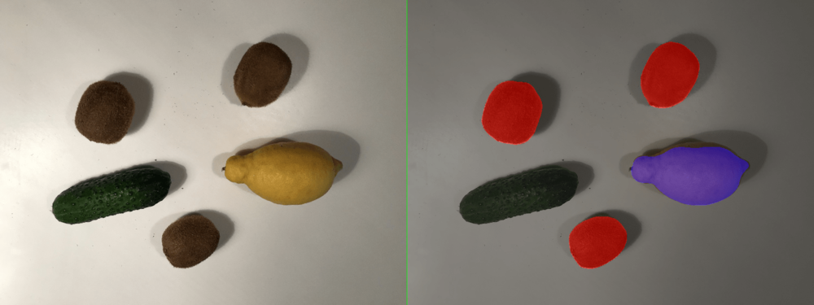
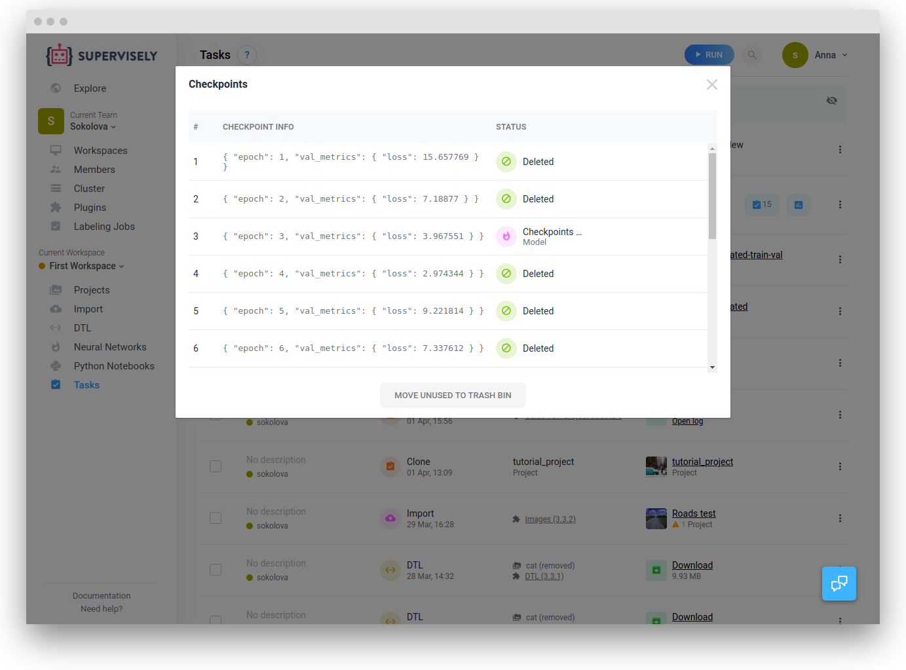

## Overview

During training several snapshots of a model are saved and can be retrieved after the training process is finished. This can be useful to understand training dynamics and select the best available model for further use.

## Example

Suppose that we have run the training process and a corresponding task was created and finished. 

In the context menu assotiated with the task there is a "Checkpoints" item that gives you access to all the checkpoints that were created during the training process.

After clicking on the "Checkpoints" item the checkpoint list will be available. Select the checkpoint you want to use, and specify the corresponding title. After that click "Create" button

Now the model with the specified name is available on the "Neuran networks" page. 

You can treat this model exactly the same way as all other available models


After the training process is finished, a model that corresponds to the latest checkpoint is automatically added to the "Neural Networks" page 


For example, in a case of UNet training, checkpoints #3, #7, #10 are added to "My models" and the segmentation results are visualised

Here is segmentation results of a model from checkpoints #3

Here is segmentation results of a model from checkpoints #7

Here is segmentation results of a model from checkpoints #10

You can see that as training progresses the results are getting better

# Unused checkpoint cleanup

In a lot of cases models might occupy a significant amount of disk space, so it's important to remove the checkpoints that will not be useful in a future.

Checkpoints are associated with a particular training task. In order to remove unused checkpoints, you need to select "Move Unused to Trash Bin" in the context menu of the relevant task.

