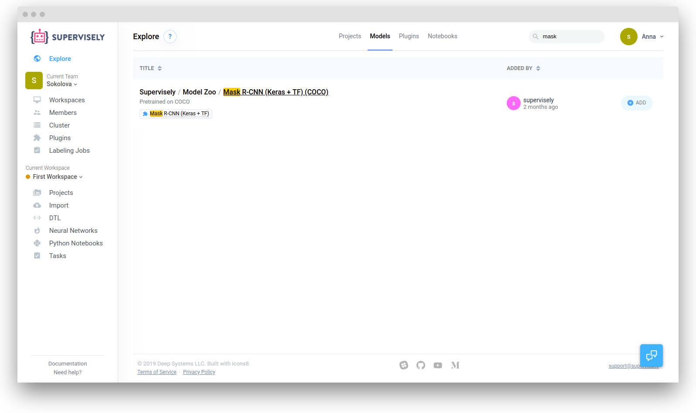
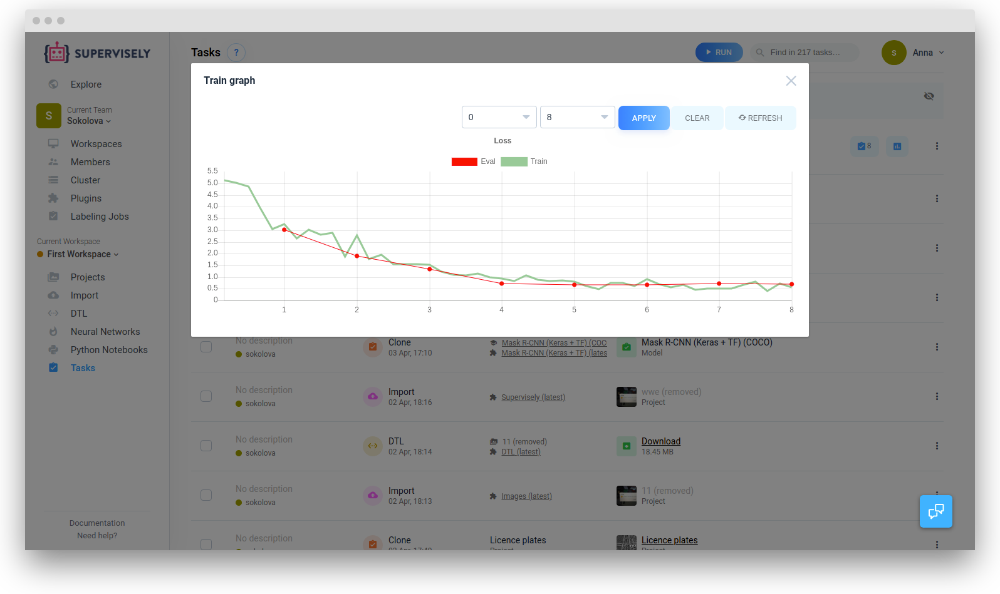
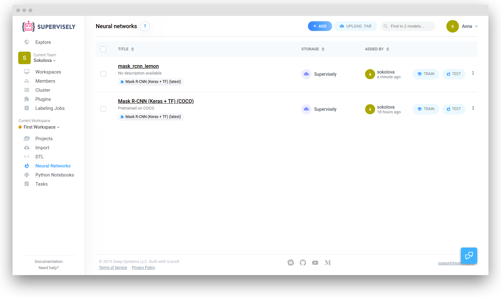
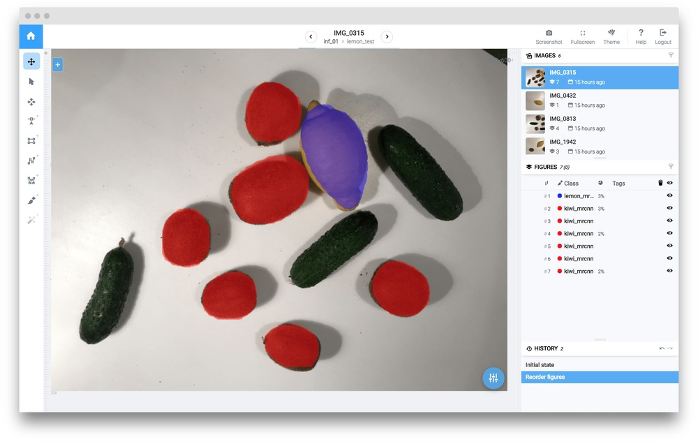

## Multi-class instance segmentation using Mask R-CNN

In this example, we will consider a more complex segmentation task, namely instance segmentation. To solve this problem we will train [Mask R-CNN](https://arxiv.org/abs/1703.06870) - state-of-the-art instance segmentation model. 

## Data preparation
To train Mask R-CNN we will use our tiny dataset containing only 6 images. In each image there are several annotated fruits belonging to different classes.   

This dataset has a few interesting properties:

1. It is small (only 6 annotated images)

2. The classes are imbalanced

3. Background objects have similarities with target classes


Using only 6 images for training is a direct road to overfitting. To train such a deep NN we have to prepare training dataset: perform various data augmentations. Supervisely has Data Transformation Language [(DTL)](../../data-manipulation/dtl/index.md) specially designed for that purpose. Full DTL config:

```json
[
  {
    "dst": "$sample",
    "src": [
      "lemon/*"
    ],
    "action": "data",
    "settings": {
      "classes_mapping": "default"
    }
  },
  {
    "dst": "$fv",
    "src": [
      "$sample"
    ],
    "action": "flip",
    "settings": {
      "axis": "vertical"
    }
  },
  {
    "dst": "$fh",
    "src": [
      "$fv",
      "$sample"
    ],
    "action": "flip",
    "settings": {
      "axis": "horizontal"
    }
  },
  {
    "dst": "$data",
    "src": [
      "$fv",
      "$sample",
      "$fh"
    ],
    "action": "dummy",
    "settings": {}
  },
  {
    "dst": "$data2",
    "src": [
      "$data"
    ],
    "action": "multiply",
    "settings": {
      "multiply": 10
    }
  },
  {
    "dst": "$data3",
    "src": [
      "$data2"
    ],
    "action": "crop",
    "settings": {
      "random_part": {
        "width": {
          "max_percent": 90,
          "min_percent": 70
        },
        "height": {
          "max_percent": 90,
          "min_percent": 70
        },
        "keep_aspect_ratio": false
      }
    }
  },
  {
    "dst": [
      "$totrain",
      "$toval"
    ],
    "src": [
      "$data3",
      "$data"
    ],
    "action": "if",
    "settings": {
      "condition": {
        "probability": 0.95
      }
    }
  },
  {
    "dst": "$train",
    "src": [
      "$totrain"
    ],
    "action": "tag",
    "settings": {
      "tag": "train",
      "action": "add"
    }
  },
  {
    "dst": "$val",
    "src": [
      "$toval"
    ],
    "action": "tag",
    "settings": {
      "tag": "val",
      "action": "add"
    }
  },
  {
    "dst": "lemon_train",
    "src": [
      "$train",
      "$val"
    ],
    "action": "supervisely",
    "settings": {}
  }
]
```
After you open DTL and copy this config to the text window, your computational graph should look like this:


So, what's going on here?

1.  First, we take the entire project  `lemon` (all 6 images with annotations).  `"classes_mapping": "default"` means that we will keep original classes as is. 

2.  Next, we generate vertical flips, then make horizontal flips from both original images and those that were flipped vertically.

3.  Then we merge the original and flipped images and generate random crops from them.

4.  After that we take all images and randomly split all images into two groups: first group will contain 95% percent of images, second group will contain the rest. 

5. Tag `train` will be assigned to all images from the first group. Tag `val` will be assigned to the images from the second group. These tags define training and validation sets that will be used on training stage.

6.  We save everything back into Supervisely as a new project.

Push the "Start" button and at the end we should get the new project `lemon_train`.

## Add NN architecture and pretrained weights

If you already have this NN in your account, you can skip this step. 

To add a new architecture with pretrained weights to your account you should go to `Explore` -> `Models`. Find Mask-RCNN, click `Add` and then `Clone`.



After that the Mask-RCNN architecture will be added to your account. Also the Mask-RCNN model (pretrained on COCO) will be added to the list of your models. This means that now you can train the NN with your custom data and use pretrained weights for transfer learning. 


## Network training

1. Go to `Neural Networks`. Find Mask-RCNN model and push the `Train` button. 


2. Now we should select the project we will use for training. Select `lemon_train` project and click the `Run` button. 


3. Before starting the training we have to define the name of a resulting NN, choose one of the agents from cluster and define some training configuration.

Model name: `mask_rcnn_lemon`

Training configuration:

```json

{
  "lr": 0.001,
  "epochs": 10,
  "batch_size": {
    "val": 1,
    "train": 4
  },
  "input_size": {
    "max_dim": 512,
    "min_dim": 512
  },
  "gpu_devices": [
    0
  ],
  "dataset_tags": {
    "val": "val",
    "train": "train"
  },
  "train_layers": "all",
  "special_classes": {
    "background": "bg"
  },
  "weights_init_type": "transfer_learning"
}
```

Training configuration defines input resolution, batch size, learning rate, list of gpu_devices used for training and other parameters.

4 . Press `Start training` button.

5 . You will be redirected to the `Tasks` page. Here you can view logs and training charts:





## Test your model
After training is completed you can apply your model to test images.


1. Go to `Neural networks`. Find the model and press the `Test` button in front of it. 


2. Choose your test project(`lemons_test`) and Define output project name (`inf_01`) and inference configuration:


```json
{
  "model": {
    "gpu_device": 0
  },
  "mode": {
    "name": "full_image",
    "model_classes": {
      "save_classes": "__all__",
      "add_suffix": "_maskrcnn"
    }
  }
}
```
<!--
Inference configuration defines the way image will be feeded to the neural network. Supervisely supports few inference types ( image, objects, roi, sliding window). "Full image" inference mode is used in this example.  
-->

After inference is completed you find result project in "Projects" section.

Here is the examaple of NN predictions:


