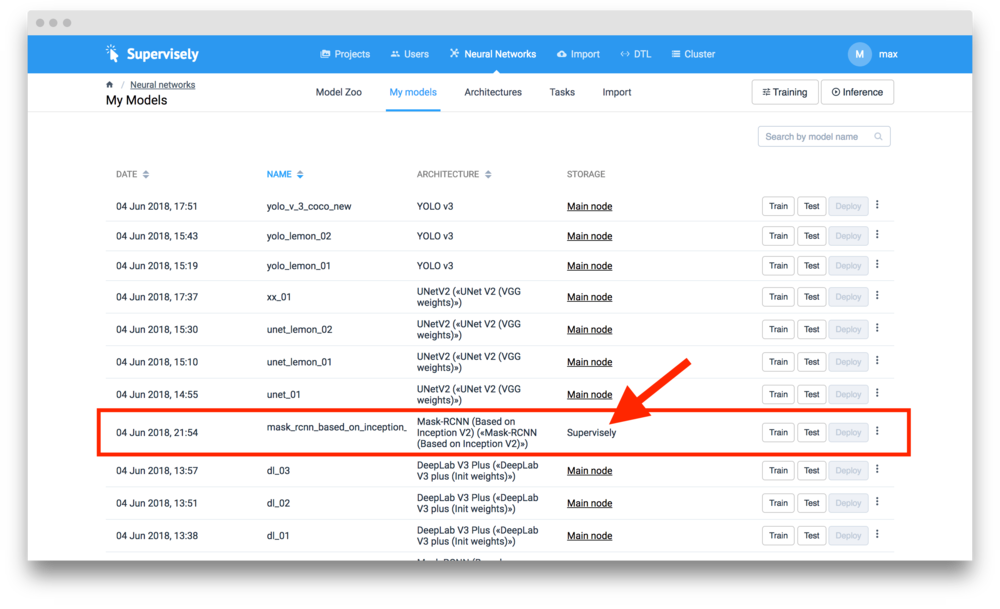
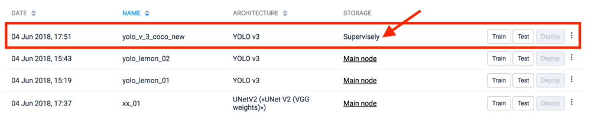

Models can be created in different ways. This page covers all possible scenarious and describes the main storage principles.


If the model is stored on Supervisely Server, this means that it can be used on all computational nodes. Before executing the task (training or inference) Agent will download the model to its local storage if it doesn't exist.



If the model is stored on a specific node in the Cluster, this means that it can be used (training or inference) only on this node. If you are going to save this model or use it on other Cluster nodes, you have to upload it to the Supervisely Server. 


## Model Zoo

If the model was added to the account from the Model Zoo, its main storage location is on Supervisely Server. This means that this model can be used on all computational nodes from the Cluster.

Here is an example:

## Training Checkpoint

After training user can create a model from any [checkpoint](../checkpoints.md). This model will be added to "My models" page. This model will be stored on the node that was used for training. 

To save this model or to be able to use it on a different node just click "three dots" -> "Upload to Supervisely" button.

After you click this button a special task will be created in "Neural Networks" -> "Tasks". You will be redirected automatically.

After the task is completed the model is stored on the Supervisely Server.

## Imported model

Every imported model is stored on the Supervisely server by default. 