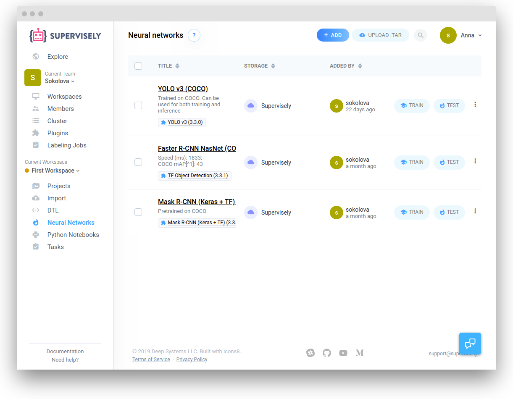

Training custom neural network inside Supervisely is as easy as a few mouse clicks. Here you can find all necessary information regarding how to start the training. 


The procedure described below is applicable for all Neural Networks inside Supervisely. The difference will only be in the json configurations used for the training. Such configurations are similar for most of the models but may differ for some of them.  


You start training from an existing neural network. Please refer to this [page](../my-models/my-models.md) to learn how you can add a model to your workspace.

Open the "Neural Networks" page and start training by clicking the "Train" button in the models list.

The "Run Plugin" page will load and the necessary fields will be automatically set.

## Step 1: Training Settings

Configure the following fields:

1. Agent: Choose an agent from the Cluster page on which the model will be trained. 

2. Input project: choose a project from the current workspace to feed into the model

3. Result title: enter the name for a future model. You can change it later

4. Configuration: the plugin associated with the source model may provide pre-configured options. Training configs for all our models are almost the same but may have some differences. Read "Configurations" chapter to learn more. Training configuration is a set of JSON-based settings that are passed directly to the model. Depending on the model, you can choose desirable classes, GPU device to use and other options. 

Click "Run" to start training.

## Step 2: Monitoring the progress

A new task will be started and "Tasks" will open.

You can select "Logs" in the model context menu ("three dots" icon) to monitor the task output or to stop training.

## Step 3: The task is finished

After training finishes, the latest checkpoint will be saved to the "Neural Networks" page as a new model with the name you have chosen.
