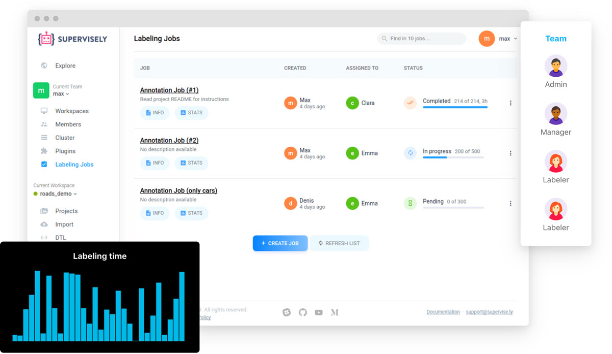

# 🤖 What's Supervisely

**Supervisely** is computer vision platform for researchers and companies to annotate, manage and train neural networks.

Our mission is to help people with and without machine learning expertise to create state-of-the-art computer vision applications.

### With Supervisely you can

* Label **images**, **videos**, **3D point clouds**, **volumetric slices** and other data in the best labeling tool.

* **Manage** and **track** annotation workflow at scale with teams, workspaces, roles and labeling jobs.

* **Train** and **apply** Neural Networks on your data — from our Model Zoo or your custom ones!

* Explore your data and automate common tasks with integrated Python Notebooks and Scripts!

### What's next?

The best way to explore Supervisely is to try it out — so don't wait and [create an account](https://app.supervisely.com/signup) \(it's completely free!\). Here are some things to start with:



Still have some questions? Check our FAQ here:


