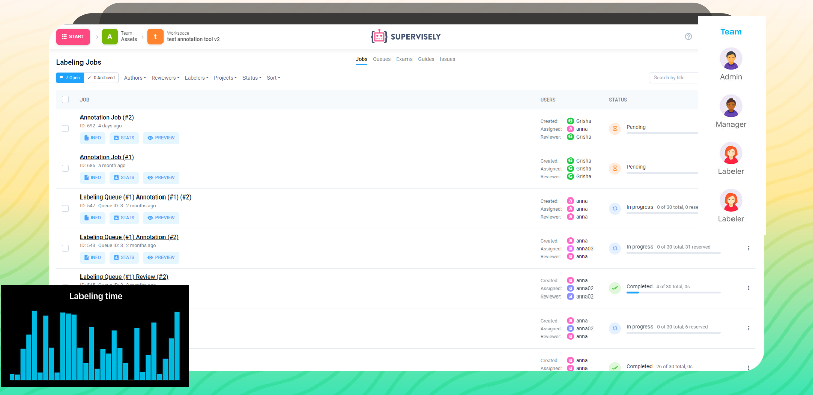
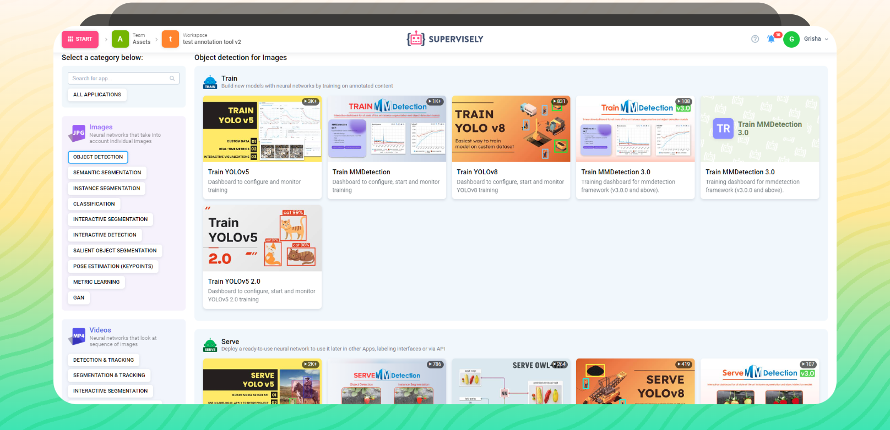
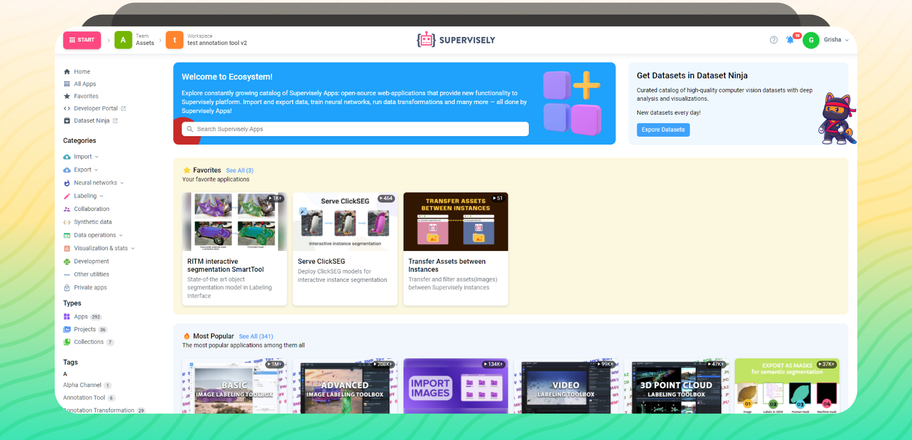

# 🤖 What's Supervisely

**Supervisely** is computer vision platform for researchers and companies to annotate and manage datasets, train neural networks and much more.

Unlike other platforms, Supervisely is [built like OS](./ecosystem/ecosystem.md): instead of having a huge monolith, Supervisely creates a foundation for developing and running applications called Supervisely Apps.

Supervisely is available [online](https://app.supervisely.com/signup) for free, as well as an on-premise edition for enterprises.

### With Supervisely you can

* [Label](labeling/Labeling-toolbox.md) **images**, **videos**, **3D point clouds**, **volumetric slices** and other data in the best labeling toolboxes.

* **Manage** and **track** annotation workflow at scale with [teams](./collaboration/teams.md), workspaces, roles and [labeling jobs](labeling/jobs/README.md).

* **Train** [neural networks](./neural-networks/overview/overview.md) on your custom datasets or use pre-trained models to speed up manual labeling.

* Use the best machine learning tools, visualize and improve your data with hundreds of applications from [Ecosystem](https://ecosystem.supervisely.com/)

### What's next?

The best way to explore Supervisely is to try it out — so don't wait and [create an account](https://app.supervisely.com/signup) \(it's completely free!\). Here are some things to start with:



### Beyond the documentation

If you are interested in learning more about Supervisely, you may find those resources interesting:

<table data-view="cards">
   <thead>
      <tr>
         <th></th>
         <th></th>
         <th data-hidden data-card-target data-type="content-ref"></th>
      </tr>
   </thead>
   <tbody>
      <tr>
         <td><strong>Supervisely Blog 📚</strong></td>
         <td>Where we share tutorials and guides on the hottest topics in computer vision.</td>
         <td><a href="https://supervisely.com/blog/">Blog</a></td>
      </tr>
      <tr>
         <td><strong>Video Course 📽️</strong></td>
         <td>Prefer video? Watch full video course on what is Sueprvisely in 50 chapters.</td>
         <td><a href="https://supervisely.com/what-is-supervisely/">Video Course</a></td>
      </tr>
      <tr>
         <td><strong>GitHub Page 🐙</strong></td>
         <td>Want to contribute to Supervisely? Start with our GitHub page here.</td>
         <td><a href="https://github.com/supervisely/supervisely">GitHub Page</a></td>
      </tr>
   </tbody>
</table>
