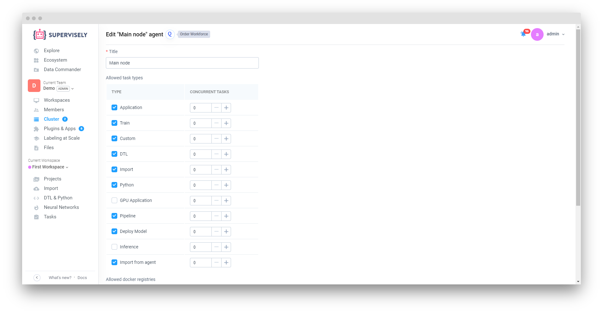

Supervisely Agent is a small but powerful task manager. It automatically consumes and manages tasks via Supervisely API.

Task lifecycle is the following:

1. User chooses the Node that will consume the task.

2. User starts the task (i.e. NN training).

3. Agent (that is running on selected Node) consumes the task.

4. Agent downloads the data (project and/or neural network) necessary for the task and puts it into the task directory.

5. Agent spawns docker container associated with that task.

6. While the task is in progress, Agent reads all logs from `stdout` and `stderr` and streams them to the server.

7. When the task has been finished, Agent uploads the results to Supervisely Server if necessary.

Also, agent sends necessary system information to Supervisely Server in the background. This information is used for healthcheck and server monitoring.

## Agent token

When you add a new node, we will generate unique secret token associated with your agent and include it in the run command.

Token is used for authorization and you should keep it secret.

Token looks like this: `mZVdyTnTGSPQz2iM4kkiNhH2IlqiOmnt`.


## Agent local storage

By default, agent stores models, images, logs and other useful stuff in `~/.supervisely-agent/<token>` (you can change storage folder by modifying `AGENT_HOST_DIR` in deploy script).

```
.
├── logs
│   ├── log_2018-06-01_12:38:21.txt
│   └──  ...
├── storage
│   ├── images
│   │   ├── 00
│   │   │   └── 2e4
│   │   │       └── 002e40383a1a8e887872c0e5293770ad9f45e477028a60a487c489a09721ddd2.jpg
│   │   ├── fd
│   │   │   └── 79f
│   │   │       └── fd79f6dac8db81df1e465de2bccf0c596dcd9aa46f840558eec2c28b277ab281.jpg
│   │   └── ...
│   └── models
│       ├── 10
│       │   └── 975
│       │       └── 10975b009a2c21ca23b2fe17da9152355625cb0c4ebfe05c875e22d93d4f697f
│       │           ├── config.json
│       │           └── model_weights
│       │               ├── checkpoint
│       │               ├── model.ckpt.data-00000-of-00001
│       │               ├── model.ckpt.index
│       │               └── model.ckpt.meta
│       ├── 1b
│       │   └── f03
│       │       └── 1bf0314ec4cf2a85956b56ae2c1d8c521cb6a5cbd06705502b988b5f0cbc4a16
│       │           ├── config.json
│       │           └── model_weights
│       │               ├── checkpoint
│       │               ├── model.ckpt.data-00000-of-00001
│       │               ├── model.ckpt.index
│       │               └── model.ckpt.meta
│       └── ...
├── tasks
│   ├── 14
│   │   └── logs
│   │       └── log_2018-06-01_12:39:46.txt
│   └── 15
│       └── logs
│           └── log_2018-06-01_12:43:16.txt
└── tmp

```


## Agent settings

To rename an agent or change the list of tasks that can be run on it, go to the agents page and click on the "edit" button next to this agent.



