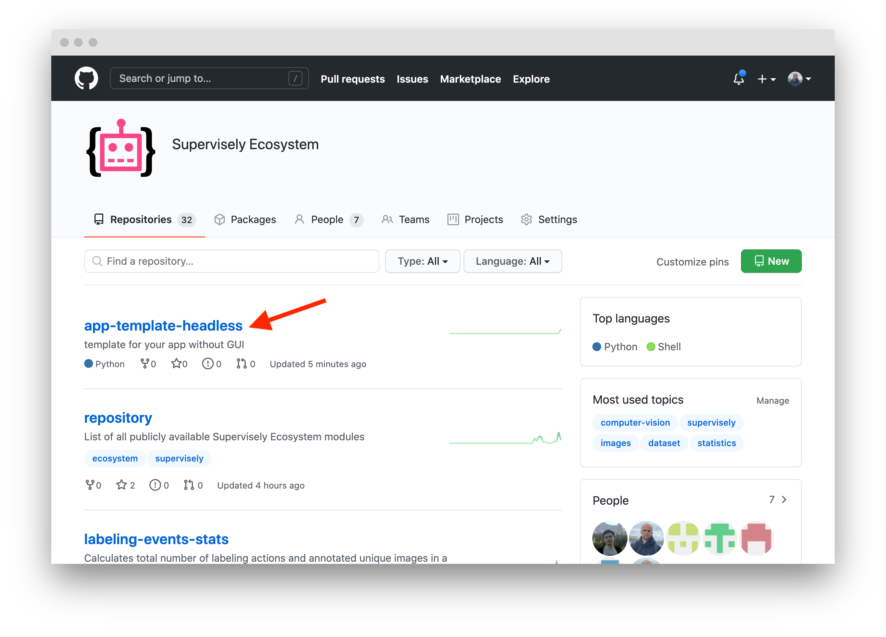
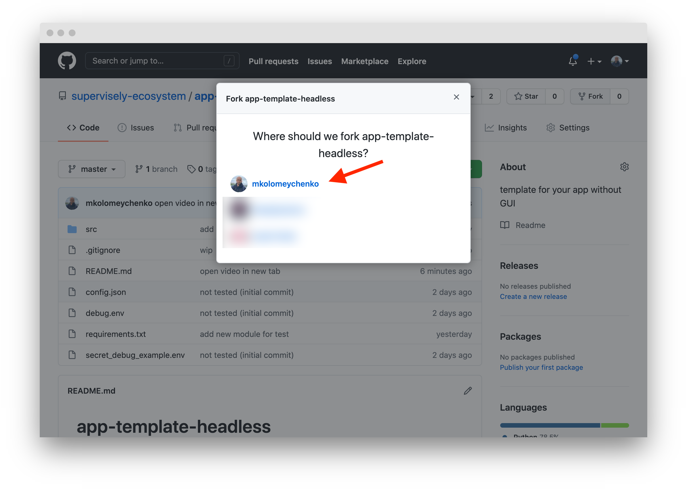

# How to fork app repo on Github

1. Go to application repository in [Supervisely Ecosystem Github](https://github.com/supervisely-ecosystem). For example, this app: [App Template Headless](https://github.com/supervisely-ecosystem/app-template-headless).

2. Fork repo

3. Add it to your github account

