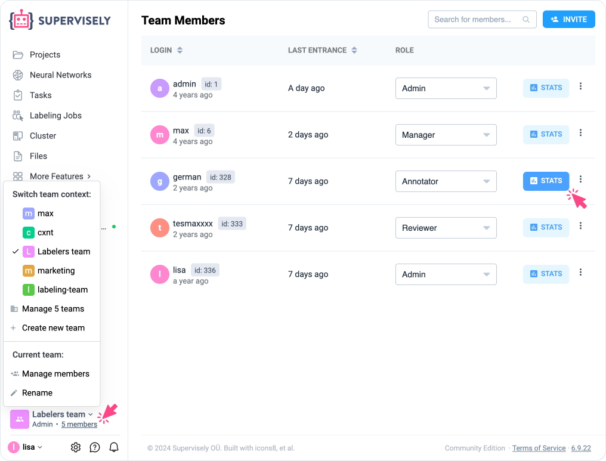

# Activity log

The **Activity Log** is a powerful tool that enables team members to closely monitor and various vital aspects of their collaborative efforts. This feature-rich tool plays a pivotal role in ensuring the efficient management of tasks and projects within a team.

<figure><figcaption></figcaption></figure>

Here is a more in-depth look at its capabilities:

* **Editing duration:** Records when team members make edits to data or documents, ensuring a reliable change history.
* **Time in labeling tool:** Monitors how much time team members invest in working with data labeling tools.
* **Completed jobs:** Logs completed tasks and issues, aiding in project management and quality control.
* **Number of labeled images:** Keeps track of the quantity of images processed during labeling.
* **Number of labeled objects:** Tracks the count of annotated objects within images.
* **Reviewed images:** Records images that have been reviewed, useful for quality control and verifying completed work.

Additionally, the **Activity Log** allows you to export activity logs in CSV format, opening opportunities for further data analysis and processing. You can upload the CSV file from the context menu of a project, job, or team and work with the data according to your needs. This feature makes team activity management more flexible and adaptable to your goals and tasks.

Furthermore, you can access the activity log via an API, enabling integration with other systems and the creation of custom solutions based on the activity log. This expands the possibilities for managing and analyzing your team's activity.

Thus, the **Activity Log** provides a more detailed and effective means of project management and team member action tracking.

In summary, the **Activity Log** is an indispensable tool for teams. It not only offers a comprehensive record of their collaborative efforts but also promotes transparency, accountability, and effective project management. With its robust features, this tool streamlines tasks and enhances the quality of work, making it an invaluable asset in any team's toolkit.
