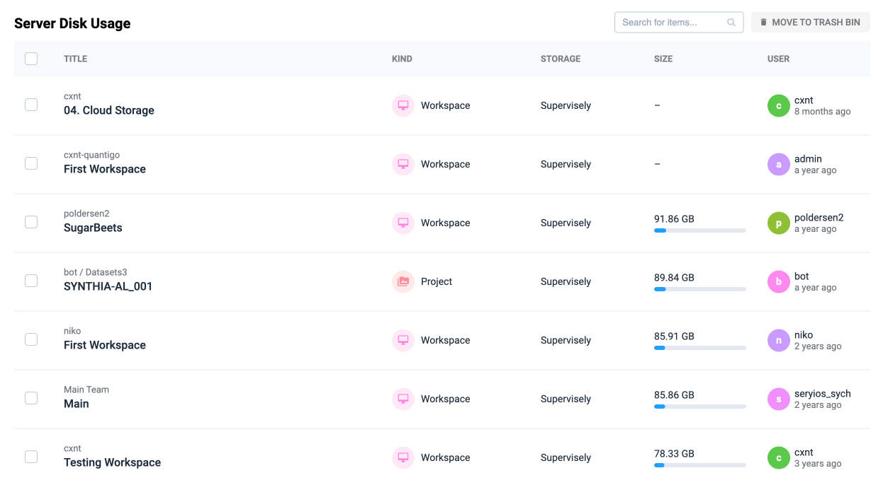

# Server disk usage

Server Disk Usage provides a comprehensive view of disk usage across different workspaces and storage types. This feature allows users to effectively monitor and manage their storage by identifying large datasets and files.

1. **Monitor Storage Usage**: Understand how much storage is being used by specific projects, workspaces, and teams.
2. **Identify Storage Bottlenecks**: Locate large datasets or files that are consuming excessive storage.
3. **Optimize Disk Space**: Free up space by removing or archiving outdated or unused items.
4. **Enforce Team Policies**: Track usage by users and teams to ensure storage limits are respected.

<figure><figcaption></figcaption></figure>

## How to Use

### Step 1. Open the tool

Access the **Server Disk Usage** page in Admin Panel to view a detailed list of items and their storage consumption.

### Step 2. Review storage data

Examine the list of items, focusing on:

* **Title**: The name of the workspace, project, or dataset.
* **Size**: The amount of storage consumed by the item.
* **User**: The individual responsible for the item.

### Step 3. Analyze large items

1. Sort items by **Size** to identify the largest contributors to disk usage.
2. Use the search bar to find specific items or keywords.

### Step 4. Free up space

1. Select one or more items to delete by checking their boxes.
2. Click the **Move to Trash Bin** button to temporarily remove items.
3. Review the trash bin periodically to permanently delete outdated items.

## Step 5. Enforce team policies

1. Use the **User** column to identify users with high storage consumption.
2. Set internal policies to encourage periodic cleanup and efficient storage practices.

***

### Best Practices

**Monitor regularly**: Check disk usage regularly to avoid running out of storage.

**Collaborate with users**: Discuss with team members before removing shared items.

**Archive old projects**: Move completed projects to an archive folder to free up active workspace storage.

**Set alerts**: Use internal policies or tools to alert users when nearing storage limits.
