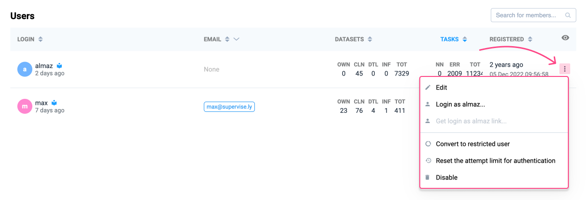

# Users management

Administrators can manage users through the admin panel. To access it:

1. Click the settings in the bottom-left corner of the interface.
2. Select the **Users** option from the dropdown menu.

<figure><figcaption></figcaption></figure>

## User list

**The list helps administrators quickly review user details and activity.**

After selecting **Users**, a list of all registered users will appear. For each user, the following information is displayed:

* **Login**: Username of the user.
* **Email**: Associated email address (if provided).
* **Datasets**: Number of datasets the user has access to.
* **Tasks**: Number of tasks completed by the user.
* **Registered**: Time and date of user registration.

Administrators can customize the user list display to filter or focus on specific information. Each column in the user list can be filtered to refine the displayed data. For example, you can:

* Filter users by their email type (e.g., None, Free, Corporate, Educational) using the dropdown in the **Email** column.
* Adjust sorting or filtering criteria for columns like **Login**, **Datasets**, **Tasks**, or **Registered** to organize and prioritize information.

<figure><figcaption></figcaption></figure>

Regularly review user activity to maintain system security and performance.

***

## Signup new user

Administrators can create new user accounts directly from the user management panel. To do this:

1. Click the **Signup** button at the bottom of the user list.

<figure><figcaption></figcaption></figure>

2. Fill in the required fields in the pop-up window:

* **Login**: Enter a unique username for the new user.
* **Password**: Set a secure password for the user.
* **Settings**: Toggle between default or restricted access.

If "**Is restricted**" is selected, the user will face the following limitations:

* No access to the Ecosystem section.
* No personal team will be created during signup.
* Can't create a team.

3. Click **Signup** to finalize the creation of the new user account.

<figure><figcaption></figcaption></figure>

***

## Managing users

User management is critical to keeping systems secure, managing permissions and ensuring smooth collaboration.

<figure><figcaption></figcaption></figure>

### Editing user details

To update user details, including changing passwords and modifying user restrictions:

1. Locate the desired user in the list.
2. Click the three-dot icon on the right side of the user's row.
3. Select **Edit** from the dropdown menu.

In the pop-up window, update the necessary fields:

* **Login**: Change the username if required.
* **Password**: Enter a new password to reset the user's credentials.
* **Settings**: Toggle between default or restricted access.

If "**Is restricted**" is selected, the user will face the following limitations:

* No access to the Ecosystem section.
* No personal team will be created during signup.
* Can't create a team.

4. Click **Update** to save changes.

<figure><figcaption></figcaption></figure>

### Additional actions

Administrators can perform the following actions from the three-dot action menu next to a user:

* **Login as user**: Log into the system as the selected user.
* **Convert to restricted user**: Restrict the user's permissions.
* **Reset the attempt limit for authentication**: Reset the failed login attempt counter for the user.
* **Disable**: Block the user's access to the system. Use the "Disable" option cautiously to avoid disrupting active users.
