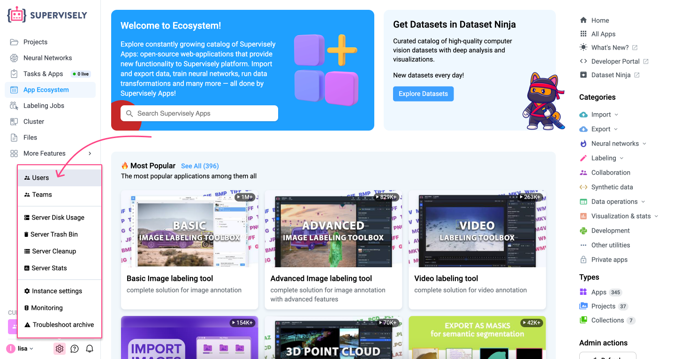
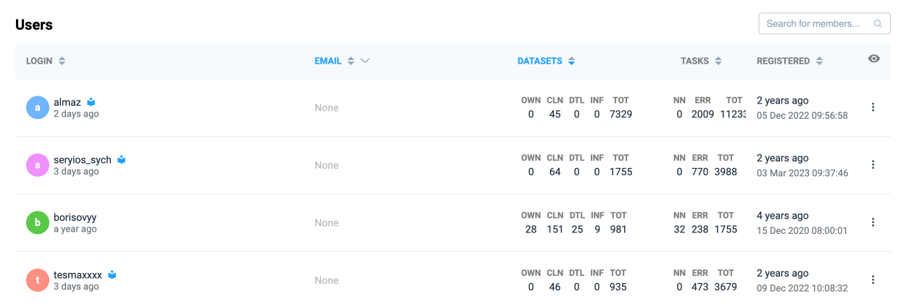
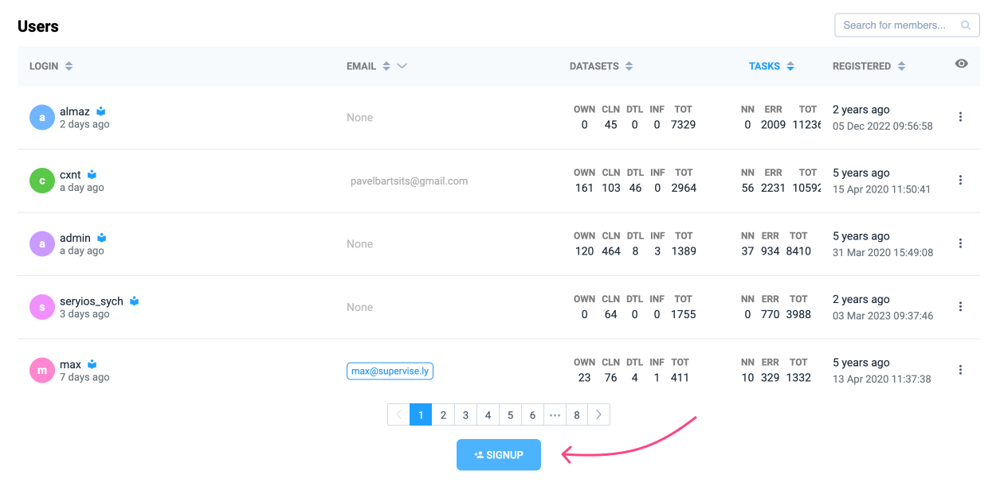
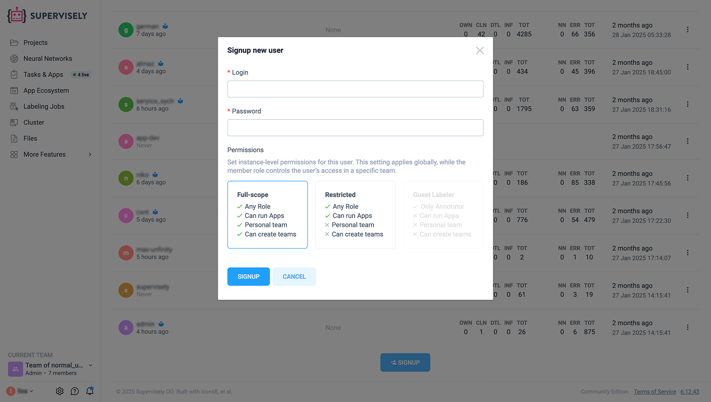
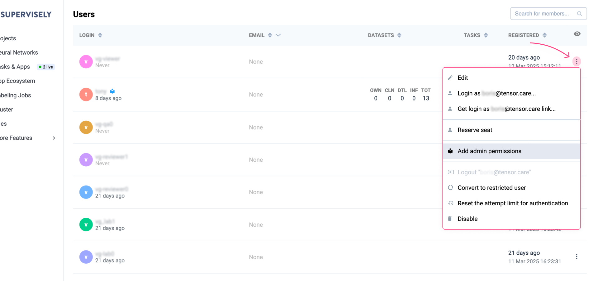
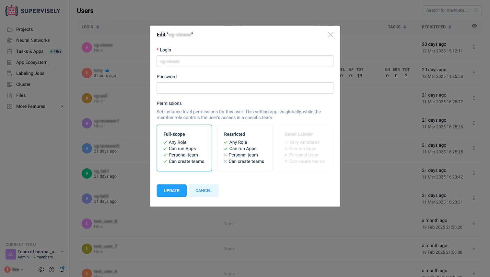
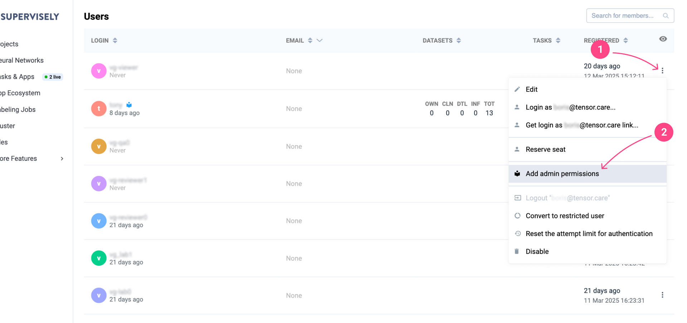
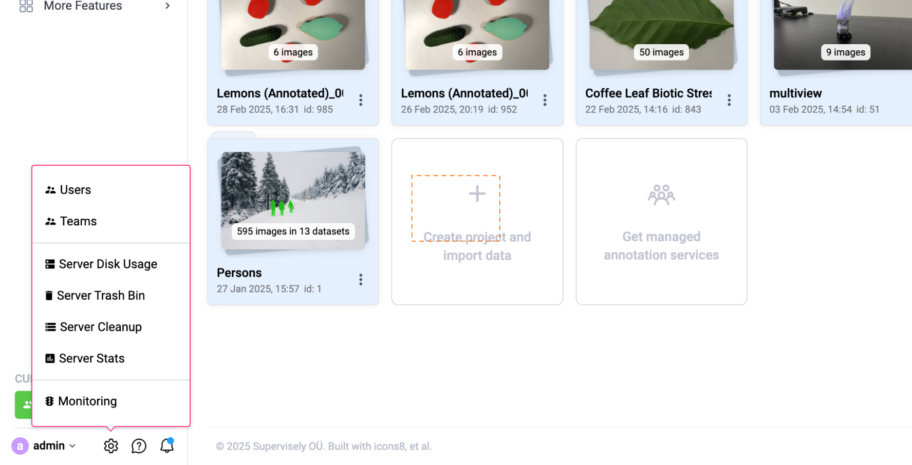
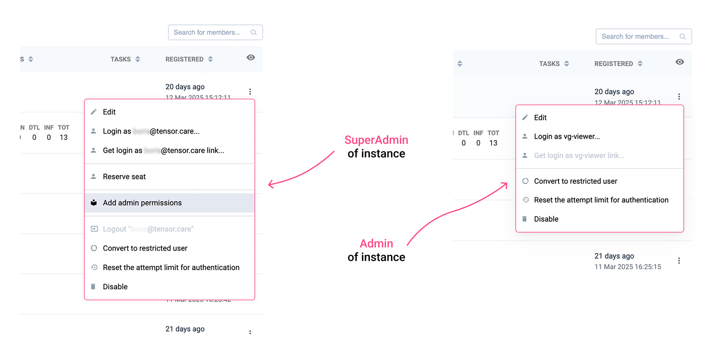

# Users management

Administrators can manage users through the admin panel. To access it:

1. Click the settings in the bottom-left corner of the interface.
2. Select the **Users** option from the dropdown menu.

<figure><figcaption></figcaption></figure>

## User list

**The list helps administrators quickly review user details and activity.**

After selecting **Users**, a list of all registered users will appear. For each user, the following information is displayed:

* **Login**: Username of the user.
* **Email**: Associated email address (if provided).
* **Datasets**: Number of datasets the user has access to.
* **Tasks**: Number of tasks completed by the user.
* **Registered**: Time and date of user registration.

Administrators can customize the user list display to filter or focus on specific information. Each column in the user list can be filtered to refine the displayed data. For example, you can:

* Filter users by their email type (e.g., None, Free, Corporate, Educational) using the dropdown in the **Email** column.
* Adjust sorting or filtering criteria for columns like **Login**, **Datasets**, **Tasks**, or **Registered** to organize and prioritize information.

<figure><figcaption></figcaption></figure>

Regularly review user activity to maintain system security and performance.

## Signup new user

Administrators can create new user accounts directly from the user management panel. To do this:

1. Click the **Signup** button at the bottom of the user list.

    <figure><figcaption></figcaption></figure>

2. Fill in the required fields in the pop-up window:

* **Login**: Enter a unique username for the new user.
* **Password**: Set a secure password for the user.
* **Permissions**: Set instance-level permissions for this user. This setting applies globally, while the member role controls the user’s access in a specific team.

    There are three categories of permissions:

  * "**Full-scope**" grants full access, including the ability to:
    * Assign any role
    * Run Any Apps
    * Automatically create a personal team during signup
    * Create new teams after signup
  * "**Restricted**" grants limited access, including:
    * Assign any role
    * Run Any Apps
    * No personal team creation during signup
    * Cannot create new teams after signup
  * "**Guest Labeler**" is available only if the "Active Labelers" option is enabled in the license. It grants limited access, including:
    * Can assign only the Annotator role
    * Cannot run any apps
    * No personal team creation during signup
    * Cannot create new teams after signup

3. Click **Signup** to finalize the creation of the new user account.
     
     
    <figure><figcaption></figcaption></figure>

## Managing users

User management is critical to keeping systems secure, managing permissions and ensuring smooth collaboration.

<figure><figcaption></figcaption></figure>

### Editing user details

To update user details, including changing passwords and modifying user permissions:

1. Locate the desired user in the list.
2. Click the three-dot icon on the right side of the user's row.
3. Select **Edit** from the dropdown menu.

    In the pop-up window, update the necessary fields:

    * **Login**: Change the username if required.
    * **Password**: Enter a new password to reset the user's credentials.
    * **Permissions**: Toggle between Full-scope, Restricted or Guest Labeler (if available).

4. Click **Update** to save changes.
     
     
    <figure><figcaption></figcaption></figure>

### Differences between Instance SuperAdmin, Instance Admin and Team Admin

1. An **Instance SuperAdmin** is a pre-installed user with the highest level of permissions. The default login is "Admin".

    An Instance SuperAdmin can perform the following actions from the three-dot action menu next to a user:
     
     
    <figure><figcaption></figcaption></figure>
     
     
    * **Add admin permissions**: The Instance SuperAdmin can create users on the instance and grant them Admin rights.

    Also, Instance SuperAdmin can:

    * **Edit**: Update user details, including changing passwords and modifying user permissions.
    * **Login as user**: Log into the system as the selected user.
    * **Reserve seat**: Allocate a workspace slot for the user, ensuring they have access to necessary resources.
    * **Convert to restricted user**: Restrict the user's permissions.
    * **Reset the attempt limit for authentication**: Reset the failed login attempt counter for the user.
    * **Disable**: Block the user's access to the system. Use the "Disable" option cautiously to avoid disrupting active users.

    An Instance SuperAdmin can also use the [application](https://ecosystem.supervisely.com/apps/create-users-from-csv) to create users from a CSV file.
    However, they cannot directly change team member's roles but can log in as a Team Admin to modify user roles within that team.

    An Instance SuperAdmin and Instance Admin have access to instance settings, allowing them to modify its configuration, add global cloud storage, perform updates, and more.
     
     
    <figure><figcaption></figcaption></figure>
     
     
2. An **Instance Admin** is a team member with an individual login who receives their Admin rights from the Instance SuperAdmin. However, unlike the Instance SuperAdmin, they have limited rights. For example, they can create users but cannot assign Admin rights to others.

    Compare:

    <figure><figcaption></figcaption></figure>

3. A **Team Admin** is a user assigned to manage a specific team within the instance. They have full administrative control over that team, such as:

    * **Managing team members**: Can invite new members and assign roles within their team. However, they do not have the ability to modify global settings or manage users outside their team.

    * **Limited scope**: Unlike Instance SuperAdmin or Instance Admin, the Team Admin's control is restricted to the team they manage.
