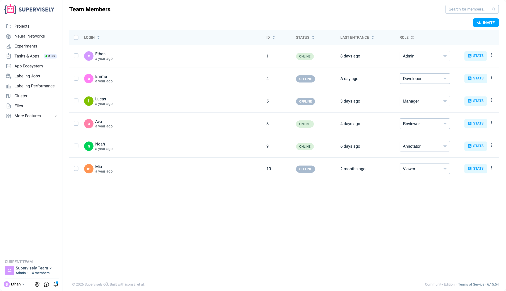
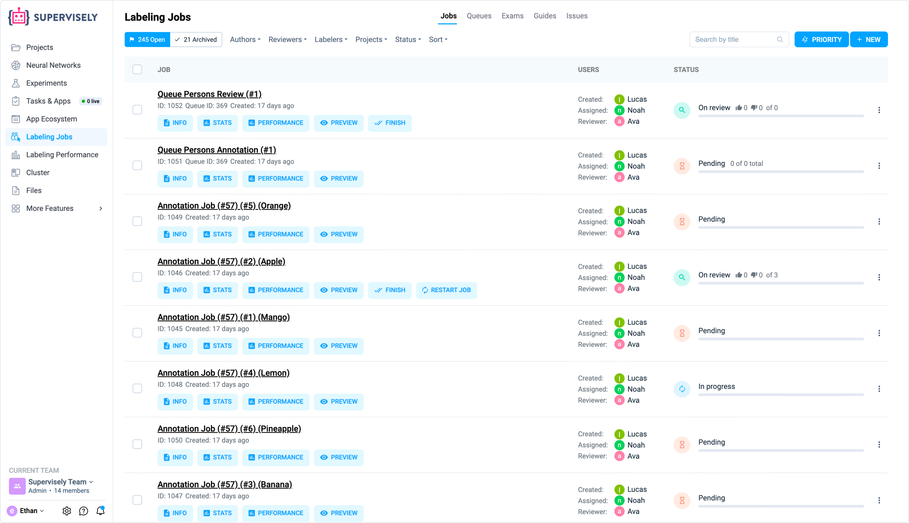
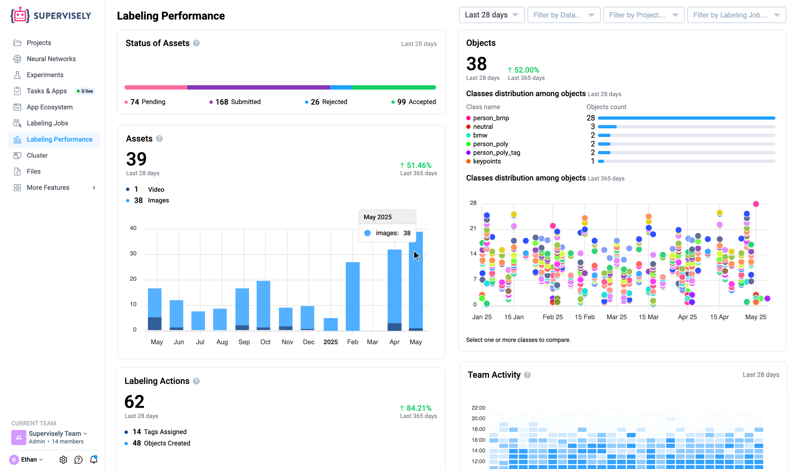
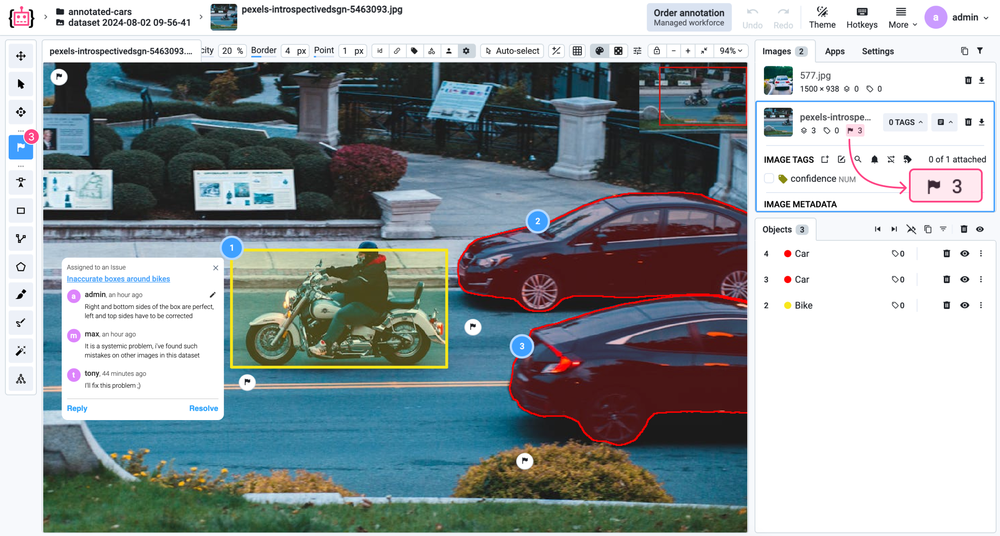

# Collaboration

Supervisely provides a comprehensive suite of tools for team management, user coordination,
and collaborative workflows. The Collaboration section enables seamless teamwork across your organization with capabilities designed for scale - from small teams to enterprise-level operations.

## Supervisely Collaboration Ecosystem

Supervisely's collaboration ecosystem is built to support large-scale annotation teams and complex
project workflows. The platform organizes users, resources, and access permissions through a
hierarchical structure of teams and workspaces, complemented by powerful tools for job management,
performance tracking, issue resolution, quality assurance, and team coordination.

**Collaboration features include:**

- **[Team Management](/collaboration/teams.md#teams)**: Organize users into teams with role-based access control
- **[Workspace Organization](/collaboration/teams.md#workspaces)**: Create and manage multiple workspaces within teams to organize projects
- **[Member Roles & Permissions](/collaboration/members.md)**: Fine-grained control with 6 role types (Admin, Developer, Manager, Annotator, Reviewer, Viewer)
- **[Labeling Jobs](/labeling/jobs/README.md)**: Distribute annotation tasks to team members with built-in quality control
- **[Labeling Queues](/labeling/jobs/Labeling-Queues.md)**: Queue-based task distribution for flexible team workflows
- **[Labeling Consensus](/labeling/jobs/Labeling-Consensus.md)**: Multiple annotators independently label the same data for validation
- **[Quality Control](/labeling/jobs/Labeling-Quality-Control.md)**: Built-in validation mechanism for annotation accuracy
- **[Labeling Performance Analytics](/labeling/labeling-performance.md)**: Track team productivity and performance metrics
- **[Issues & Discussion](/labeling/issues/README.md)**: Integrated issue tracking system for collaborative problem-solving
- **[Activity Monitoring](/collaboration/Activity-Log.md)**: Real-time tracking of team activities, editing duration, and labeling progress
- **[Guides & Exams](/labeling/exams/README.md)**: Educational tools for annotator training and quality assessment
- **[Resource Sharing](/collaboration/sharing.md)**: Multiple methods to share resources between teams and users
- **[Admin Panel](/collaboration/admin-panel/README.md)**: Server-level management for administrators

## Teams & Workspaces

**Teams** are the fundamental organizational unit in Supervisely - a group of users who share the
same resources such as projects, models, and datasets.
Users can be members of multiple teams, and all entities like projects and models belong to a specific team. You can easily switch between teams using the sidebar menu.

**Workspaces** provide a secondary organizational layer within teams, acting as folders to separate different sets of experiments and projects. Every team has at least one workspace to organize projects, datasets, and tasks, though workspaces themselves do not have separate access control mechanisms.

## Members & Roles

Access control in Supervisely is managed through [member roles](/collaboration/members.md). Each team member has a role that
determines their permissions and capabilities within that team.

**Available Roles:**

1. **Admin** - Full access to team resources and management; can invite members and remove entities
2. **Developer** - Similar to Admin but can only remove own entities; cannot invite new members
3. **Manager** - Can view and modify projects and labeling jobs; no access to Neural Networks
4. **Annotator** - Access only to Labeling Jobs page
5. **Reviewer** - Same as Annotator but can also create new labeling jobs
6. **Viewer** - Read-only access to team resources

Every team must have at least one Admin, but can have multiple Admins.

**Roles in Labeling Context:**
The role system is especially important when managing Labeling Jobs. Managers, Annotators, and
Reviewers have distinct responsibilities in the annotation workflow.

## Labeling Jobs - Core Collaboration Feature

[Labeling Jobs](/labeling/jobs/README.md) is the central mechanism for efficiently organizing and distributing data annotation
tasks within a team. It enables managers to assign well-defined annotation tasks to team members,
ensure consistent quality, and track progress in real time.

**Why Labeling Jobs Matter:**
Data annotation at scale requires careful coordination. Labeling Jobs solve this by preventing task overlap through explicit assignment, maintaining quality through built-in review mechanisms, ensuring consistency with predefined guidelines, and providing real-time progress tracking.

**Core Features:**

- **Annotation Quality Control** - Includes inspections and re-labeling options when necessary
- **Task Distribution** - Prevents overlap by assigning jobs to specific team members
- **Consistent Guidelines** - Eliminates subjective errors through clear technical requirements and restrictions
- **Real-Time Monitoring** - Tracks progress and allows iterations to improve results
- **Access Control** - Limits access to specific datasets as needed

### Roles in Labeling Jobs

In the context of labeling, **Managers** create and manage jobs, provide instructions, assign tasks, and monitor team performance. **Annotators** label the assigned data according to the instructions and submit their work for review, with access limited only to the Labeling Jobs page. **Reviewers** check the submitted annotations, either accepting them or sending them back for re-labeling, and can also create new jobs and analyze statistics.

### Labeling Jobs Workflow

The labeling process follows a simple, structured workflow.

- First, a **Manager** creates a labeling job by defining the task, providing instructions, selecting the data, and assigning **Annotators** and **Reviewers**.
- Next, **Annotators** complete the job by labeling the data according to the specifications and submitting their work.
- Finally, **Reviewers** check the submitted annotations, either accepting them or rejecting them for re-annotation. Throughout this process, **Managers** and **Reviewers** can track progress and view performance metrics such as completion rates and quality scores.

### Labeling Queues

**Queue-Based Task Distribution**

[Labeling Queues](/labeling/jobs/Labeling-Queues.md) provide a systematic method for distributing tasks using a "pool" approach. Instead of direct assignment, tasks are grouped into queues and sequentially distributed to the first available annotator. This automatically balances the workload based on availability, making it ideal for large teams with varying speeds or continuous annotation workflows where flexible, independent work is preferred.

### Labeling Consensus

**Collaborative Quality Validation**

[Labeling Consensus](/labeling/jobs/Labeling-Consensus.md) is an advanced annotation approach where multiple annotators independently label the same set of images, and the system combines their labels to produce consensus results.

**Key Concepts:**
In this approach, multiple team members independently annotate identical images, and the system combines their labels using consensus algorithms. It calculates a consensus score (0-100%) to measure agreement between annotators. This method is highly recommended for tasks with strict accuracy requirements, complex or ambiguous data, quality assurance, and dataset validation before model training across various tasks like object detection and segmentation.

### Labeling Quality Control

**Automated Validation System**

[Quality Control](/labeling/jobs/Labeling-Quality-Control.md) functionality enables you to assign random samples of annotated images to reviewers
for validation. The system automatically generates summary reports with quality insights.

**QC Process & Benefits:**
You can easily send a random sample of annotated images to reviewers for validation directly from the project interface. Reviewers assess the correctness of assigned classes, object geometries, and applied tags. The system then automatically generates a quality report, providing unbiased assessment, early identification of issues, and actionable insights for process improvement.

## Labeling Performance Analytics

[Labeling Performance](/labeling/labeling-performance.md) is a powerful analytics tool that provides detailed statistics about the data annotation process. It helps you track team efficiency, monitor individual contributions, identify bottlenecks, and manage annotation quality across all projects.

You can use flexible filtering by time period, data type, project, or specific labeling jobs to get precise insights. The analytics dashboard offers a comprehensive view of key performance indicators, including labeling speed, acceptance rates, average time per object, and detailed member performance tables. This allows managers to easily assess both the speed and quality of the team's work, making it an essential tool for optimizing the annotation workflow.

## Issues

[Issues](/labeling/issues/README.md) are an integrated collaboration tool for tracking and resolving annotation problems at scale.
Built with professional labeling teams in mind, Issues enable your team to discuss, track, and
resolve quality issues without switching interfaces.

**Core Features & Use Cases:**
Issues can be private for project-specific discussions or public for organization-wide visibility. The system features a rich discussion interface with markdown support, flexible filtering, and real-time notifications. Integrated directly into the annotation tool, it allows teams to track and resolve individual image or object issues seamlessly. This makes it ideal for coordinating review processes, discussing edge cases, and maintaining quality standards across large teams.

## Guides & Exams

Training and assessing your annotation team is critical for quality data. [Guides & Exams](/labeling/exams/README.md) provide
the tools to educate annotators and measure their understanding of your annotation policies.

**Labeling Guides** are educational resources that document your annotation policy using videos, documents, and examples of correct and incorrect annotations. They can be easily attached to Labeling Jobs and Exams for reference.

**Labeling Exams** allow you to measure annotator comprehension by testing their understanding of requirements. You receive detailed quality scores and reports to identify top performers and track accuracy. These tools are essential for ensuring all annotators understand the labeling requirements, assessing their skills, and retraining them when policies change.

## Activity Log

Monitor and track all team activities for effective project management and team oversight.
The [Activity Log](/collaboration/Activity-Log.md) records detailed information about your team's collaborative efforts.

**Capabilities:**

- Export activity logs to CSV for analysis and reporting
- Access via API for integration with external systems
- Create custom dashboards and reports based on activity data
- Monitor team productivity and project progress

## Sharing & Resource Distribution

Supervisely provides multiple methods to [share resources](/collaboration/sharing.md) between teams and users while
maintaining security and organization.

**Sharing Methods:**

- **Cloning** - the simplest way to copy resources between teams from the context menu
  specifying the target team.
- **Share as Link** - generate unique links to grant access to resources.
- **Data Commander** - advanced tool for complex data exchange operations between teams and workspaces.
- **Instance Copying** - dedicated application for transferring resources between different platform instances or environments.

## Admin Panel

System administrators have access to server-level management tools through the [Admin Panel](/collaboration/admin-panel/README.md).
These tools are designed for infrastructure management and server oversight.

**Admin Features:**

- **Users Management** - Manage user accounts and access
- **Teams Management** - Oversee teams and team settings
- **Server Disk Usage** - Monitor storage utilization
- **Server Trash Bin** - Manage deleted items recovery
- **Server Cleanup** - Optimize and clean server resources
- **Server Stats & Errors** - View system statistics and error logs

**Note:** Admin panel features are typically available only to system administrators,
not regular team administrators.

## Collaboration Workflow

A typical team collaboration workflow in Supervisely follows a structured, iterative process designed to ensure high-quality data annotation at scale:

**1. Setup & Organization**
Start by creating **Teams** and **Workspaces** to organize your projects. Invite members and assign appropriate **Roles** (Managers, Annotators, Reviewers) to establish clear access control.

**2. Task Distribution**
Managers create **Labeling Jobs** with clear guidelines or set up **Labeling Queues** for flexible task distribution. For complex tasks, **Consensus** labeling can be configured to ensure accuracy.

**3. Execution & Monitoring**
Annotators process the data while Managers track progress in real-time using **Labeling Performance Analytics**. Any questions or edge cases are discussed directly in the labeling interface using **Issues**.

**4. Quality Assurance**
Reviewers check the submitted work, accepting or rejecting annotations. **Quality Control** sampling can be used for unbiased validation, and **Exams** help maintain team skill levels.

**5. Analysis & Optimization**
Finally, teams analyze performance metrics, export **Activity Logs**, and share resources across the organization to continuously improve the annotation pipeline.
