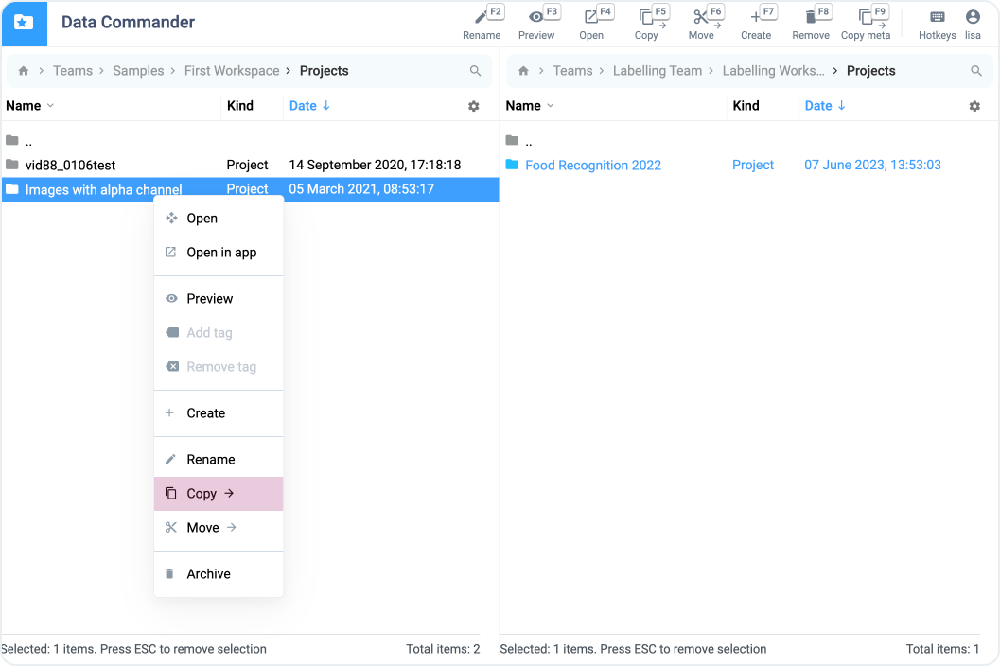

# Sharing

While keeping your resources well-organized, there are times when you need to share them between teams and users. The platform offers several ways to do this.

### Cloning

Cloning is one of the simplest methods to share resources. You can copy resources and data between teams by selecting "Clone to..." in the context menu and specifying the team to which you want to clone the item. Please note that you can only choose teams in which you are already a member.

<figure><figcaption></figcaption></figure>

### Share as Link

For more flexible resource sharing, you can create a unique link to grant access to the item. This allows you to share resources even with teams where you are not a member. When this link is opened in another team or workspace, you will see the option to clone the specific item.

<figure><figcaption></figcaption></figure>

### Data Commander

For more complex and extensive data exchange operations between teams and workspaces, you can make use of the [Data Commander](../data-organization/data-commander/) tool. This tool provides additional capabilities for more flexible and controlled data movement and copying.

<figure><figcaption></figcaption></figure>

### [Instance Copying Application](https://app.supervisely.com/ecosystem/apps/copy-project-between-instances?id=40)

To transfer resources between different instances of the platform, a dedicated [application](https://app.supervisely.com/ecosystem/apps/copy-project-between-instances?id=40) is available. It offers a convenient way to transfer resources and data between various environments, providing broader collaboration opportunities.

<figure><figcaption></figcaption></figure>

