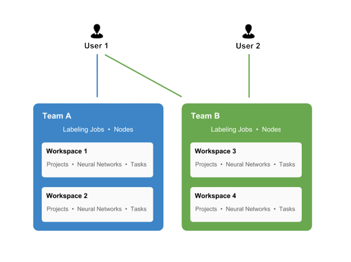
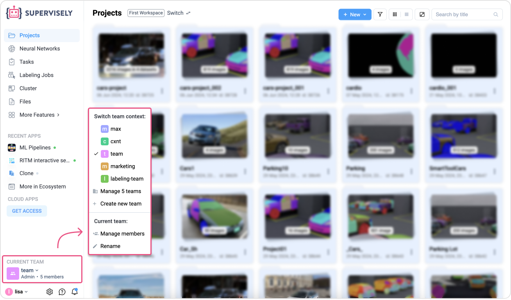
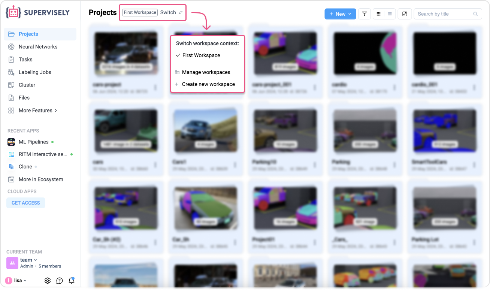
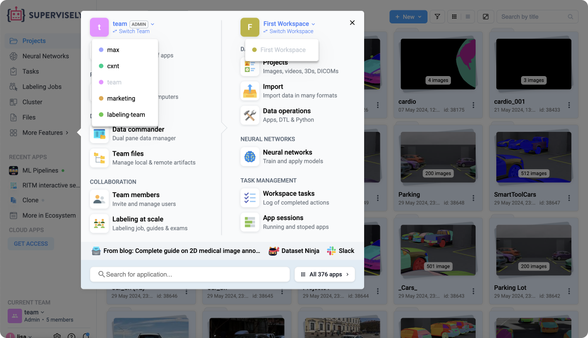

# Teams & workspaces

Supervisely allows you to manage and develop datasets, models, apps and many other entities. It is important to understand how we organize users, resources and access permissions.

## **Teams**

**Team** is a group of users and resources.

Users in the same team share the same resources, like projects and models.

When you login to Supervisely, your last team will be selected. At every moment you work in a particular team and all new items like projects you create will be created in that team.&#x20;


You can't create entities like projects outside of a team or have the same project in multiple teams simultaneously.&#x20;


Switch and manage teams at any time or create a new team from the the left `Team` menu.

<figure><figcaption></figcaption></figure>

## Workspaces

When multiple users collaborate within the same team, it is usually convenient to split results into separate "rooms" called **Workspaces**.

A Workspace is a filter within a particular team that allows you to quickly switch between different sets of experiments.

Workspace have two types of organized resources:

* Projects and Datasets
* Workspace Tasks

Easily switch between workspaces, create new or manage existing workspaces directly from the **Projects** or **Tasks** page.

<figure><figcaption></figcaption></figure>


A workspace is a part of a team. You can't have a workspace outside of a team. Every team must have at least one workspace, but can have two or more.


At every moment you work in particular workspace and all projects and tasks you create become a part of the current workspace and the current team.

Workspaces don't provide any access permissions or roles mechanisms, unlike teams.

## More Navigation

The **Current Team** and **Workspace** are displayed next to the `More Features` button in the header bar.

<figure><figcaption></figcaption></figure>
