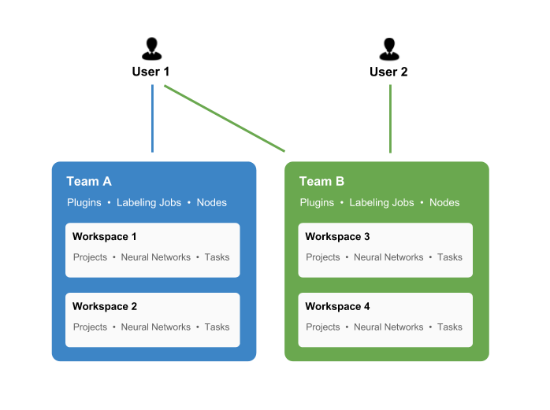
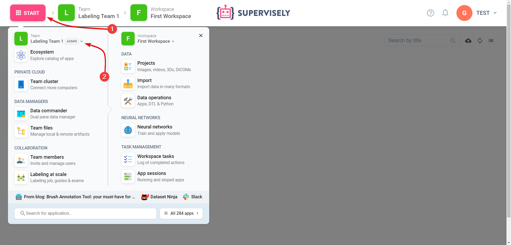
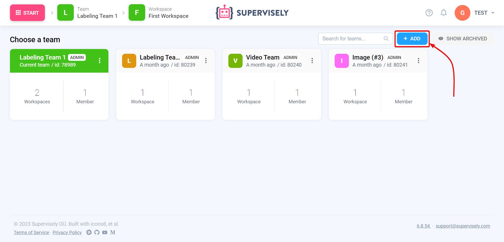
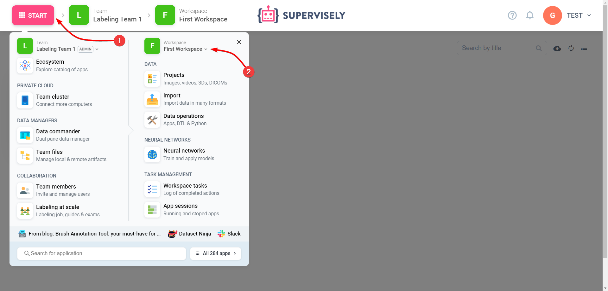

# Teams

Supervisely allows you to manage and develop datasets, models, custom extensions and many other entities.
It is important to understand how we organize users, resources and access permissions.

Team is a group of users and resources.

Users in the same team share the same resources, like projects and models.

When you login to Supervisely, your last team will be selected. At every moment you work in a particular team and all new items like projects you create will be created in that team. You cannot create entities like projects outside of a team or have the same project in multiple teams at once (you can share them with Explore, Clone and Links, read below). 

You can switch teams at any moment or create a new team in the left menu.

## Workspaces

When multiple users are collaborating together in the same team it is usually convenient to have a way to split results into separate "rooms" called "workspaces".

Workspace is filter inside a particular team that allows to quickly switch between different sets of experiments. There are three resources that are split between workspaces:

- Projects and datasets
- Neural networks
- Tasks

A workspace is a part of a team. You cannot have a workspace outside of a team. Every team must have at least one workspace, but can have two or more. 

At every moment you work in particular workspace and all projects, neural networks and tasks you create become a part of the current workspace and the current team.

Workspaces do not provide any access permissions or roles mechanisms, unlike teams. 

