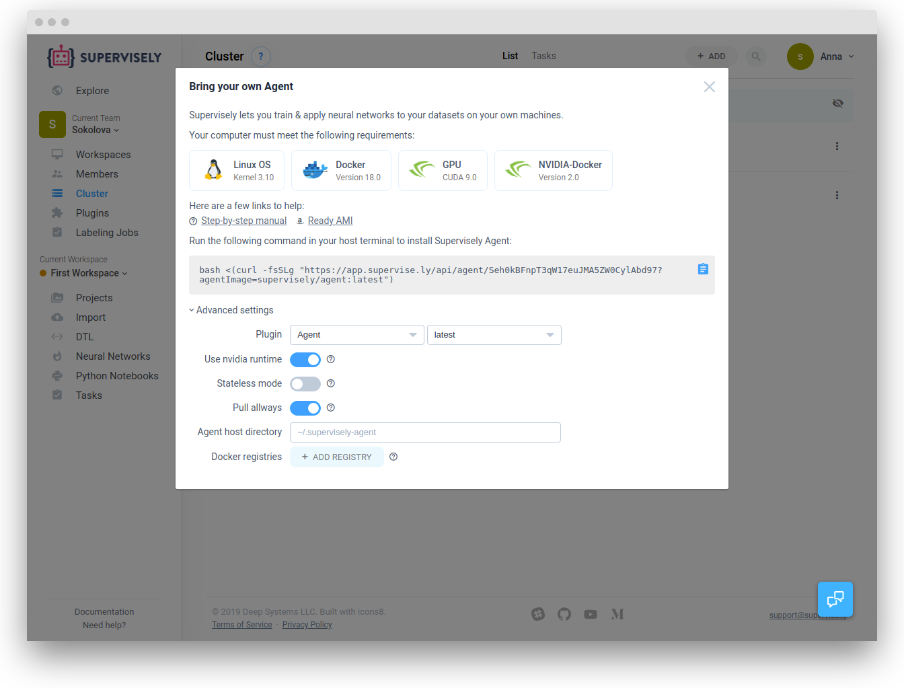

Here you can find all necessary information about how to add (or delete) nodes to your computational Cluster. 

With Supervisely Agent it is easy and straightforward to add new nodes to the Cluster.


We only run the tasks that you have explicitly started yourself on your agents. We will never use your nodes for benefit of others.


## System requirements

First, make sure that the computer you want to use in Supervisely meets several requirements:

- Linux OS (Kernel 3.10)
- Docker (Version 18.0)
- GPU (CUDA 9.0) - for training and inference tasks
- Nvidia-docker - for training and inference tasks

## Installation

Open the Cluster section in Supervisely Dashboard. If you have no agents installed yet, you will see the following picture:

Click "Connect your first node" button to open the Agent installation dialog window.

Copy the command you will see (you can click on the blue icon on the right to do it), paste in the terminal on the computer (host) you want to use with Supervisely and run it.


You can run only one agent per node. Don't worry — it's multithreading and runs tasks in separate docker containers.


It will run Supervisely *agent* as a docker image with name "supervisely-agent/<token>".

### Advanced configuration (optional)

Before starting Agent on you computer you can customize a few parameters.


To apply changes in advanced settings to already running agent you need to copy resulting command and execute it on the same machine where agent running


- Use nvidia runtime: will add `--runtime-nvidia` flag to docker run to support GPU related taks
- Registries: if you want to use your own private docker images for training and inference custom models, provide path, login and password.

  

We don't store your registry credentials. Your login and password will be passed to command as an environment variables.


If everything goes well, you will the the following output in your terminal:

You can now close the terminal window.


Supervisely agent runs with a `--restart=always` flag by default and will start again after reboot.


## Restarting and updating agent

There are a few scenarios when you will need to restart Agent: to update to the latest version or to apply your custom changes. The restart process is simple. 

Just click the "three dots" icon in the nodes list and select "Instructions". Copy command from the instructions and perform it in the terminal on the Agent's computer (host). Updated version will be automatically pulled from the Docker registry.


Restarting agent will stop all running tasks


## Disable agent

To remove the node from Supervisely simply click on the "three dots" icon in the nodes list and select "Archive". You data will stay safe and you can recover you node later by selecting the "Recover" option. 

## Stop agent(s)

If you will need to stop your agent(s), you can safely do it by running `docker stop $(docker ps -q -f "name=supervisely-agent")` command in your terminal. You can always bring it back by running `docker start $(docker ps -q -f "name=supervisely-agent")` command. Agent will re-connect to Supervisely and you can continue your work.

## Remove agent(s)

To completely remove agent(s) from your machine run `docker rm -fv $(docker ps -q -f "name=supervisely-agent")` in your terminal and delete directory `~/.supervisely-agent/<token>`

