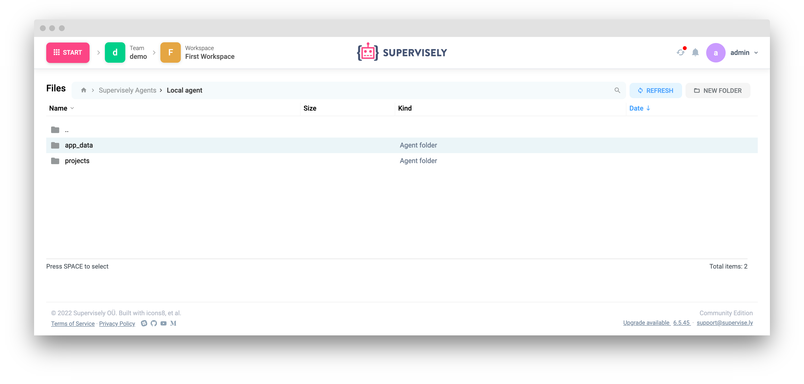

If you need to load a large project or want to have access to files from your host you can use "agent storage". To connect your folder to Supervisely you need to:

1. Open agents list page, click "instructions" button in agent context menu. 
  - Make sure that the "Enable supervisely net" setting is enabled.
  - You can change the folder using the "Folder to mount" setting. `~/sueprvisely/agent-{agentId}` folder will be used by default.

2. Copy generated string and run it in the terminal on your host
3. After agent connected open agent info page and check that "Agent Storage folder on Host" exists

4. Go to "Team files"

All files you place in the mounted folder will show up here.
