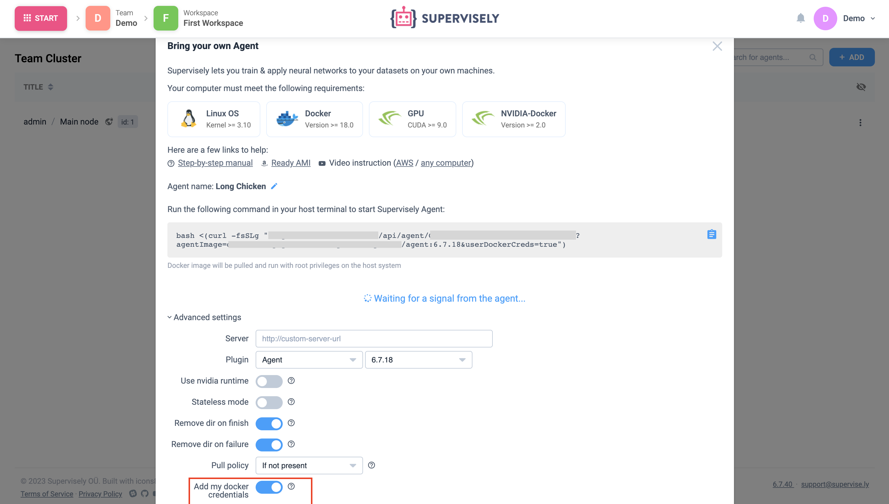

# Add docker registry

If you want to run Docker images from your own registry, for example, to develop and run private applications, you can use the following methods:

#### Local docker images

Put your Docker image on the computer where the agent is running. When the application starts, agent will find this image and run it.

#### User account settings

This method is better for you if you want only specific users to have access to Docker registry credentials.


This method requires instance version \`6.7.41\` or higher


Open "Account Settings" -> "Registries" -> click the "Add" button. Fill in the form and click "Add registry".


In order for agent to have access to the registry from your account, go to the "Team Cluster" page -> open agent "Instructions" -> click "Advanced settings" and enable "Add my Docker credentials" setting.&#x20;



Next, redeploy your agent to apply changes. Сopy the command and run it on the server where this agent is running.


You must be the agent owner that it had access to your registries list.


#### Supervisley configuration

This method will allow any agent on your instance to connect to your docker registry (this will require the agent to be redeployed)

1. Connect to the server where Supervisely instance is running. Open `.env` file in Supervisely folder and add your registry credentials to the following fields with a comma separation:

```
DOCKER_REGISTRY=docker.enterprise.supervise.ly,<your-registry-url>
DOCKER_LOGIN=sly...,<your-registry-login>
DOCKER_PASSWORD=va7f...,<your-registry-password>
AGENT_DOCKER_REGISTRY=docker.enterprise.supervise.ly,<your-registry-url>
AGENT_DOCKER_LOGINsly...,<your-registry-login>
AGENT_DOCKER_PASSWORD=va7f...,<your-registry-password>
```

2. Restart your instance

```
sudo supervisely up -d
```

3. Redeploy your agents to apply changes. To do this go to the "Team Cluster" page -> open agent "Instructions" -> Copy the command and run it on the server where this agent is running.
