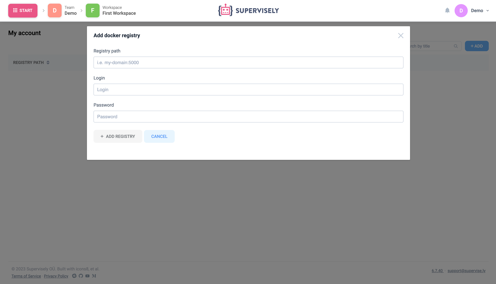

If you want to add your own Docker registry, for example, to develop and run private applications, you can use the following methods:

### Local docker image
Put Docker image on the computer where the agent is running. When the application starts, agent will find this image and run it.


### User account settings
This method is better for you if you want only specific users to have access to Docker registry credentials.


Open "Account Settings" -> "Registers" -> click the "Add" button. Fill the form and click "Add registry".
  
  

  
  
In order for agent to have access to the registry from your account, go to the "Team Cluster" page -> open agent "Instructions" -> click "Advanced settings" and enable "Add my Docker credentials" setting. Next, copy the command and run it on the server where the agent is running.
  
  

  
  
 You must be the owner of the agent that it had access to your registers list. 


### Supervisley configuration 
1. Open `.env` file in Supervisely folder and add your registry credentials to the following fields with a comma separation:
```
DOCKER_REGISTRY
DOCKER_LOGIN
DOCKER_PASSWORD
AGENT_DOCKER_REGISTRY
AGENT_DOCKER_LOGIN
AGENT_DOCKER_PASSWORD
```

2. Restart your instance
```
sudo supervisely up -d
```
3. Go to the "Team Cluster" page -> open agent "Instructions" -> Copy the command and run it on the server where the agent is running.
