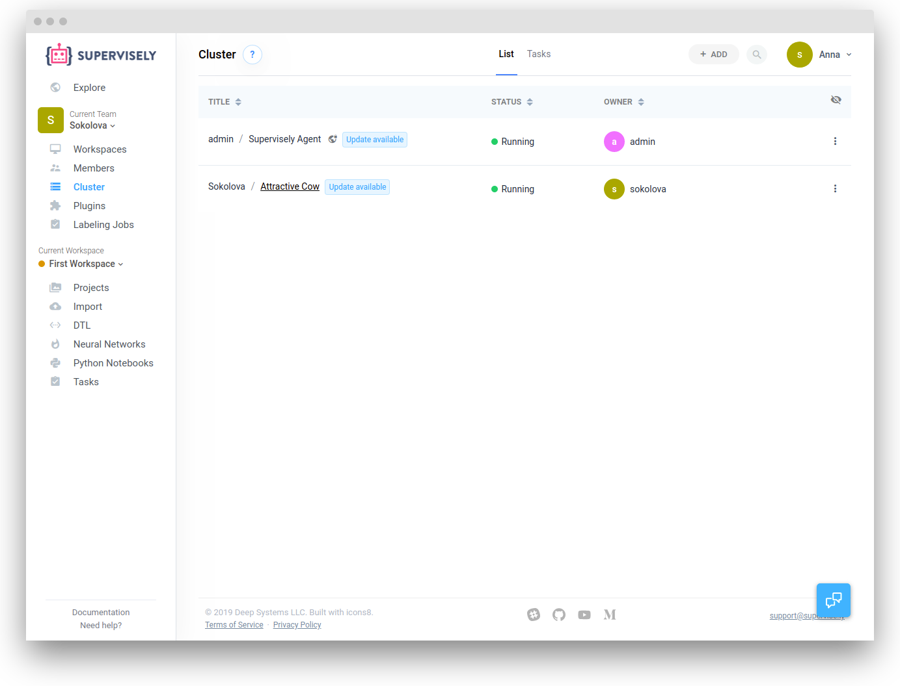

Now you should see your node in the dashboard with the status "Running". It means that you can run tasks on that agent. You can click on the node name (generated automatically) to see the hardware info, "htop" and "nvidia-smi" (if available) commands output and other system information for node's health monitoring.

## Open the node dashboard

Go to the "Cluster" page. Click on the name of the relevant node.

## Node dashboard

1. General information

2. Local Agent storage information

3. NVidia-smi

4. htop

All information refreshes automatically every few seconds.

## Manage local Agent storage


Clean your data carefully. It is especially crucial for the NN weights. Before removing the NN weights from the folder check that all important models were uploaded to Supervisely Server. 

	
User can clean cached images, stored NN weights and temporary task directory. Agent storage shows actual information about used space.

To clean some of the directories just choose the action you want. 

