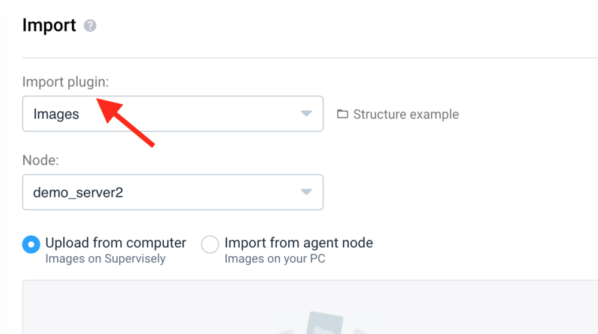
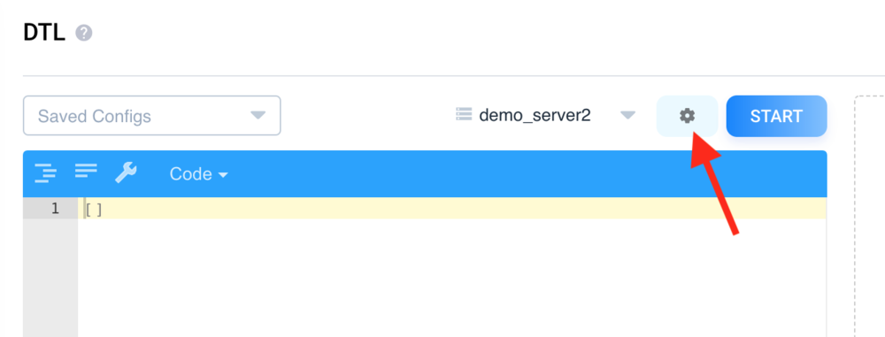
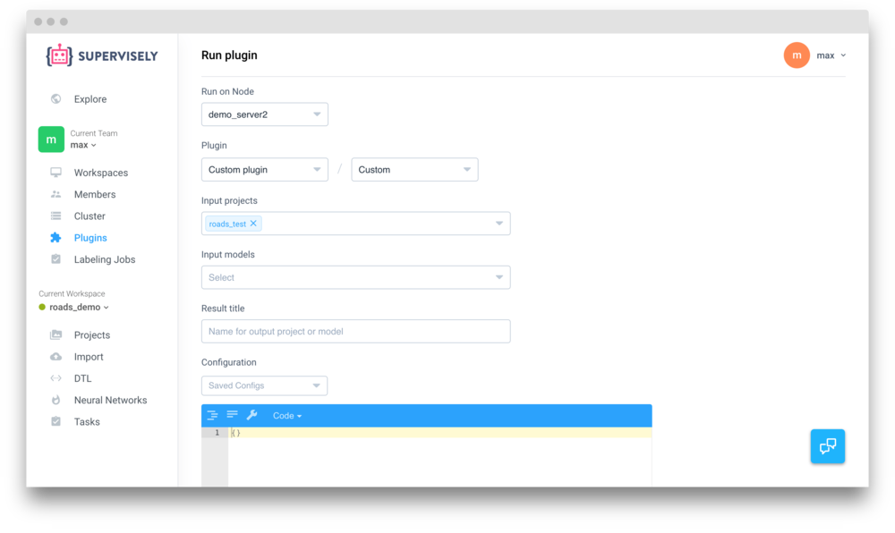
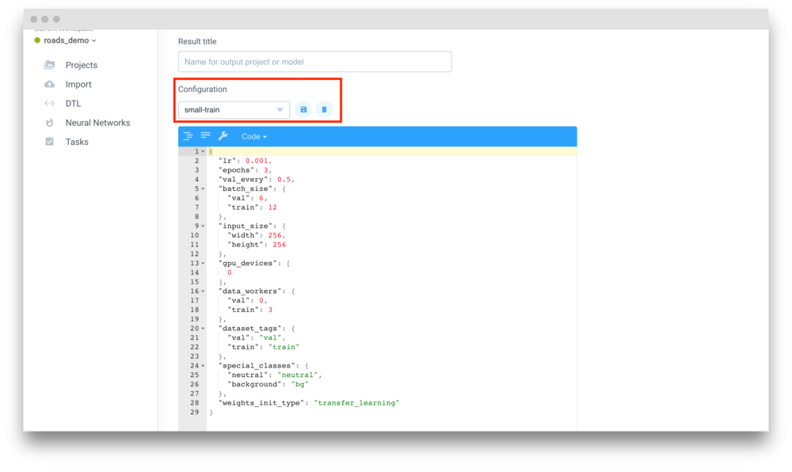

We want to make the customization of Supervisely as easy as possible. That's why we isolate every complex tool like DTL or Neural networks in form of attachable extensions called plugins.

## What is a plugin?

A Plugin is a set of docker images that can be executed on the [node](../agents/overview.md) using the agent from the web interface. Usually a plugin has just one docker image to perform it's operation, but some (like Neural Network Architecture) can have more than one image (for example, one for training and another one for inference): 

The following types of plugins are supported:

- Import: converts images and annotations from custom format to Supervisely
- DTL: defines a set of transformations for input projects
- NN Architecture: implements a neural network with all necessary libraries like Tensorflow
- Agent: custom version of the agent to run custom pipelines
- Custom: anything else you may implement to perform certain operations on projects or models, like calculate statistics

Supervisely already comes with a set of plugins available. When you setup a new team, it already has all the necessary plugins, for example "Images" plugin to import a bunch of folders as datasets.

Other plugins can be added to your team from the Explore page. This usually includes less necessary plugins, like "Kitti" import plugin to parse [KITTI Dataset](http://www.cvlibs.net/datasets/kitti/).

You can also add your very own plugins on the Cluster page. Please refer to [SDK](../../customization/sdk/README.md) section to learn how to create docker images that implement custom functionality. You can also share your plugin to another team using "Clone to" option.

## How to run Plugins?

There are a few places from where you can run a plugin.

### Import

When you [upload](../../data-organization/import-export.md) your data, you will see the plugin selector as a first field. After the agent will have your input data locally, it will run docker image associated with the selected plugin, wait till it processes your files (for example, converts them) and then save them as datasets and images.

### DTL

If you have more than one DTL plugin, you will see "Options" icon next to the "Start" button that will let you select your custom plugin.

### Custom

You can run your own custom plugins from the Plugins page. Scroll to the bottom and click "Run custom plugin" button. Select your plugin, input projects and models and click "Run". Selected agent will download input projects and models and execute docker image associated with your plugin. Downloaded items will be shared to docker container as a read-only volumes.  

### NN Architecture

Please refer to the [Neural Networks](../../neural-networks/overview/overview.md) section to learn how to train and apply neural networks. 

## Configurations

Plugin can also have a set of pre-defined JSON configurations that shows up when you launch the plugin. That configuration will be provided to a docker container as a JSON file.

It is very useful to customize plugin behaviour in such cases like training or inference (to `batch size` or number of epochs), but other plugins can also use configuration. For example "Video" import plugin uses config to control what frames it should skip. 
 
You can also save your current configuration directly from the DTL / Import / Run plugin page by selecting "New config..." in the configuration selector.  
 

