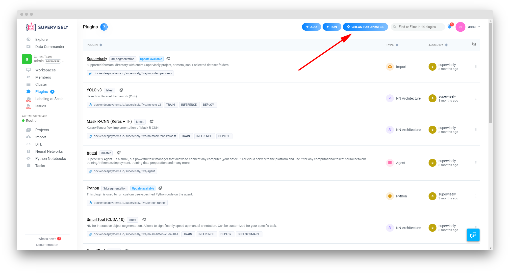
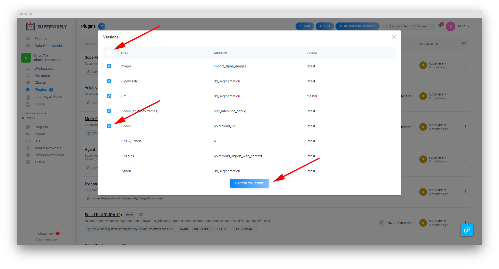
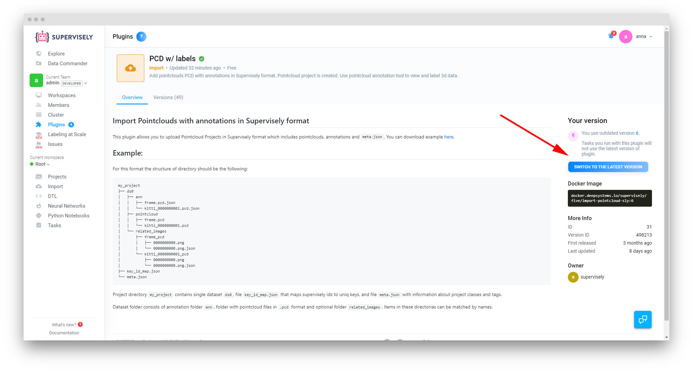
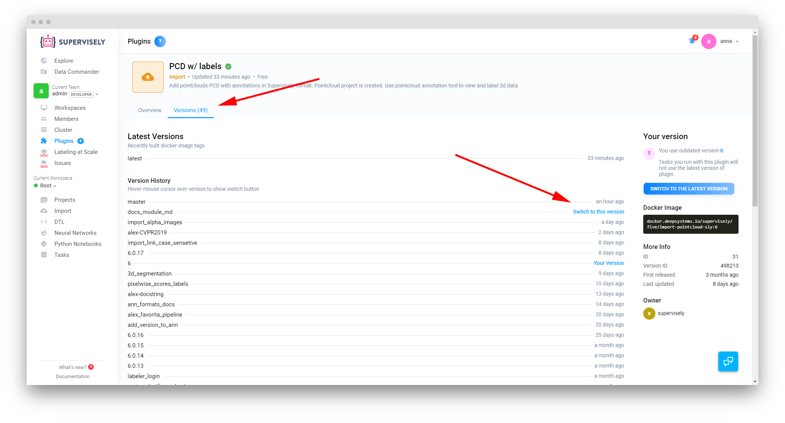
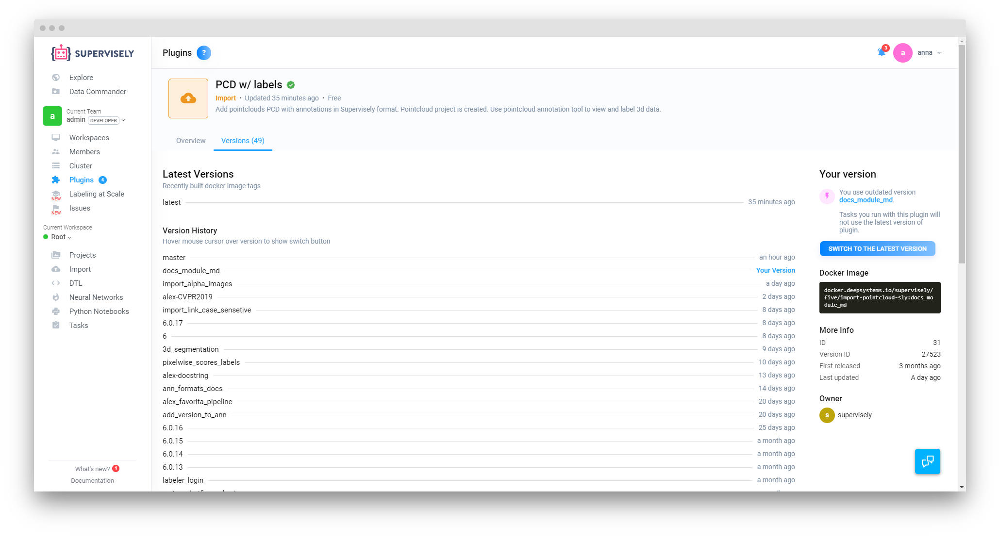

## Plugin Updates and Versioning

Supervisely plugins are complex tools, often deeply integrated and dependent on each other to function properly. That is often why your plugins need to be reguraly updated, as even a smmaler change or a new fuctionality added to even one element of the platform can require a series of consequent changes needed to be implenented in sometimes seemingly disconnected parts of the platfom. 

The great things about this is that the update process is very easy and that all of the earlier plugin versions are preserved inside the platform.

Please note that plugin lists and their respective versions are distinctive for every individual team inside Supervisely.

### Plugin Updates

There are 2 ways to update your plugins inside Supervisely:

**Updating all available plugins**

1. Go to the **Plugins** page and press *Check for updates*

2. Select either all or a few individual plugins you wish to update and press *Update to Latest*. Success!

**Updating individual plugins**

If you already know which plugin you want to update, you can simply navigate to the relevant from the Plugins list by clicking on the plugin name. Once there, simply click on the *Switch to the latest version* in the right column and you're done. 

### Plugin Versions

As we've mentioned earlier, all outdated plugin versions are preserved inside the platform and can be easily accessed at any moment from the main plugin page. 

To do that, navigate to the Versions tab under the plugin title card and click on the version you want to switch to.

Once you've done that, the page will refresh and the version you clicked on will be displayed as selected. There's no limit on how many times you can do that or from which to which version you're switching.

