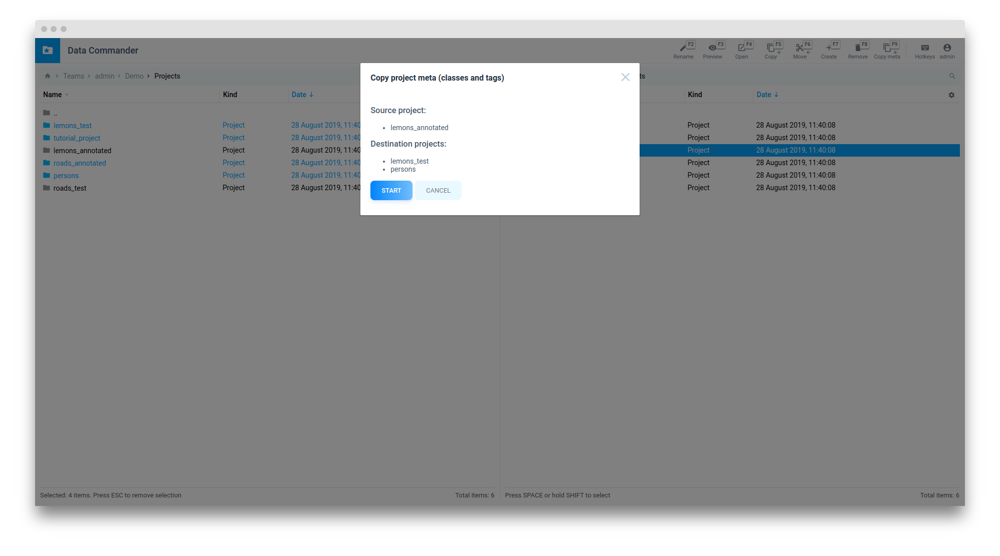

# Clone Project Meta

If you need to copy project meta (classes & tags) to other project this section will be useful for you

## Open projects panels

Go to Data Commander and open projects in both panels

## Select projects

Select one or more destination projects

Then switch to second panel and focus source project

## Copy meta

Click "Copy meta" button or press F9

If destination project already have classes or tags it will be skipped

