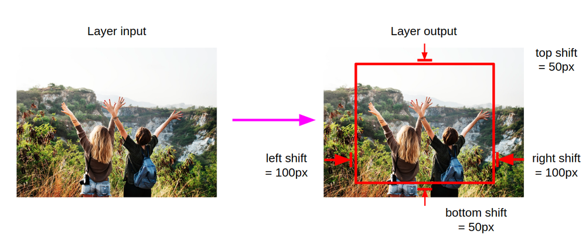
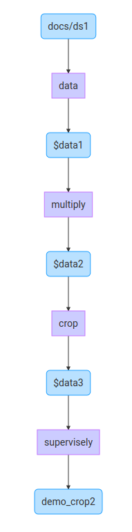
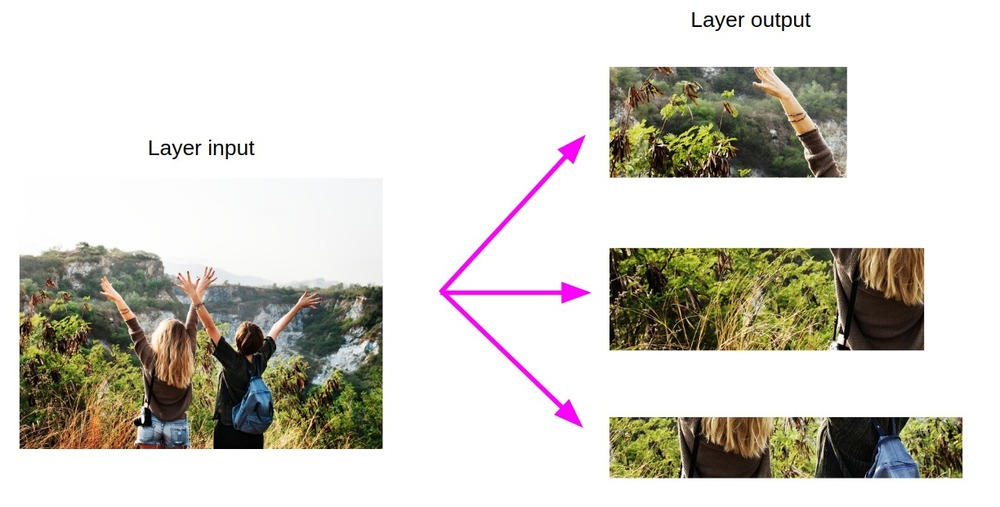

This layer (`crop`) is used to crop part of image with its annotations. This layer has several modes: it may crop fixed [given part of image](#crop-specific-part-of-image) or [random one](#crop-random-part-of-image).


## Crop specific part of image

```json
{
  "action": "crop",
  "src": ["$data1"],
  "dst": "$data2",
  "settings": {
    "sides": {
      "top":"30%",
      "left":"100px",
      "right":"100px",
      "bottom":"0px"
    }
  }
}
```

### Settings

`sides` fields define how many pixels or percents will be cropped from each image side. Values in pixels are defined with `px` suffix, and percents are defined with `%` suffix.

### Example

```json
{
  "action": "crop",
  "src": ["$data1"],
  "dst": "$data2",
  "settings": {
    "sides": {
      "left":"100px",
      "top":"50px",
      "right":"100px",
      "bottom":"50px"
    }
  }
}
```

To better understand what the field `sides` mean let me show you an image.



Here is the full export config for this example:
```json
[
  {
    "dst": "$data1",
    "src": [
      "docs/ds1"
    ],
    "action": "data",
    "settings": {
      "classes_mapping": "default"
    }
  },
  {
    "dst": "$data2",
    "src": [
      "$data1"
    ],
    "action": "crop",
    "settings": {
      "sides": {
        "top": "50px",
        "left": "100px",
        "right": "100px",
        "bottom": "50px"
      }
    }
  },
  {
    "dst": "demo_crop_sides",
    "src": [
      "$data2"
    ],
    "action": "supervisely",
    "settings": {}
  }
]
```


## Crop random part of image


```json
{
  "action": "crop",
  "src": ["$data1"],
  "dst": "$data2",
  "settings": {
    "random_part": {
      "height":{
        "min_percent":10,
        "max_percent":40
      },
      "width":{
        "min_percent":30,
        "max_percent":80
      },
      "keep_aspect_ratio": false
    }
  }
}
```

### Settings

- `height`
    - `min_percent` — minimum height of resulting crop (in percent wrt to image height)
    - `max_percent` — maximum height of resulting crop (in percent wrt to image height)
- `width`
    - `min_percent` — minimum width of resulting crop (in percent wrt to image width)
    - `max_percent` — maximum width of resulting crop (in percent wrt to image width)
- `keep_aspect_ratio` — should resulting random crop have the same aspect ratio as a source image

### Example

Let's consider following example: get all images from `myproj/ds1`, duplicate each image three times, apply random crop to each image and then save the results to project `demo_crop`.

```json
[
  {
    "dst": "$data1",
    "src": [
      "myproj/ds1"
    ],
    "action": "data",
    "settings": {
      "classes_mapping": "default"
    }
  },
  {
    "dst": "$data2",
    "src": [
      "$data1"
    ],
    "action": "multiply",
    "settings": {
      "multiply": 3
    }
  },
  {
    "dst": "$data3",
    "src": [
      "$data2"
    ],
    "action": "crop",
    "settings": {
      "random_part": {
        "width": {
          "max_percent": 80,
          "min_percent": 30
        },
        "height": {
          "max_percent": 40,
          "min_percent": 10
        },
        "keep_aspect_ratio": false
      }
    }
  },
  {
    "dst": "demo_crop",
    "src": [
      "$data3"
    ],
    "action": "supervisely",
    "settings": {}
  }
]
```
Here is the visualization of computational graph:



Here are the results of export for this example:


