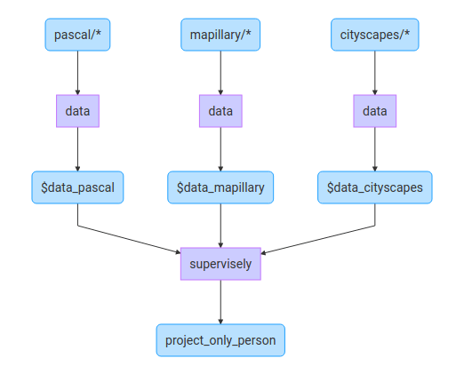

Data layer (`data`) is used to specify project and its datasets that will participate in data transformation process. Let's take a look at the example below:

```json
{
    "action": "data",
    "src": ["my_proj/*"],
    "dst": "$data",
    "settings": {
      "classes_mapping": "default"
    }
}
```

It means that we will get all data (images + annotations) from project `my_proj` from all its datasets (because of `*` symbol in `"src": ["my_proj/*"]`). We will name this data as variable `$data` (because of `"dst": "$data"`). And we perform default classes mapping (because of `"classes_mapping": "default"`) — will keep all annotated objects and their classes without any changes.

Let's consider all typical usages of this layer.

## Use case: custom class mapping

```json
{
    "action": "data",
    "src": ["pascal/*"],
    "dst": "$data",
    "settings": {
      "classes_mapping": {
        "person":"__default__",
        "car": "vehicle",
        "bus": "vehicle",
        "__other__":"__ignore__"
      }
    }
}
```

Let's take a look at class mapping in this examples.

`"person":"__default__"` means that we will keep all objects of class "person" as is.

`"car": "vehicle"` means that for all objects of class "car" we will rename class to "vehicle".

`"bus": "vehicle"` means that for all objects of class "bus" we will rename class to "vehicle".

This means that all objects of class "car" and "bus" from original project after this layer will have the same class "vehicle". Note that the source classes must have one shape (e.g., "bitmap" and "bitmap").


`"__other__":"__ignore__"` means that objects of all other classes (that are not in ["person", "car", "bus"]) will be ignored. In other words, when data (image + annotation) will pass through this layer, objects of other classes (that are not in ["person", "car", "bus"]) will be deleted from annotations. For example, we also can map other classes to one class with: `"__other__":"my_super_class"`


Why do we need this? Because there are a lot of cases, when you are going to work only with objects of certain classes and objects of other classes should be removed. Also it is very convenient when you are going to merge objects of few classes into one.

## Use case: read data from several projects

JSON config:
```json
[
    {
      "action": "data",
      "src": ["pascal/*"],
      "dst": "$data_pascal",
      "settings": {
        "classes_mapping": {
          "person":"__default__",
          "__other__":"__ignore__"
        }
      }
    },
    {
        "action": "data",
        "src": ["mapillary/*"],
        "dst": "$data_mapillary",
        "settings": {
          "classes_mapping": {
            "Person":"person",
            "__other__":"__ignore__"
          }
        }
    },
    {
        "action": "data",
        "src": ["cityscapes/*"],
        "dst": "$data_cityscapes",
        "settings": {
          "classes_mapping": {
            "person":"__default__",
            "__other__":"__ignore__"
          }
        }
    },
    {
        "action": "supervisely",
        "src": ["$data_pascal", "$data_mapillary", "$data_cityscapes"],
        "dst": "project_only_person",
        "settings": {}
    }
]
```

Computational graph:



This case demonstrates how we easily read data from projects "pascal", "mapillary" and "cityscapes", drop all objects except class "person", and put all this data to new project called "project_only_person".

This is practical, because data scientists merge different public datasets with private data and work with objects of specific classes while researching.
