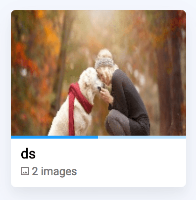

This layer (`dataset`) places every image that it sees to dataset with a specified name.

Put name of the future dataset in the field `name`.

```json
{
  "action": "dataset",
  "src": ["$input" ],
  "dst": "$output",
  "settings": {
    "name": "new_dataset_name"
  }
}
```

## Special case: preserve original dataset names

```json
{
  "action": "dataset",
  "src": ["$input" ],
  "dst": "$output",
  "settings": {
    "rule": "save_original"
  }
}
```

If `"rule": "save_original"` passed instead of `name` then each image will be stored in dataset named like original dataset in source project for the image.


## Example

In this example we will put images that have tag `"good"` to separate dataset `good` and keep other images in default dataset (named like "SourceProject__SourceDataset").




```json
[
  {
    "dst": "$data",
    "src": [
      "example/*"
    ],
    "action": "data",
    "settings": {
      "classes_mapping": "default"
    }
  },
  {
    "action": "if",
    "src": ["$data" ],
    "dst": [
      "$good",
      "$bad"
    ],
    "settings": {
      "condition": {
        "tags": ["good"]
      }
    }
  },
  {
    "action": "dataset",
    "src": ["$good" ],
    "dst": "$good_ds",
    "settings": {
      "name": "good"
    }
  },
  {
    "dst": "example_dataset",
    "src": [
      "$good_ds",
      "$bad"
    ],
    "action": "supervisely",
    "settings": {}
  }
]
```

