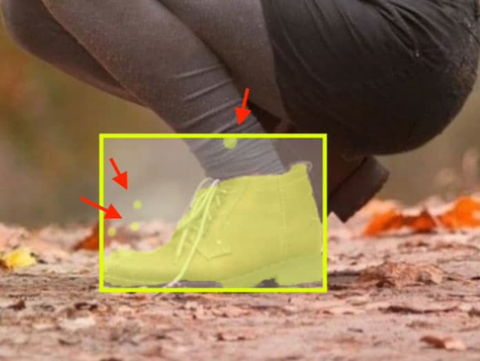
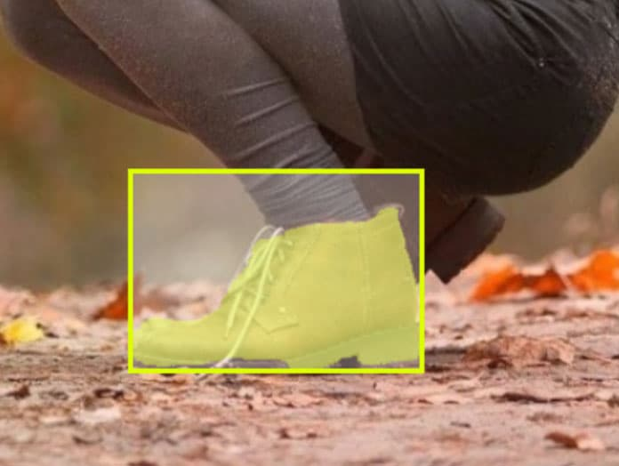

This layer (`drop_noise`) removes connected components smaller than the specified size from bitmap annotations. This can be useful to eliminate noise after running neural network.

## Settings
- `classes` (type: array of strings)
- `min_area` (type: string)
- `src_type` (type: enum ["image", "bbox"])

Minimum area (`min_area`) for pixel group to be removed can be provided in pixels (ex. `10px`) or in percentage (`1%`).

If `min_area` is in percentage, area of pixel group to delete can be calculated based on total resoultion of image (`src_type` = `image`) or based on area of bounding box of annotation (`src_type` = `bbox`).

Only annotations of classes from array `classes` would be processed. Those classes should have shape `bitmap`.

```json
{
  "action": "drop_noise",
  "src": ["$input" ],
  "dst": "$output",
  "settings": {
    "classes": ["noise"],
    "min_area": "2%",
    "src_type": "bbox"
  }
}
```

## Example

In this example we will remove noise from annotations of class `shoes` (bitmap) less than `20px` in size.





```json
[
  {
    "dst": "$data",
    "src": [
      "example/*"
    ],
    "action": "data",
    "settings": {
      "classes_mapping": "default"
    }
  },
  {
    "action": "drop_noise",
    "src": ["$data"],
    "dst": "$output",
    "settings": {
      "classes": ["shoes"],
      "min_area": "20px",
      "src_type": "image"
    }
  },
  {
    "dst": "example_drop_noise",
    "src": [
      "$output"
    ],
    "action": "supervisely",
    "settings": {}
  }
]
```
