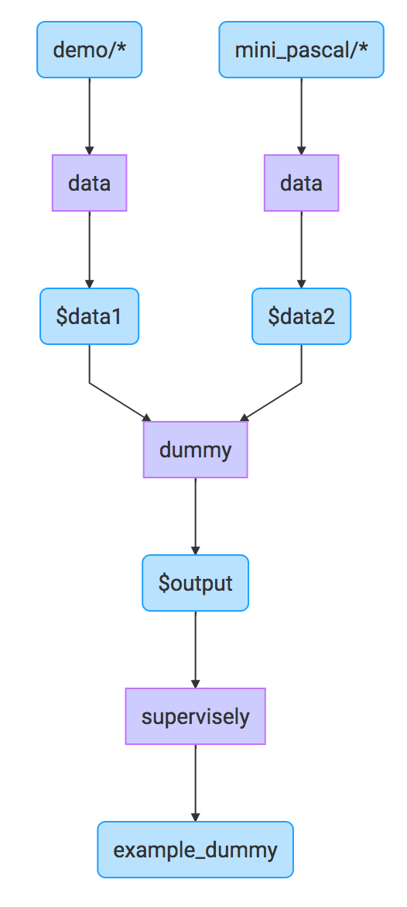

This layer (`dummy`) does nothing. Literally.

Dummy layer can be useful when you have many destinations of other layers you want to merge into one.

```json
{
  "action": "dummy",
  "src": ["$input" ],
  "dst": "$output",
  "settings": {}
}
```

## Example

Merge together two projects with different class mapping and save it as a new project.

```json
[
  {
    "dst": "$data1",
    "src": [
      "demo/*"
    ],
    "action": "data",
    "settings": {
      "classes_mapping": "default"
    }
  },
  {
    "dst": "$data2",
    "src": [
      "mini_pascal/*"
    ],
    "action": "data",
    "settings": {
      "classes_mapping": {
        "dog": "dog",
        "__other__": "__ignore__"
      }
    }
  },
  {
    "action": "dummy",
    "src": ["$data1", "$data2" ],
    "dst": "$output",
    "settings": {
      "classes": ["human"]
    }
  },
  {
    "dst": "example_dummy",
    "src": [
      "$output"
    ],
    "action": "supervisely",
    "settings": {}
  }
]
```


