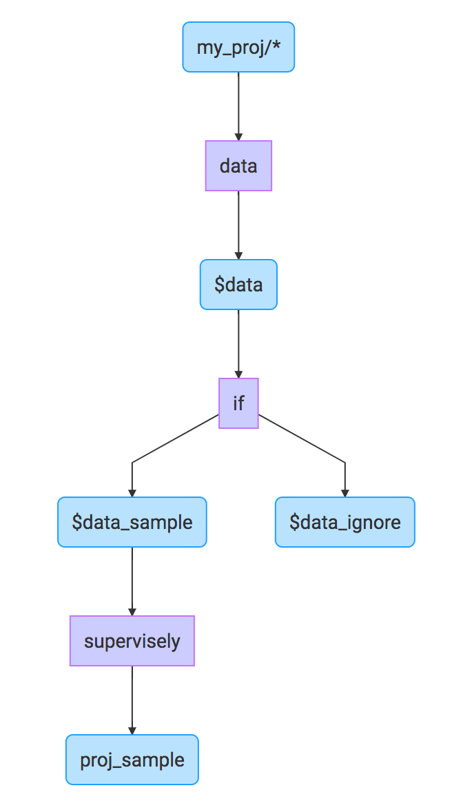
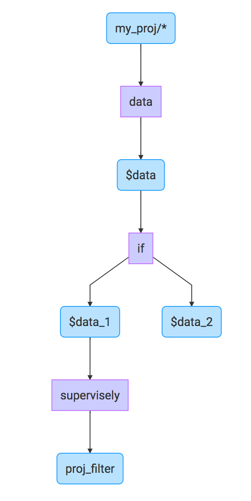

"if" layer (`if`) is used to split input data to several flows with a specified criterion. Lets consider all possible use cases.

## Use case: split with probability

```json
{
  "action": "if",
  "src": ["$data_input" ],
  "dst": [
    "$data_1",
    "$data_2"
  ],
  "settings": {
    "condition": {
      "probability": 0.95
    }
  }
}
```

In this case input data (image + annotation) will go to the "left" branch (`$data_1` varibable) with probability 95%, to the "right" branch (`$data_2` varibable) with probability 5%.

It can be used in several scenarios.

### Split data to train and val subsets

First scenario is when we are going to split data into train and validation sets by adding corresponding tag to each image.

```json
[
  {
    "action": "data",
    "src": ["my_proj/*"],
    "dst": "$data",
    "settings": {
      "classes_mapping": "default"
    }
  },
  {
    "action": "if",
    "src": ["$data"],
    "dst": [
      "$totrain",
      "$toval"
    ],
    "settings": {
      "condition": {
        "probability": 0.95
      }
    }
  },
  {
    "action": "tag",
    "src": ["$totrain"],
    "dst": "$train",
    "settings": {
      "tag": "train",
      "action": "add"
    }
  },
  {
    "action": "tag",
    "src": ["$toval"],
    "dst": "$val",
    "settings": {
      "tag": "val",
      "action": "add"
    }
  },
  {
    "action": "supervisely",
    "src": [
      "$train",
      "$val"
    ],
    "dst": "proj_with_tags",
    "settings": {}
  }
]
```

Computational graph:


### Get sample from data

Second scenario is when we are going to get small data sample:


```json
[
  {
    "action": "data",
    "src": ["my_proj/*"],
    "dst": "$data",
    "settings": {
      "classes_mapping": "default"
    }
  },
  {
    "action": "if",
    "src": ["$data"],
    "dst": [
      "$data_sample",
      "$data_ignore"
    ],
    "settings": {
      "condition": {
        "probability": 0.01
      }
    }
  },
  {
    "action": "supervisely",
    "src": ["$data_sample"],
    "dst": "proj_sample",
    "settings": {}
  }
]
```

Computational graph:




We just get 1 persent of data and put it to project `proj_sample`. Other data will be skipped.


## Use case: split data by objects count

This case allows us to split data by objects count (`min_objects_count` value). In the example below, images with equal or more that three objects will be passed to `$data_1` branch, other images — to the `$data_2` branch

```json
{
  "action": "if",
  "src": ["$data_input" ],
  "dst": [
    "$data_1",
    "$data_2"
  ],
  "settings": {
    "condition": {
      "min_objects_count": 3
    }
  }
}
```

Example of full config:

```json
[
  {
    "action": "data",
    "src": ["my_proj/*"],
    "dst": "$data",
    "settings": {
      "classes_mapping": "default"
    }
  },
  {
    "action": "if",
    "src": ["$data" ],
    "dst": [
      "$data_1",
      "$data_2"
    ],
    "settings": {
      "condition": {
        "min_objects_count": 3
      }
    }
  },
  {
    "action": "supervisely",
    "src": ["$data_1"],
    "dst": "proj_filter",
    "settings": {}
  }
]
```


Computational graph:



In this example we put images with `"min_objects_count": 3` to `proj_filter`. Other images are ignored.


## Use case: split by image height or width

For example, we are going to filter images by minimum image height (200 pixels):

```json
{
  "action": "if",
  "src": ["$data_input" ],
  "dst": [
    "$data_1",
    "$data_2"
  ],
  "settings": {
    "condition": {
      "min_height": 200
    }
  }
}
```

The same can be applied to minimum width:


```json
{
  "action": "if",
  "src": ["$data_input" ],
  "dst": [
    "$data_1",
    "$data_2"
  ],
  "settings": {
    "condition": {
      "min_width": 200
    }
  }
}
```

This case is useful when we are going to skip some small images after applying "instance crop" layer.

## Use case: split by tags

This example passes images with tag "party" or "dinner" to the `$data_1` branch, other images are passed to `$data_2` branch.

```json
{
  "action": "if",
  "src": ["$data_input" ],
  "dst": [
    "$data_1",
    "$data_2"
  ],
  "settings": {
    "condition": {
      "tags": ["party", "dinner"]
    }
  }
}
```

## Use case: split by class presence

In this example images which contain any object of some required class (`person` or `dog`) are passed to the `$data_1` branch.

```json
{
  "action": "if",
  "src": ["$data_input" ],
  "dst": [
    "$data_1",
    "$data_2"
  ],
  "settings": {
    "condition": {
      "include_classes": ["person", "dog"]
    }
  }
}
```


## Use case: split by images names in range, and step

Names is ordered alphabetical (a, b ,c ...).
```json
{
  "action": "if",
  "src": ["$data_input" ],
  "dst": [
    "$data_1",
    "$data_2"
  ],
  "settings": {
   "condition": {
        "name_in_range": ["a0100", "a0105"],
        "frame_step": 2
   }
  }
}
```

Should pass images with names ["00100", "00102", "00104"] into first branch (`$data1`) and else into (`$data2`) branch.

<!---

#### Settings
- :white_square_button:&nbsp;`settings` (type: object)

	- `condition` (choice_0, choice_1, choice_2, choice_3, choice_4, choice_5, choice_6, choice_7, choice_8)

		- choice_0 (type: object)


			_True if random value < `probability`_

			- :white_square_button:&nbsp;`probability` (type: number, minimum: 0, maximum: 1)

		- choice_1 (type: object)


			_True if image's name matches any regex string from `regex_names`_

			- :white_square_button:&nbsp;`regex_names` (type: array)

				- items (type: string)

		- choice_2 (type: object)


			_True if image is one of the elements of `project_datasets`_

			- :white_square_button:&nbsp;`project_datasets` (type: array)

				- items (type: string)

		- choice_3 (type: object)


			_True if image's objects count is >= `min_objects_count`_

			- :white_square_button:&nbsp;`min_objects_count` (type: integer, minimum: 0)

		- choice_4 (type: object)


			_True if image has any object with class from `include_classes`_

			- :white_square_button:&nbsp;`include_classes` (type: array)

				- items (type: string)

		- choice_5 (type: object)


			_True if image has a tag that is one of the elements of `tags`_

			- :white_square_button:&nbsp;`tags` (type: array)

				- items (type: string)

		- choice_6 (type: object)

			- :white_square_button:&nbsp;`min_height` (type: integer)

		- choice_7 (type: object)

			- :white_square_button:&nbsp;`min_width` (type: integer)

		- choice_8 (type: object)

			- :white_square_button:&nbsp;`min_area` (type: integer)


#### Description and examples
This layer allows to separate data by if statement.

`dst` field in layer config should be a list of 2 strings. First for images where statement is true and second for images where statement is false. Every string could be `null` so that corresponding images are not passed further.


Randomly split images. 80% of images from `$sample` will pass to `$sample_train` and 20% will pass to `$sample_val` and `$sample_val_copy`:
```
{
  "action": "if",
  "src": ["$sample"],
  "dst": ["$sample_train", "$sample_val"],
  "settings": {
    "condition": {
      "probability": 0.8
    }
  }
}
```

_________

Filter images with unwanted names. Images starting with `0002` or having `stacked_` as a substring won't pass to `$sample2`:
```
{
  "action": "if",
  "src": ["$sample1"],
  "dst": ["null", "$sample2"],
  "settings": {
    "condition": {
      "regex_names": ["^0002", "stacked_"]
    }
  }
}
```

_________

Project/dataset split example. Only images from `project1/dataset2` or `project2` will pass to `$sample2`:
```
{
  "action": "if",
  "src": ["$sample1"],
  "dst": ["$sample2", "null"],
  "settings": {
    "condition": {
      "project_datasets": ["project1/dataset2", "project2/*"]
    }
  }
}
```

_________

Split images by number of objects in images. Images having >= 2 objects will pass to `$sample_with_>=2_objects`, images will less than 2 objects will pass to `$sample_with_<2_objects`.
```
{
  "action": "if",
  "src": ["$sample"],
  "dst": ["$sample_with_>=2_objects", "$sample_with_<2_objects"],
  "settings": {
    "condition": {
      "min_objects_count": 2
    }
  }
}
```

_________

Include classes split example 1. Only images containing `car` or `person` objects will pass to `$sample_car_or_person`:
```
{
  "action": "if",
  "src": ["$sample"],
  "dst": ["$sample_car_or_person", "null"],
  "settings": {
    "condition": {
      "include_classes": ["car", "person"]
    }
  }
}
```

_________

Include classes split example 2. Get all 4 combinations of images of having or not having `car` or `person` classes:
```
{
  "action": "if",
  "src": ["$sample"],
  "dst": ["$sample_car", "$sample_no_car"],
  "settings": {
    "condition": {
      "include_classes": ["car"]
    }
  }
},
{
  "action": "if",
  "src": ["$sample_car"],
  "dst": ["$sample_car_and_person", "$sample_car_and_no_person"],
  "settings": {
    "condition": {
      "include_classes": ["person"]
    }
  }
},
{
  "action": "if",
  "src": ["$sample_no_car"],
  "dst": ["$sample_no_car_and_person", "$sample_no_car_and_no_person"],
  "settings": {
    "condition": {
      "include_classes": ["person"]
    }
  }
}
```

_________

Tags split example. Images that have `siamese` or `maine_coon` tags will pass to `$animal_cat`, other will pass to `$animal_dog`:
```
{
  "action": "if",
  "src": ["$animal"],
  "dst": ["$animal_cat", "$animal_dog"],
  "settings": {
    "condition": {
      "tags": ["siamese", "maine_coon"]
    }
  }
}
```
-->
