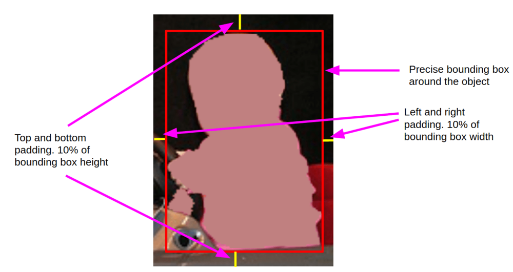
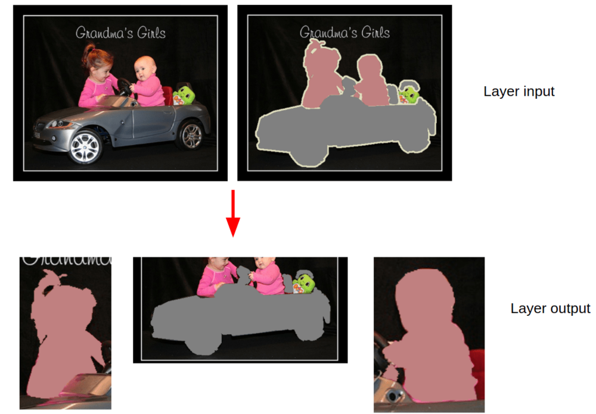

This layer (`instances_crop`) crops objects of specified classes from image with configurable padding. So from one image there can be produced multiple images, each with one target object: other objects are removed from crop.

```json
{
  "action": "instances_crop",
  "src": [
    "$sample"
  ],
  "dst": "$sample1",
  "settings": {
    "classes": [
      "car",
      "person"
    ],
    "pad": {
      "sides": {
        "top": "10%",
        "left": "10%",
        "right": "10%",
        "bottom": "10%"
      }
    }
  }
}
```

## Settings

- `classes` — list of classes to crop. It means that all objects of such classes will be cropped from image.

- `pad`

    - `top` — how many will be padded from the top of precise bounding box around object. May be defined in pixels (e.g. "15px") or in percent of bounding box height (e.g. "10%").

    - `left` — how many will be padded from the left of precise bounding box around object. May be defined in pixels (e.g. "15px") or in percent of bounding box height (e.g. "10%").

    - `right` — how many will be padded from the right of precise bounding box around object. May be defined in pixels (e.g. "15px") or in percent of bounding box height (e.g. "10%").

    - `bottom` — how many will be padded from the bottom of precise bounding box around object. May be defined in pixels (e.g. "15px") or in percent of bounding box height (e.g. "10%").

Here is the graphical description of fields:



Result of applying the layer from the example above:



As we can see, "cat" and "person" objects are cropped separetely. This layer from one input image produced three images with one target object. Other objects are dropped from the resulting images.

## Use case: crop all "person" instances from pascal

```json
[
  {
    "dst": "$sample",
    "src": [
      "pascal/*"
    ],
    "action": "data",
    "settings": {
      "classes_mapping": "default"
    }
  },
  {
    "dst": "$sample1",
    "src": [
      "$sample"
    ],
    "action": "instances_crop",
    "settings": {
      "pad": {
        "sides": {
          "top": "10%",
          "left": "10%",
          "right": "10%",
          "bottom": "10%"
        }
      },
      "classes": [
        "car",
        "person"
      ]
    }
  },
  {
    "dst": "pascal_person_crop",
    "src": [
      "$sample1"
    ],
    "action": "supervisely",
    "settings": {}
  }
]
```

## Special case: save some objects

If you want to save some other objects during instance cropping, there is an optional parameter:

- `save_classes` — list of classes to save while cropping. Lists of `classes` and `save_classes` cannot intersect.

Therefore, resulting images will contain single "target" object and some count of objects of `save_classes`.

```json
{
  "action": "instances_crop",
  "src": [
    "$sample"
  ],
  "dst": "$sample1",
  "settings": {
    "classes": [
      "car",
      "person"
    ],
    "save_classes": [
      "traffic_sign"
    ],
    "pad": {
      "sides": {
        "top": "10%",
        "left": "10%",
        "right": "10%",
        "bottom": "10%"
      }
    }
  }
}
```

