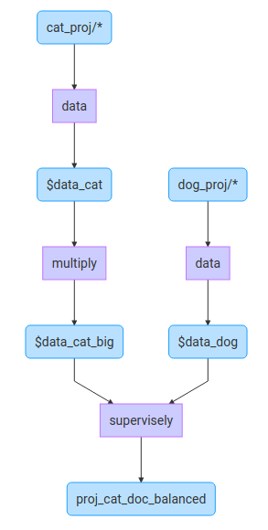

This layer (`multiply`) duplicates data (image + annotation).

Example:
```json
{
  "action": "multiply",
  "src": ["$sample1"],
  "dst": "$sample2",
  "settings": {
    "multiply": 3
  }
}
```

Results:


## Use case: training data balancing

This layer is useful when we are going to balance or unbalance data in training dataset.

For example, we have two projects: "cat_proj" with 200 images of cats and "dog_proj" with 600 images of dogs. And we are going to prepare training dataset for cat-dog classifier.

```json
[
  {
    "action": "data",
    "src": ["cat_proj/*"],
    "dst": "$data_cat",
    "settings": {
      "classes_mapping": "default"
    }
  },
  {
    "action": "data",
    "src": ["dog_proj/*"],
    "dst": "$data_dog",
    "settings": {
      "classes_mapping": "default"
    }
  },
  {
    "action": "multiply",
    "src": ["$data_cat"],
    "dst": "$data_cat_big",
    "settings": {
      "multiply": 3
    }
  },
  {
    "action": "supervisely",
    "dst": "proj_cat_doc_balanced",
    "src": ["$data_cat_big", "$data_dog"],
    "settings": {}
  }
]
```



As you can see from this computational graph, we just read data from both datasets and apply "multiply" layer to variable `$data_cat`. Produced variable `$data_cat_big` will contain 200 * 3 images. And then we save both `$data_cat_big` and `$data_dog` to project `proj_cat_doc_balanced`.
