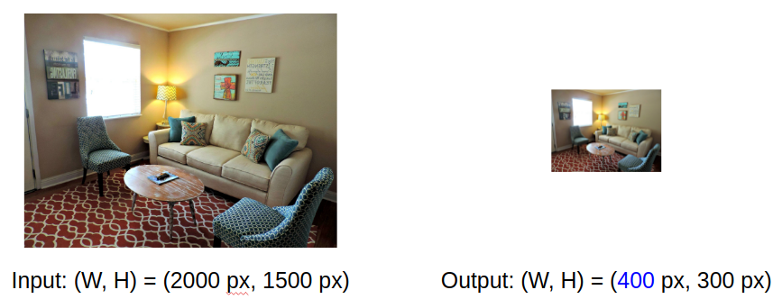
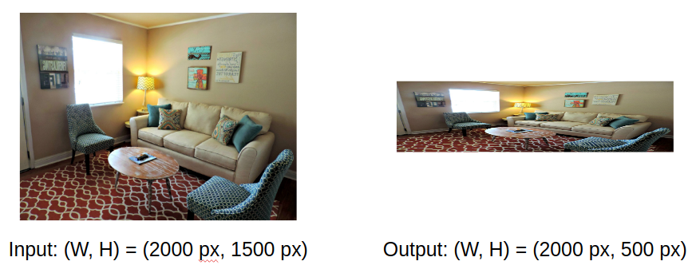

Resize layer (`resize`) resizes data (image + annotation) to the certain size.

```json
{
  "action": "resize",
  "src": ["$data1"],
  "dst": "$data2",
  "settings": {
    "width": 800,
    "height": 600,
    "aspect_ratio": {
      "keep": true
    }
  }
}
```

* "aspect_ratio": "keep" — flag (`true` or `false`). If `true` result should save original proportions.

* `width` — width in pixels or `-1`. If value is equal to `-1` and `"keep": true` then for specific `height` `width` will be automatically computed to keep aspect ratio. The case when value is equal to `-1` and `"keep": false` is not allowed.

* `height` — height in pixels or `-1`. If value is equal to `-1` and `"keep": true` then for specific `width` `height` will be automatically computed to keep aspect ratio. The case when value is equal to `-1` and `"keep": false` is not allowed.


## Use case: resize to specific width

```json
{
  "action": "resize",
  "src": ["$data1"],
  "dst": "$data2",
  "settings": {
    "width": 800,
    "height": -1,
    "aspect_ratio": {
      "keep": true
    }
  }
}
```

Result will be the following:


Height will be automatically computed and it is 600 px in this example.


## Use case: resize to specific height

```json
{
  "action": "resize",
  "src": ["$data1"],
  "dst": "$data2",
  "settings": {
    "width": 400,
    "height": 300,
    "aspect_ratio": {
      "keep": true
    }
  }
}
```

Result will be the following:



Width will be automatically computed and it is 400 px in this example.


## Use case: resize to specific width and height without keeping aspect ratio

```json
{
  "action": "resize",
  "src": ["$data1"],
  "dst": "$data2",
  "settings": {
    "width": 2000,
    "height": 500,
    "aspect_ratio": {
      "keep": false
    }
  }
}
```

Result will be the following:




## Use case: resize to specific width and height with keeping aspect ratio

```json
{
  "action": "resize",
  "src": ["$data1"],
  "dst": "$data2",
  "settings": {
    "width": 2000,
    "height": 500,
    "aspect_ratio": {
      "keep": true
    }
  }
}
```

Result will be the following:


As we can see, additional black padding is added to save both certain image size (width=2000 and height=500) and original proportions.
