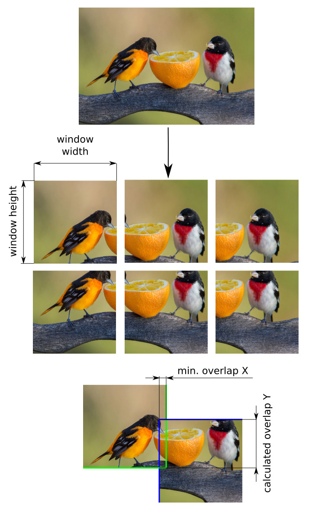

This layer (`sliding_window`) is used to crop part of image with its annotations by sliding of window from left to rigth, from top to bottom.

```json
{
  "action": "sliding_window",
  "src": ["$sample1"],
  "dst": "$sample2",
  "settings": {
    "window": {
      "width": 128,
      "height": 128
    },
    "min_overlap": {
      "x": 32,
      "y": 32
    }
  }
}
```

### Settings

- `window`
    - `width` — sliding window width
    - `height` — sliding window height
- `min_overlap`
    - `x` — sliding window overlap `x` (must be less than sliding window width, minimal `1`px) 
    - `y` — sliding window overlap `y` (must be less than sliding window height, minimal `1`px)


### Example




```json
[
  {
    "dst": "$sample_1",
    "src": [
      "Birds Small/*"
    ],
    "action": "data",
    "settings": {
      "classes_mapping": "default"
    }
  },
  {
    "dst": "$sample_2",
    "src": [
      "$sample_1"
    ],
    "action": "sliding_window",
    "settings": {
      "window": {
        "width": 192,
        "height": 192
      },
      "min_overlap": {
        "x": 32,
        "y": 32
      }
    }
  },
  {
    "dst": "Birds Small Cropped",
    "src": [
      "$sample_2"
    ],
    "action": "supervisely",
    "settings": {}
  }
]
```
