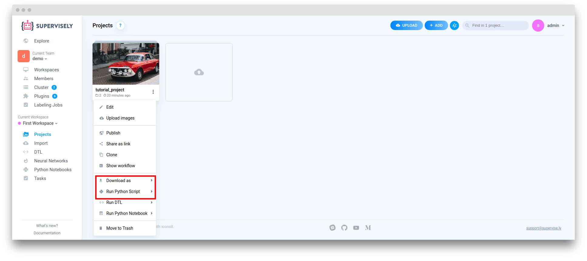
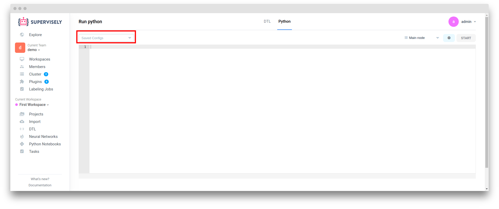
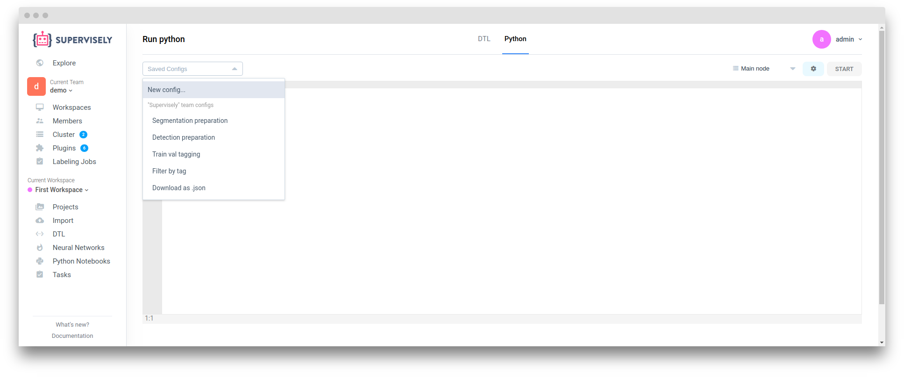

# Python Scripts

"Python scripts" solves a bunch of tasks related with projects and datasets manipulations such as export or transformation. As follows from name it based on python scripts and allow to run tasks easier. Main difference between Python scripts and Python Notebooks is that Python scripts are executed on selected [agent](../customization/agents/README.md) by "Python" [plugin](../customization/plugins/README.md).

## Run Python Script

1. Go to projects page and click on three dots on project card



Here we are interested in two items "Download as..." and "Run Python Script".

2. After selecting the menu item, a dialog window with the script configuration appears.


Here you can setup script variables value.
If you need to change plugin or agent you can do it in "advanced settings" section

## Custom Python Scripts


Custom python scripts available only in enterprise edition


1. Go to "DTL" page and select "Python" tab



2. In top-left corner select "New config..."



3. Enter script name and click "Create" button


Custom python scripts will automatically appears in "Python scripts" projects context menu. If script name starts with "Download as " it will appear in "Download as..." projects context menu.


4. Write python script and then click save button. Lets take for example "Download as .json + .png masks + images..." script


Custom python scripts are binded to the user account. that's why they are available only for the user who created it.


``` pyhon
import os
import numpy as np
import supervisely_lib as sly
from supervisely_lib.io.json import dump_json_file

WORKSPACE_ID = int('%%WORKSPACE_ID%%')
src_project_name = '%%IN_PROJECT_NAME%%'
src_dataset_ids = %%DATASET_IDS:None%%
thickness = int('%%thickness:2%%')

api = sly.Api(server_address=os.environ['SERVER_ADDRESS'], token=os.environ['API_TOKEN'])

#### End settings. ####

sly.logger.info('DOWNLOAD_PROJECT', extra={'title': src_project_name})
project_info = api.project.get_info_by_name(WORKSPACE_ID, src_project_name)
dest_dir = os.path.join(sly.TaskPaths.OUT_ARTIFACTS_DIR, src_project_name)
sly.download_project(api, project_info.id, dest_dir, dataset_ids=src_dataset_ids, log_progress=True)
sly.logger.info('Project {!r} has been successfully downloaded. Starting to render masks.'.format(src_project_name))

project = sly.Project(directory=dest_dir, mode=sly.OpenMode.READ)
machine_colors = {obj_class.name: [idx, idx, idx] for idx, obj_class in enumerate(project.meta.obj_classes, start=1)}
dump_json_file(machine_colors, os.path.join(dest_dir, 'obj_class_to_machine_color.json'), indent=2)
for dataset in project:
    ds_progress = sly.Progress(
        'Processing dataset: {!r}/{!r}'.format(project.name, dataset.name), total_cnt=len(dataset))

    human_masks_dir = os.path.join(dataset.directory, 'masks_human')
    machine_masks_dir = os.path.join(dataset.directory, 'masks_machine')
    sly.fs.mkdir(human_masks_dir)
    sly.fs.mkdir(machine_masks_dir)
    for item_name in dataset:
        item_paths = dataset.get_item_paths(item_name)
        ann = sly.Annotation.load_json_file(item_paths.ann_path, project.meta)
        mask_img_name = os.path.splitext(item_name)[0] + '.png'

        # Render and save human interpretable masks.
        raw_img = sly.image.read(item_paths.img_path)
        raw_img_rendered = raw_img.copy()
        for label in ann.labels:
            label.geometry.draw(raw_img_rendered,
                                color=label.obj_class.color,
                                config=label.obj_class.geometry_config,
                                thickness=thickness)
        raw_img_rendered = ((raw_img_rendered.astype(np.uint16) + raw_img.astype(np.uint16)) / 2).astype(np.uint8)
        sly.image.write(os.path.join(human_masks_dir, mask_img_name),
                        np.concatenate([raw_img, raw_img_rendered], axis=1))

        # Render and save machine readable masks.
        machine_mask = np.zeros(shape=ann.img_size + (3,), dtype=np.uint8)
        for label in ann.labels:
            label.geometry.draw(machine_mask, color=machine_colors[label.obj_class.name], thickness=thickness)
        sly.image.write(os.path.join(machine_masks_dir, mask_img_name), machine_mask)

        ds_progress.iter_done_report()

sly.logger.info('Finished masks rendering.'.format(src_project_name))
```

### Placeholders
In the script above you can see placeholders like `%%thickness:2%%`. This placeholders are used in Run python script dialog.

Placeholders have the following format:
`%%name[:default_value]%%`
- name - name, that used as label.
- default_value - (optional) default value of the placeholder.

### Internal placeholders
Internal placeholders processed in a special way. They will be replaced automatically with values related on context in which python script is starts up.

Internal placeholders:

- TEAM_NAME
- WORKSPACE_NAME
- WORKSPACE_ID
- IN_PROJECT_NAME
- DATASET_IDS
