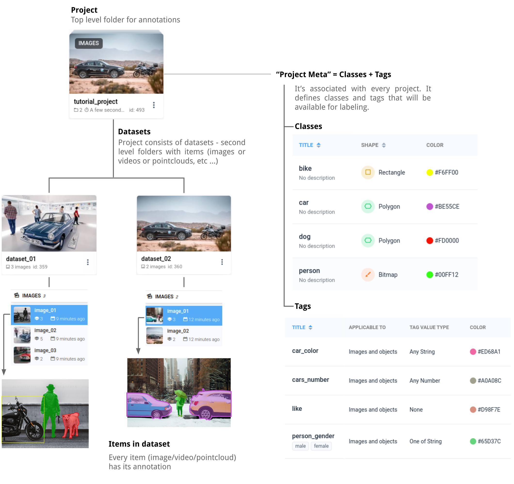

# Supervisely JSON Annotation Format Project Structure

In Supervisely all data and annotations are stored inside individual projects which themselves consist of datasets with files in them, and Project Meta - series of classes and tags. 

When downloaded, each project is converted into a folder that stores `meta.json` file containing Project Meta, dataset folders with the individual annotation files (and optionally the original data files) in them. This allows you to seamlessly cycle data between Supervisely and local storage with the use of `Supervisely Format` import apps, if you so require. 

This structure remains the same for every type of project in Supervisely. 

## Project Structure System



**Project Folder**

On the top level we have Project folders, these are the elements visible on the main Supervisely dashboard. Inside them they can contain only Datasets and Poject Meta information, all other data has to be stored a level below in a Dataset. All datasets within a project have to contain content of the same cathegory.

**Project Meta**

Project Meta contains the essential information about the project - Classes and Tags. These are defined project-wide and can be used for labeling in every dataset inside the current roject. 

**Datasets**

Datasets are the second level folders inside the project, they host the individual data files and their annotations.

**Items**

Every data file in the project has to be stored inside a dataset. Each file as it's own set of annotations.


## Downloaded Project Structure

All projects downloaded from Supervisely maintain the same basic structure, with the contents varying based on which download option you chose. 

**Download Archive**

When you select one of the download option, the system automatically creates an archive with the following name structure: `project_name.tar`

**Downloaded Project**

All projects downloaded from Supervisely have the following structure: 


Root folder for the project named `project name`
  - `meta.json` file 
  - `obj_class_to_machine_color.json` file (optional, for image annotation projects)
  - `key_id_map.json` file (optional)
  - Dataset folders, each named `dataset_name`, which contains:
    - `ann` folder,  contains annotation files, each named `source_media_file_name.json` for the corresponding file
    - `img` (`video` or `pointcloud`) optional folder, contains source media
    - `meta` optional folder, contains corresponding JSON files with metadata for images
    - `masks_human` optional folder for image annotation projects, contains .png files with annotations marked on them
    - `masks_machine` optional folder for image annotation projects, contains .png files with machine annotations
    
    
### Project structure example

The following structure is an example of a project with 3 datasets, each containing 3 images with annotations, and also meta directory with metadata for each image.

```text
📦 project-name
 ┣ 📂 dataset-name-001
 ┃ ┣ 📂 ann
 ┃ ┃ ┣ 📄 pexels-photo-101063.png.json
 ┃ ┃ ┣ 📄 pexels-photo-103123.png.json
 ┃ ┃ ┗ 📄 pexels-photo-103127.png.json
 ┃ ┣ 📂 img
 ┃ ┃ ┣ 🏞️ pexels-photo-101063.png
 ┃ ┃ ┣ 🏞️ pexels-photo-103123.png
 ┃ ┃ ┗ 🏞️ pexels-photo-103127.png
 ┃ ┗ 📂 meta
 ┃ ┃ ┣ 📄 pexels-photo-101063.png.json
 ┃ ┃ ┣ 📄 pexels-photo-103123.png.json
 ┃ ┃ ┗ 📄 pexels-photo-103127.png.json
 ┣ 📂 dataset-name-002
 ┃ ┣ 📂 ann
 ┃ ┃ ┣ 📄 pexels-photo-100583.png.json
 ┃ ┃ ┣ 📄 pexels-photo-105472.png.json
 ┃ ┃ ┗ 📄 pexels-photo-106118.png.json
 ┃ ┣ 📂 img
 ┃ ┃ ┣ 🏞️ pexels-photo-100583.png
 ┃ ┃ ┣ 🏞️ pexels-photo-105472.png
 ┃ ┃ ┗ 🏞️ pexels-photo-106118.png
 ┃ ┗ 📂 meta
 ┃ ┃ ┣ 📄 pexels-photo-100583.png.json
 ┃ ┃ ┣ 📄 pexels-photo-105472.png.json
 ┃ ┃ ┗ 📄 pexels-photo-106118.png.json
 ┣ 📂 dataset-name-003
 ┃ ┣ 📂 ann
 ┃ ┃ ┣ 📄 pexels-photo-101647.png.json
 ┃ ┃ ┣ 📄 pexels-photo-103681.png.json
 ┃ ┃ ┗ 📄 pexels-photo-104328.png.json
 ┃ ┣ 📂 img
 ┃ ┃ ┣ 🏞️ pexels-photo-101647.png
 ┃ ┃ ┣ 🏞️ pexels-photo-103681.png
 ┃ ┃ ┗ 🏞️ pexels-photo-104328.png
 ┃ ┗ 📂 meta
 ┃ ┃ ┣ 📄 pexels-photo-101647.png.json
 ┃ ┃ ┣ 📄 pexels-photo-103681.png.json
 ┃ ┃ ┗ 📄 pexels-photo-104328.png.json
 ┗ 📄  meta.json
```
