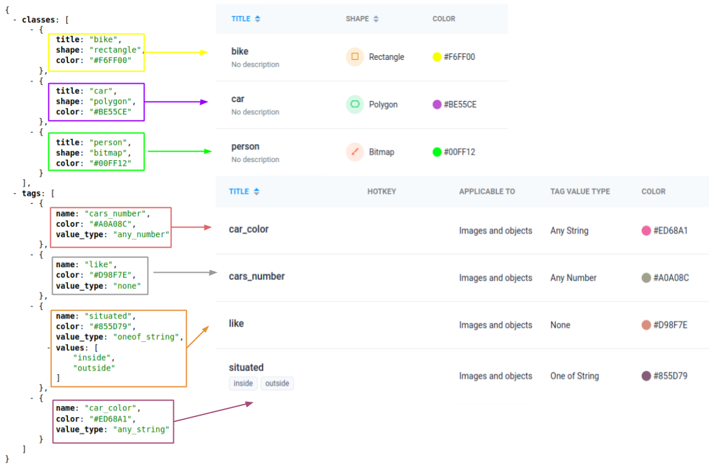

# Supervisely JSON Annotation Format Project Classes And Tags

Each project in Supervisely has a set of predetrminded classes and tags. This information is referred to as `Project Meta` and it's stored in a corresponding JSON-based `project.meta` file. This files contains all of the data from the Classes and Tags tab for the project:




Json format for project meta:

```json
{
    "classes": [
        {
            "title": "bike",
            "shape": "rectangle",
            "color": "#F6FF00",
            "geometry_config": {}
        },
        {
            "title": "car",
            "shape": "polygon",
            "color": "#BE55CE",
            "geometry_config": {}
        },
        {
            "title": "person",
            "shape": "bitmap",
            "color": "#00FF12",
            "geometry_config": {}
        }
    ],
    "tags": [
        {
            "name": "cars_number",
            "color": "#A0A08C",
            "value_type": "any_number"
        },
        {
            "name": "like",
            "color": "#D98F7E",
            "value_type": "none"
        },
        {
            "name": "situated",
            "color": "#855D79",
            "value_type": "oneof_string",
            "values": [
                "inside",
                "outside"
            ]
        },
        {
            "name": "car_color",
            "color": "#ED68A1",
            "value_type": "any_string"
        }
    ]
}
```


Fields definitions:

- `classes`(string) - list of all possible object classes. Each class has the following fields assigned:
  - `title`(string) - the unique identifier of a class
  - `shape`(string) - class shape, read more [here](x)
  - `color`(string) - hex color code
  - `geometry_config`(string) - ???

- `tags`(string) - list of all possible tags that can be assigned to images or objects
  - `name`(string) - the unique identifier of a tag
  - `value_type`(string) - one of the possible [tag](./tags) types
  - `color`(string) - hex color code
  - `values`(string) (optional) - ???
