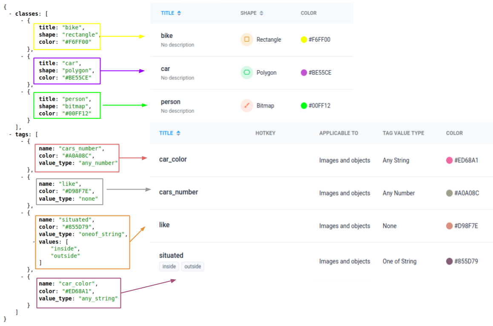

# Project Meta: Annotation Classes, Tags, Settings

Each project in Supervisely has a set of predetermined classes and tags. This information is called `Project Meta` and stored in a corresponding JSON-based `meta.json` file. This file contains all of the necessary data from the project's classes and tags. Also, it has information about the project's type and settings:



### Json format for project meta

```json
{
    "classes": [
        {
            "title": "bike",
            "shape": "rectangle",
            "color": "#F6FF00",
            "geometry_config": {},
            "id": 6509759,
            "hotkey": ""
        },
        {
            "title": "car",
            "shape": "polygon",
            "color": "#BE55CE",
            "geometry_config": {},
            "id": 6509764,
            "hotkey": ""            
        },
        {
            "title": "building_group",
            "shape": "multipolygon",
            "color": "#FF0079",
            "geometry_config": {},
            "id": 6509768,
            "hotkey": ""
        },
        {
            "title": "person",
            "shape": "bitmap",
            "color": "#00FF12",
            "geometry_config": {},
            "id": 6509777,
            "hotkey": ""            
        },
        {
            "title": "dog",
            "shape": "alpha_mask",
            "color": "#C4D68A",
            "geometry_config": {},
            "id": 6509789,
            "hotkey": ""            
        }
    ],
    "tags": [
        {
            "name": "cars_number",
            "color": "#A0A08C",
            "value_type": "any_number",
            "id": 27855,
            "hotkey": "",
            "applicable_type": "all",
            "classes": []            
        },
        {
            "name": "like",
            "color": "#D98F7E",
            "value_type": "none",
            "id": 27856,
            "hotkey": "",
            "applicable_type": "all",
            "classes": []               
        },
        {
            "name": "situated",
            "color": "#855D79",
            "value_type": "oneof_string",
            "values": [
                "inside",
                "outside"
            ],
            "id": 27857,
            "hotkey": "",
            "applicable_type": "all",
            "classes": []               
        },
        {
            "name": "car_color",
            "color": "#ED68A1",
            "value_type": "any_string",
            "id": 27858,
            "hotkey": "",
            "applicable_type": "all",
            "classes": ["car"]
        },
        {
            "name": "reviewed_at",
            "color": "#5A6C8D",
            "value_type": "date",
            "id": 27859,
            "hotkey": "",
            "applicable_type": "all",
            "classes": []
        },
        {
            "name": "car_type",
            "color": "#4A90D9",
            "value_type": "oneof_string",
            "values": [
                "sedan",
                "suv",
                "pickup"
            ],
            "id": 27860,
            "hotkey": "",
            "applicable_type": "objectsOnly",
            "classes": ["car"],
            "default": true,
            "default_value": "sedan"
        }
    ],
    "projectType": "images",
    "projectSettings": {
        "multiView": {
            "enabled": true,
            "tagName": "cars_number", 
            "tagId": null, 
            "isSynced": false
        }
    }
}
```

### Fields definitions

* `classes`(string) - list of all possible object classes. Each class has the following fields assigned:
  * `title`(string) - the unique identifier of a class
  * `shape`(string) - class shape, read more [here](../supervisely-annotation-json-format/objects.md#objects)
  * `color`(string) - hex color code
  * `geometry_config`(dictionary) [optional] - additional settings of the geometry. May be used with keypoints.
  * `id` (int) [optional] - the unique identification value of the class on the server
  * `hotkey` (string) [optional] - hotkey for the Labeling Tool to quickly change active annotation class
* `tags`(string) - list of all possible tags that can be assigned to images or objects. Read more [here](../supervisely-annotation-json-format/tags.md)
  * `name`(string) - the unique identifier of a tag
  * `value_type`(string) - one of the possible tag value types: `none`, `any_number`, `any_string`, `oneof_string`, `date`
  * `color`(string) - hex color code  
  * `values`(string) [optional] - initially predefined set of possible values
  * `id` (int) [optional] - the unique identification value of the tag  
  * `hotkey` (string) [optional] - hotkey for the Labeling Tool to quickly assign tag to object or image
  * `applicable_type` (string) [optional] - defines the applicability of Tag only to images (`imagesOnly`), objects (`objectsOnly`), or both (`all`). By default, tag can be assigned to both images and objects.
  * `classes` (list of strings) [optional] - defines the applicability of Tag only to certain classes
  * `target_type` (string) [optional] - Defines the scope of application. It can be applied globally for the entire duration or to individual frames, with the following values: `entitiesOnly`,`framesOnly`, `all`. Since images do not have "frames," the `all` option is used for them.
  * `frame_range_min_length` (int) [optional] - minimum length, in frames, of a finished frame-based tag. Length is inclusive, so frames 10 to 12 count as 3. `0` means no limit. Applies to videos and point cloud episodes.
  * `frame_range_max_length` (int) [optional] - maximum length, in frames, of a finished frame-based tag, on the same terms as `frame_range_min_length`. A minimum above a maximum is rejected, since such a tag could never be applied.
  * `default` (bool) [optional] - `true` makes the labeling tools for images, videos and point clouds add the tag automatically to a new object of one of the tag's `classes`, and to an object whose class is changed to one of them. It applies only to a tag with `applicable_type` `objectsOnly` and a non-empty `classes` list. It is written only when `true`. Available since Supervisely 6.18.3, see [Default tags and default values](../project-dataset/define-classes-tags.md#default-tags-and-default-values).
  * `default_value` (string or number) [optional] - the value used when the tag is assigned without one, including when it is added automatically. It applies to `any_string`, `any_number` and `oneof_string` tags; for `oneof_string` it is one of the `values`. It is written only when set. Available since Supervisely 6.18.3.

When a project meta is updated and a tag in it omits `default` or `default_value`, the stored settings are kept. To stop adding the tag automatically, send `"default": false`; to clear a default value, send `"default_value": null`.


The Python SDK before version 6.74.46 does not know `default` and `default_value`, and a meta it reads and writes back loses both. Version 6.74.46 and later keeps them, but cannot clear them in an existing project: see [Project Meta](https://developer.supervisely.com/getting-started/supervisely-annotation-format/project-classes-and-tags) in the developer portal.

* `projectType`(string) - one of the possible project types: `images`, `videos`, `volumes`, `point_clouds`, and `point_cloud_episodes`
* `projectSettings`(string) [optional] - additional project properties. For example, multiview settings. Read more [here](https://developer.supervisely.com/getting-started/python-sdk-tutorials/images/multispectral-images#advanced-use-supervisely-format-for-multispectral-images)
  * `multiView` - additional properties for the multiview mode
    * `enabled`(bool) - enable multiview mode
    * `tagName`(string) (optional) - the name of the tag which will be used as a group tag
    * `tagId`(int) [optional] - the ID of the tag which will be used as a group tag
    * `isSynced`(bool) - enable synchronization of views for the multiview mode

Please note, that it is necessary that the group tag in `multiView` should have the corresponding `name` or the `id` in the `tags` field. Also, the `value_type` *should not be* `none`.
