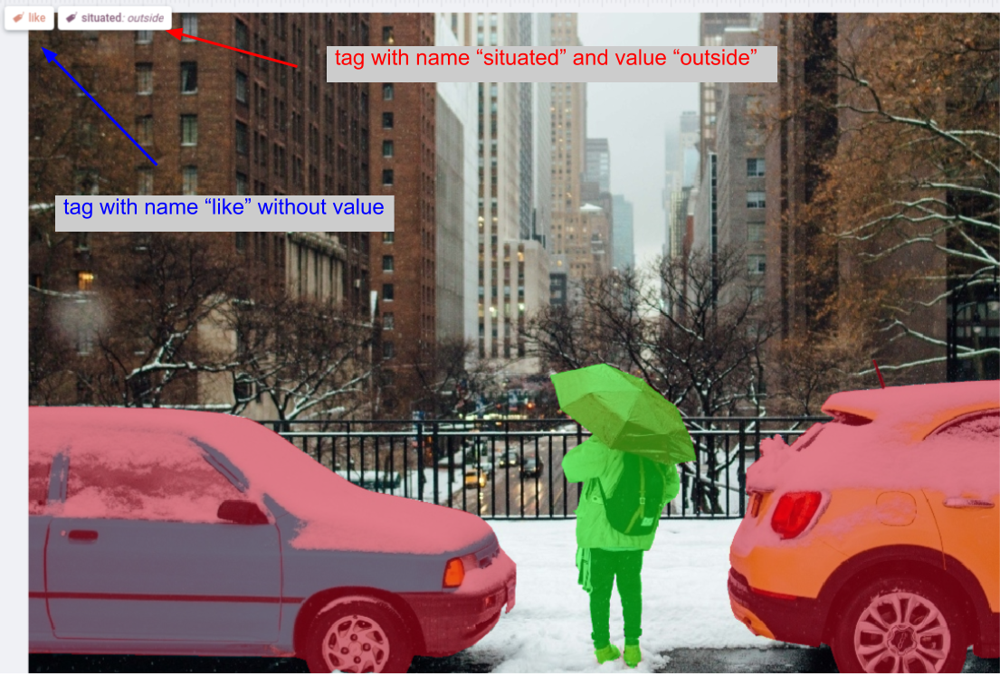
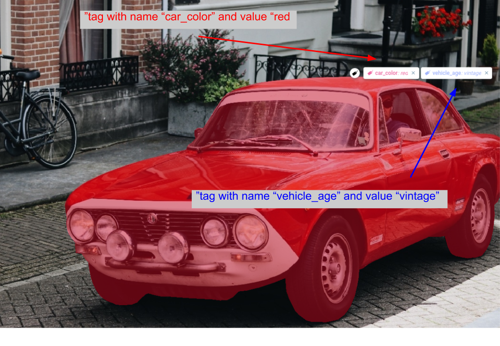

# Supervisely JSON Annotation Format Tags

In Supervisely tags provide an option to associate some additional information with the labeled image or the labels on it. Each individual tag can be attached to a single image or asingle annotation only once, but there's not limit on how many times the same tag can be attached to different parts of the scene. There are different lists of tags for images and figures in the annotation file.

When defining a tag, you assign it a name, possible values for a tag instance and what types of things it can be attached to. We support values of the following types: None (without an assigned value), Text, Number, and One of. 

## Tags With 'None' Value 

Tags of 'none' type can't be assigned a value. Adding one manually will result in an error.

Json format for 'None' tags:

```json
{
    "id": 86334622,
    "tagId": 28256197,
    "labelerLogin": "alexxx",
    "createdAt": "2020-08-23T09:51:06.246Z",
    "updatedAt": "2020-08-23T09:51:06.246Z",
    "name": "like",
    "value": null
}
```

Fields definitions:

- `name` - string - name of the tag
- `value` - value of the current tag (always null for any tag of type 'none')
- Optional fields `id`, `tagId`, `labelerLogin`, `createdAt`, `updatedAt` will be described [below](#Optional-fields)

## Tag with 'Number' Value

Tags of type 'number' can only take a numeric value. Adding a different type of value during manual annotation will result in an error.

Json format for 'Number' tags:

```json
{
    "id": 98753625,
    "tagId": 28256196,
    "labelerLogin": "alexxx",
    "createdAt": "2020-08-26T08:23:24.644Z",
    "updatedAt": "2020-08-26T08:23:24.644Z",
    "name": "cars_number",
    "value": 700
}
```

Fields definitions:

- `name` - string - name of the tag
- `value` - value of the current tag
- Optional fields `id`, `tagId`, `labelerLogin`, `createdAt`, `updatedAt` will be described [below](#Optional-fields)

## Tag with String('Text') Value

Tags of type 'string' can only take a string value. Adding a different type of value during manual annotation will result in an error.

Json format for 'text' tags:

```json
{
    "id": 95462538,
    "tagId": 28256201,
    "labelerLogin": "alexxx",
    "createdAt": "2020-07-24T07:30:39.202Z",
    "updatedAt": "2020-07-24T07:30:39.202Z",
    "name": "car_color",
    "value": "red"
}
```

Fields definitions:

- `name` - string - name of the tag
- `value` - value of current tag
- Optional fields `id`, `tagId`, `labelerLogin`, `createdAt`, `updatedAt` will be described [below](#Optional-fields)

## Tag with value from a given list ('One Of')

Tag of type 'One Of' can only take a value from the list of possible values for this tag. List of possible values is set when creating the tag. Adding a value not from the list during manual annotation will result in an error.

Json format for 'one of' tags:

```json
 {
    "id": 86334621,
    "tagId": 28256198,
    "labelerLogin": "alexxx",
    "createdAt": "2020-08-23T09:51:02.843Z",
    "updatedAt": "2020-08-23T09:51:02.843Z",
    "name": "situated",
    "value": "outside"
}
```

Fields definitions:

- `name` - string - name of the tag
- `value` - value of current tag
- Optional fields `id`, `tagId`, `labelerLogin`, `createdAt`, `updatedAt` will be described [below](#Optional-fields)

## Optional fields

The following fields are created and assigned automatically by the system when the tags are first created in it (or the data is uploaded). This means these fields are optional and you don't have to assign them during manual annotation. 

Optional fields:

```json
"id": 503051990,
"tagId": 1693352,
"labelerLogin": "alexxx",
"createdAt": "2020-08-22T09:32:48.010Z",
"updatedAt": "2020-08-22T09:33:08.926Z".
```

Fields definitions:

- `id` - unique identifier of the current object
- `tagId` - unique tag identifier of the current object
- `labelerLogin` - string - the name of user who created the current figure
- `createdAt` - string - date and time of figure creation
- `updatedAt` - string - date and time of the last figure update


## Examples 

**Image tags:**



Json format for image tags:

```json
"tags": [
    {
        "id": 86334622,
        "tagId": 28256197,
        "labelerLogin": "alexxx",
        "createdAt": "2020-08-23T09:51:06.246Z",
        "updatedAt": "2020-08-23T09:51:06.246Z",
        "name": "like",
        "value": null
    },
    {
        "id": 86334621,
        "tagId": 28256198,
        "labelerLogin": "alexxx",
        "createdAt": "2020-08-23T09:51:02.843Z",
        "updatedAt": "2020-08-23T09:51:02.843Z",
        "name": "situated",
        "value": "outside"
    }
]
```

Fields definitions:

- `name` - string - name of the tag
- `value` - value of current tag
- Optional fields `id`, `tagId`, `labelerLogin`, `createdAt`, `updatedAt` are described [above](x)


**Objects tags:**



Json format for object tags:

```json
"tags": [
    {
        "id": 95462539,
        "tagId": 28256199,
        "labelerLogin": "alexxx",
        "createdAt": "2020-07-24T07:30:39.202Z",
        "updatedAt": "2020-07-24T07:30:39.202Z",
        "name": "vehicle_age",
        "value": "vintage"
    },
    {
        "id": 95462538,
        "tagId": 28256201,
        "labelerLogin": "alexxx",
        "createdAt": "2020-07-24T07:30:39.202Z",
        "updatedAt": "2020-07-24T07:30:39.202Z",
        "name": "car_color",
        "value": "red"
    }
]
```

Fields definitions:

- `name` - string - name of the tag
- `value` - value of current tag
- Optional fields `id`, `tagId`, `labelerLogin`, `createdAt`, `updatedAt` are described [above](#Optional-fields)

