# Supervisely JSON Annotation Format Objects

## Supported Shapes

Supervisely Annotation Format supports the following figures:

- point
- rectangle
- polygon
- line / polyline
- bitmap
- alpha_mask
- keypoint structures
- cuboid
- mask_3d

## Coordinate System

For two-dimensional mediums (images and videos) we use the following coordinate system (it's similar to a two-dimensional NumPy coordinate system):

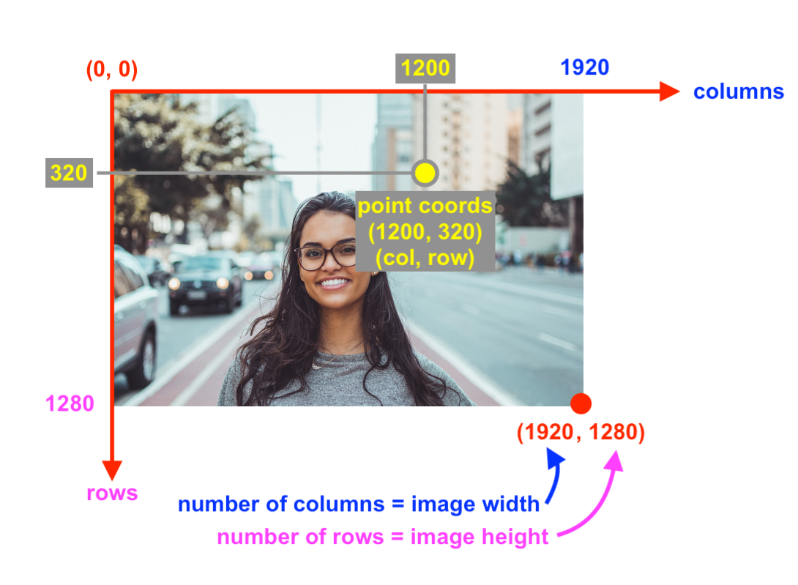

All numerical values are provided in pixels.

## General Fields

When generating JSON annotation files, we assign each figure a mix of general fields and fields unique for each geometric shape. Some general fields are optional: the system generates them automatically when the data is uploaded/first created. This means that these fields can be omitted during manual annotation.

**Optional fields:**

```json
"id": 503051990,
"classId": 1693352,
"labelerLogin": "alexxx",
"createdAt": "2020-08-22T09:32:48.010Z",
"updatedAt": "2020-08-22T09:33:08.926Z".
```

Fields definitions:

- `id` - unique identifier of the current object
- `classId` - unique class identifier of the current object
- `labelerLogin` - string - the name of user who created the current figure
- `createdAt` - string - date and time of figure creation
- `updatedAt` - string - date and time of the last figure update

## Point

Example:

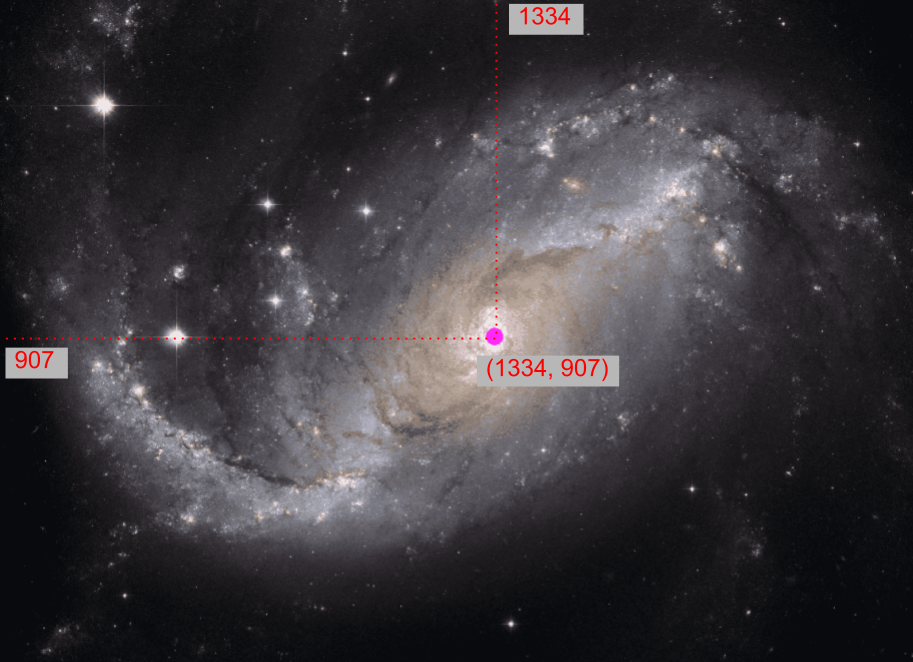

JSON format for this shape:

```json
{
  "id": 503051990,
  "classId": 1693352,
  "labelerLogin": "alexxx",
  "createdAt": "2020-08-22T09:32:48.010Z",
  "updatedAt": "2020-08-22T09:33:08.926Z",
  "description": "",
  "geometryType": "point",
  "tags": [],
  "classTitle": "point",
  "points": {
    "exterior": [[1334, 907]],
    "interior": []
  }
}
```

Fields definitions:

- Optional fields `id`, `classId`, `labelerLogin`, `createdAt`, `updatedAt` are described [above](#general-fields)
- `description` - string - text description (optional)
- `geometryType: "point"` - class shape
- `tags` - list of tags assigned to the current object
- `classTitle` - string - the title of the current class. It's used to identify the corresponding class shape from the `meta.json` file
- `points` - object with two fields:
  - `exterior` - list of 2 values for coordinates (`x` and `y` in that order) for every figure
  - `interior` - always an empty field for this type of figure

## Rectangle

Example:

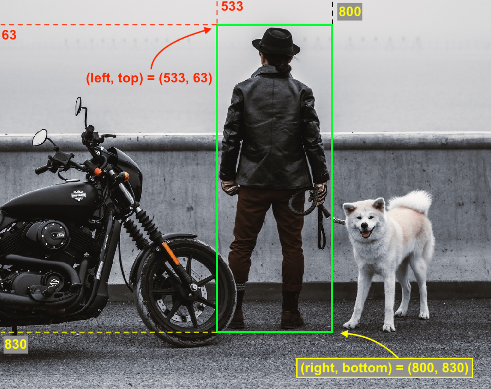

JSON format for this figure:

```json
{
  "id": 283051572,
  "classId": 1692857,
  "labelerLogin": "max",
  "createdAt": "2020-08-22T09:32:48.010Z",
  "updatedAt": "2020-08-22T09:33:08.926Z",
  "description": "",
  "geometryType": "rectangle",
  "tags": [],
  "classTitle": "person_bbox",
  "points": {
    "exterior": [
      [533, 63],
      [800, 830]
    ],
    "interior": []
  }
}
```

Fields definitions:

- Optional fields `id`, `classId`, `labelerLogin`, `createdAt`, `updatedAt` are described [above](#general-fields)
- `description` - string - text description (optional)
- `geometryType: "rectangle"` - class shape
- `tags` - list of tags assigned to the current object
- `classTitle` - string - the title of the current class. It's used to identify the corresponding class shape from the `meta.json` file
- `points` - object with two fields:
- `exterior` - list of two lists, each containing two coordinates (`x` and `y` in that order), with the following structure: [[left, top], [right, bottom]]
- `interior` - always an empty list for this type of figure

## Polygon (without holes)

Example:

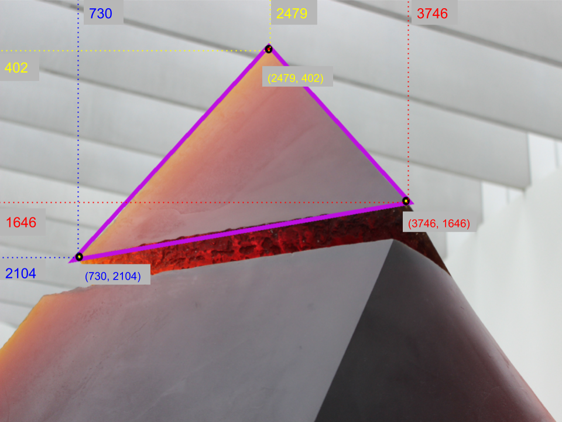

```json
{
    "id": 503004154,
    "classId": 1693021,
    "labelerLogin": "alexxx",
    "createdAt": "2020-08-21T15:15:28.092Z",
    "updatedAt": "2020-08-21T15:15:37.687Z",
    "description": "",
    "geometryType": "polygon",
    "tags": [],
    "classTitle": "triangle",
    "points": {
        "exterior": [
            [730, 2104],
            [2479 402],
            [3746, 1646]
        ],
        "interior": []
    }
}
```

Fields definitions:

- Optional fields `id`, `classId`, `labelerLogin`, `createdAt`, `updatedAt` are described [above](#general-fields)
- `description` - string - text description (optional)
- `geometryType: "polygon"` - class shape
- `tags` - list of tags assigned to the current object
- `classTitle` - string - the title of the current class. It's used to identify the corresponding class shape from the `meta.json` file
- `points` - object with two fields:
- `exterior` - list of points [point1, point2, point3, etc ...] where each point is a list of two numbers (coordinates) [col, row]
- `interior` - list of elements with the same structure as the "exterior" field. In other words, this is the list of polygons that define object holes. For polygons without holes in them, this field is empty

## Polygon (without holes)

Example:

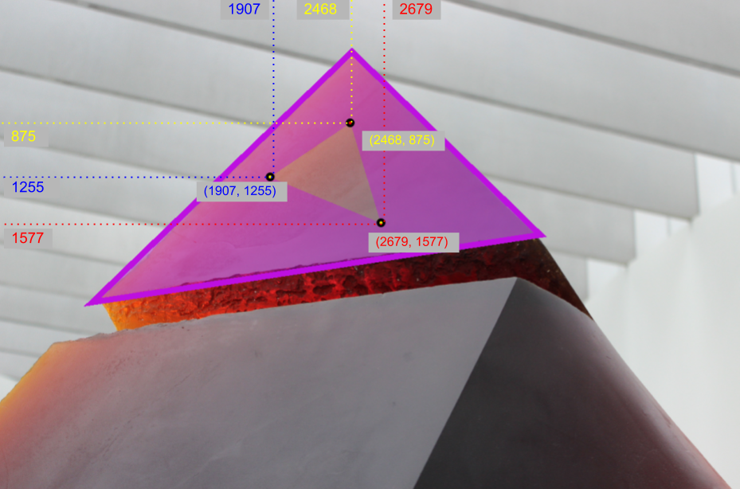

```json
{
  "id": 503004154,
  "classId": 1693021,
  "labelerLogin": "alexxx",
  "createdAt": "2020-08-21T15:15:28.092Z",
  "updatedAt": "2020-08-21T16:06:11.461Z",
  "description": "",
  "geometryType": "polygon",
  "tags": [],
  "classTitle": "triangle_hole",
  "points": {
    "exterior": [
      [730, 2104],
      [2479, 402],
      [3746, 1646]
    ],
    "interior": [
      [
        [1907, 1255],
        [2468, 875],
        [2679, 1577]
      ]
    ]
  }
}
```

Fields definitions:

- Optional fields `id`, `classId`, `labelerLogin`, `createdAt`, `updatedAt` are described [above](#general-fields)
- `description` - string - text description (optional)
- `geometryType: "polygon"` - class shape
- `tags` - list of tags assigned to the current object
- `classTitle` - string - the title of the current class. It's used to identify the corresponding class shape from the `meta.json` file
- `points` - object with two fields:
- `exterior` - list of points [point1, point2, point3, etc ...] where each point is a list of two numbers (coordinates) [col, row]
- `interior` - list of elements with the same structure as the "exterior" field. In other words, this is the list of polygons that define object holes.

## Polyline

Example:

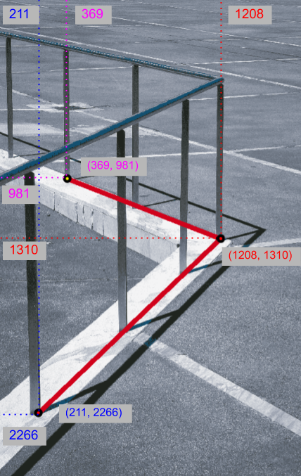

```json
{
  "id": 503049791,
  "classId": 1693340,
  "labelerLogin": "alexxx",
  "createdAt": "2020-08-22T08:39:29.386Z",
  "updatedAt": "2020-08-22T08:39:34.802Z",
  "description": "",
  "geometryType": "line",
  "tags": [],
  "classTitle": "line",
  "points": {
    "exterior": [
      [211, 2266],
      [1208, 1310],
      [369, 981]
    ],
    "interior": []
  }
}
```

Fields definitions:

- Optional fields `id`, `classId`, `labelerLogin`, `createdAt`, `updatedAt` are described [above](#general-fields)
- `description` - string - text description (optional)
- `geometryType: "line"` - class shape
- `tags` - list of tags assigned to the current object
- `classTitle` - string - the title of the current class. It's used to identify the corresponding class shape from the `meta.json` file
- `points` - object with two fields:
- `exterior` - list of points [point1, point2, point3, etc ...] where each point is a list of two numbers (coordinates) [col, row]
- `interior` - always an empty list for this type of figure

## Bitmap

Bitmap is a figure that is described by a point of "origin"(upper left corner), which defines the location of the bitmap within the image and a "data" - Boolean matrix encoded into a string, which defines each pixel of the bitmap.

Example:

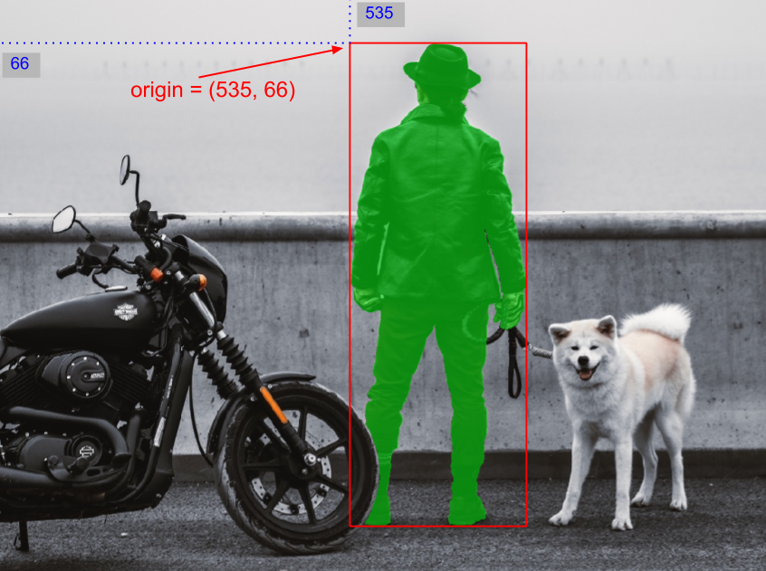

```json
{
  "id": 497489556,
  "classId": 1661459,
  "labelerLogin": "alexxx",
  "createdAt": "2020-07-24T07:30:39.202Z",
  "updatedAt": "2020-07-24T07:41:12.753Z",
  "description": "",
  "geometryType": "bitmap",
  "tags": [],
  "classTitle": "person",
  "bitmap": {
    "data": "eJwB ... kUnW",
    "origin": [535, 66]
  }
}
```

Fields description:

- Optional fields `id`, `classId`, `labelerLogin`, `createdAt`, `updatedAt` are described [above](#general-fields)
- `description` - string - text description (optional)
- `geometryType: "bitmap"` - class shape
- `tags` - list of tags assigned to the current object
- `classTitle` - string - the title of the current class. It's used to identify the corresponding class shape from the `meta.json` file
- `bitmap` - object with two fields:
  - `origin` - points (`x` and `y` coordinates) of the top left corner of the bitmap, i.e. the position of the bitmap within the image
  - `data` - string - encoded representation of a string

A few words about `bitmap` → `data`. You can use these two python methods to convert a base64 encoded string to NumPy and vice versa.

```python
def base64_2_mask(s):
    z = zlib.decompress(base64.b64decode(s))
    n = np.fromstring(z, np.uint8)
    mask = cv2.imdecode(n, cv2.IMREAD_UNCHANGED)[:, :, 3].astype(bool)
    return mask

def mask_2_base64(mask):
    img_pil = Image.fromarray(np.array(mask, dtype=np.uint8))
    img_pil.putpalette([0,0,0,255,255,255])
    bytes_io = io.BytesIO()
    img_pil.save(bytes_io, format='PNG', transparency=0, optimize=0)
    bytes = bytes_io.getvalue()
    return base64.b64encode(zlib.compress(bytes)).decode('utf-8')
```

Example:

```python
import numpy as np
import cv2, zlib, base64, io
from PIL import Image

def base64_2_mask(s):
    z = zlib.decompress(base64.b64decode(s))
    n = np.fromstring(z, np.uint8)
    mask = cv2.imdecode(n, cv2.IMREAD_UNCHANGED)[:, :, 3].astype(bool)
    return mask

def mask_2_base64(mask):
    img_pil = Image.fromarray(np.array(mask, dtype=np.uint8))
    img_pil.putpalette([0,0,0,255,255,255])
    bytes_io = io.BytesIO()
    img_pil.save(bytes_io, format='PNG', transparency=0, optimize=0)
    bytes = bytes_io.getvalue()
    return base64.b64encode(zlib.compress(bytes)).decode('utf-8')

example_np_bool = np.ones((3, 3), dtype=bool)
example_np_bool[1][1] = False
example_np_bool[1][2] = False
print(example_np_bool)
encoded_string = mask_2_base64(example_np_bool)
print(encoded_string)
print(base64_2_mask(encoded_string))
```

Program output after executing the code:

```python
[[ True  True  True]
 [ True False False]
 [ True  True  True]]

'eJzrDPBz5+WS4mJgYOD19HAJAtLMIMwIInOeqf8BUmwBPiGuQPr///9Lb86/C2QxlgT5BTM4PLuRBuTwebo4hlTMSa44cOHAB6DqY0yORgq8YkAZBk9XP5d1TglNANAFGzA='

[[ True  True  True]
 [ True False False]
 [ True  True  True]]
```

## Alpha Mask

Alpha Mask is a figure that is described by a point of "origin"(upper left corner), which defines the location of the alpha mask within the image and a "data" - grayscale matrix encoded into a string, which defines each pixel of the alpha mask.

Example:

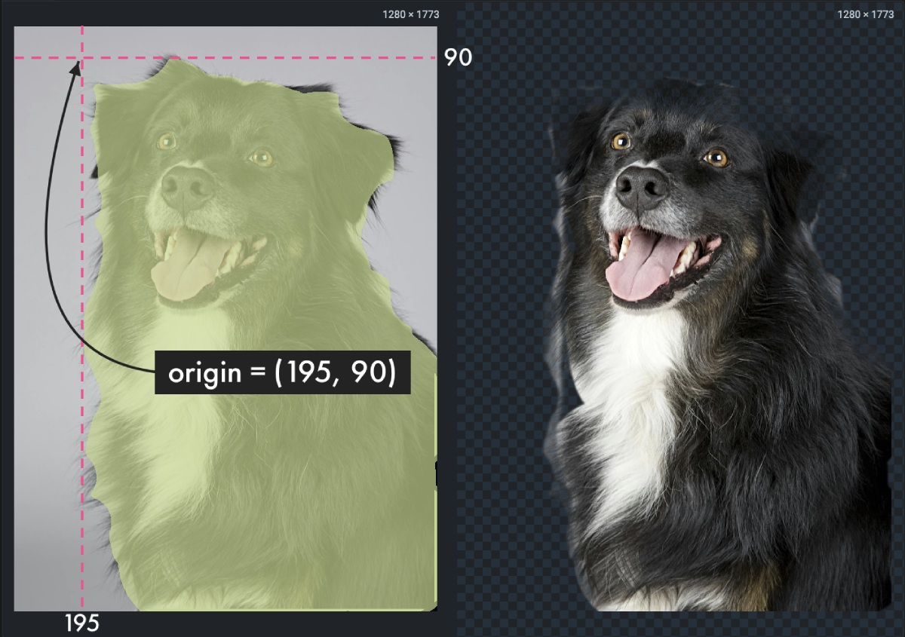

```json
{
  "id": 497489556,
  "classId": 1661459,
  "labelerLogin": "almaz",
  "createdAt": "2024-05-29T09:35:38.212Z",
  "updatedAt": "2024-05-29T09:45:14.543Z",
  "description": "",
  "geometryType": "alpha_mask",
  "tags": [],
  "classTitle": "dog",
  "bitmap": {
    "data": "eNpk ... Q08=",
    "origin": [535, 66]
  }
}
```

Fields description:

- Optional fields `id`, `classId`, `labelerLogin`, `createdAt`, `updatedAt` are described [above](#general-fields)
- `description` - string - text description (optional)
- `geometryType: "alpha_mask"` - class shape
- `tags` - list of tags assigned to the current object
- `classTitle` - string - the title of the current class. It's used to identify the corresponding class shape from the `meta.json` file
- `bitmap` - object with two fields:
  - `origin` - points (`x` and `y` coordinates) of the top left corner of the alpha mask, i.e. the position of the alpha mask within the image
  - `data` - string - encoded representation of a string

A few words about `bitmap` → `data`. You can use these two Python methods to convert a base64 encoded string to NumPy and vice versa.

```python
def base64_2_mask(s):
    z = zlib.decompress(base64.b64decode(s))
    n = np.frombuffer(z, np.uint8)
    mask = cv2.imdecode(n, cv2.IMREAD_GRAYSCALE)  # pylint: disable=no-member
    return mask

def mask_2_base64(mask):
    img_pil = Image.fromarray(np.array(mask, dtype=np.uint8), mode="L")
    bytes_io = io.BytesIO()
    img_pil.save(bytes_io, format="PNG", transparency=0, optimize=0)
    bytes_enc = bytes_io.getvalue()
    return base64.b64encode(zlib.compress(bytes_enc)).decode("utf-8")
```

Example:

```python
import numpy as np
import cv2, zlib, base64, io
from PIL import Image

def base64_2_mask(s):
    z = zlib.decompress(base64.b64decode(s))
    n = np.frombuffer(z, np.uint8)
    mask = cv2.imdecode(n, cv2.IMREAD_GRAYSCALE)  # pylint: disable=no-member
    return mask

def mask_2_base64(mask):
    img_pil = Image.fromarray(np.array(mask, dtype=np.uint8), mode="L")
    bytes_io = io.BytesIO()
    img_pil.save(bytes_io, format="PNG", transparency=0, optimize=0)
    bytes_enc = bytes_io.getvalue()
    return base64.b64encode(zlib.compress(bytes_enc)).decode("utf-8")

example_np = np.ones((3, 3), dtype=np.uint8)
example_np[1][1] = 255
example_np[1][2] = 0
example_np[0][1] = 122
print(example_np)

encoded_string = mask_2_base64(example_np)
print(encoded_string)
print(base64_2_mask(encoded_string))
```

Program output after executing the code:

```python
[[  1 122   1]
 [  1 255   0]
 [  1   1   1]]

"eJzrDPBz5+WS4mJgYOD19HAJAtLMIMwBJBiKnV8lAymmkiC/YAaGsslnLYA8EU8Xx5CKOckJa5JSEv6cP3DixAEGBq43jPUMLJK+IF2ern4u65wSmgBoaRby"

[[  1 122   1]
 [  1 255   0]
 [  1   1   1]]
```

## Keypoint structure

Keypoint structures consist of vertices (also called nodes or points) which are connected by edges (also called links or lines).

Example:

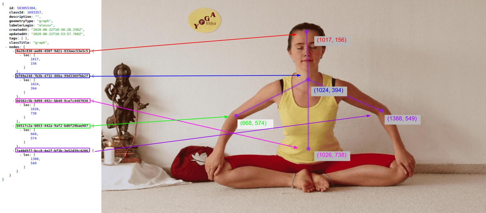

```json
{
  "id": 503055304,
  "classId": 1693357,
  "description": "",
  "geometryType": "graph",
  "labelerLogin": "alexxx",
  "createdAt": "2020-08-22T10:50:28.336Z",
  "updatedAt": "2020-08-22T10:53:57.760Z",
  "tags": [],
  "classTitle": "graph",
  "nodes": {
    "8e20c830-ee86-450f-9d21-833eec53e3c5": {
      "loc": [1017, 1556]
    },
    "bf89e248-7b3b-4732-888a-99d3369fbb2f": {
      "loc": [1024, 394]
    },
    "66502c5b-8d98-492c-bb48-8ce7c4487038": {
      "loc": [1026, 738]
    },
    "56517c2a-6053-442a-9af2-bd6f29bae987": {
      "loc": [668, 574]
    },
    "7a40d5f7-bcc8-4e2f-bf3b-3e52d39c4206": {
      "loc": [1388, 549]
    }
  }
}
```

Fields definitions:

- Optional fields `id`, `classId`, `labelerLogin`, `createdAt`, `updatedAt` are described [above](#general-fields)
- `description` - string - text description (optional)
- `geometryType: "graph"` - class shape
- `tags` - list of tags assigned to the current object
- `classTitle` - string - the title of the current class. It's used to identify the corresponding class shape from the `meta.json` file
- `nodes` - is a dictionary, where keys denote the names of the graph vertices and values in a dictionary, and where values denote location of a node on image
  - `loc` - list of single points (`x` and `y` coordinates) of a vertices

## Cuboids (2D annotation)

Example:

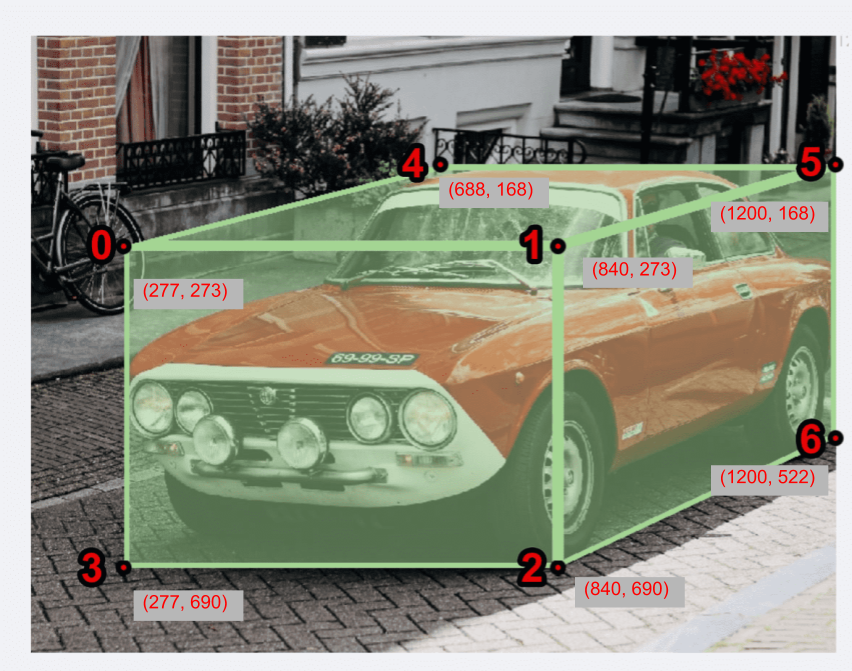

```json
{
  "id": 246511976,
  "classId": 9214847,
  "objectId": null,
  "description": "",
  "geometryType": "cuboid_2d",
  "labelerLogin": "almaz",
  "createdAt": "2024-07-29T16:10:34.986Z",
  "updatedAt": "2024-07-29T16:11:46.392Z",
  "tags": [],
  "classTitle": "car",
  "vertices": {
    "face1-topleft": {
      "loc": [588, 240]
    },
    "face1-topright": {
      "loc": [690, 240]
    },
    "face1-bottomright": {
      "loc": [690, 378]
    },
    "face1-bottomleft": {
      "loc": [588, 378]
    },
    "face2-bottomleft": {
      "loc": [787, 347]
    },
    "face2-bottomright": {
      "loc": [889, 347]
    },
    "face2-topright": {
      "loc": [889, 209]
    },
    "face2-topleft": {
      "loc": [787, 209]
    }
  }
}
```

Fields definitions:

- Optional fields `id`, `classId`, `labelerLogin`, `createdAt`, `updatedAt` are described [above](#general-fields)
- `description` - string - text description (optional)
- `geometryType: "cuboid_2d"` - class shape
- `tags` - list of tags assigned to the current object
- `classTitle` - string - the title of the current class. It's used to identify the corresponding class shape from the `meta.json` file
- `vertices` - is a dictionary, where keys denote the names of the cuboid vertices, and values in a dictionary with a location of a vertex on the image:
  - `loc` - list of single points (`x` and `y` coordinates) of a vertex

## Mask3D (3D annotation)

Mask3D is a figure that is described by a 3D array corresponding to the dimensionality of the volume. It is used as an annotation type for volume projects.
Geometry `data` stores in NRRD files and defines each pixel of the Mask3D. In the previous version whole `data` could be stored in JSON annotations as a base64 encoded string.

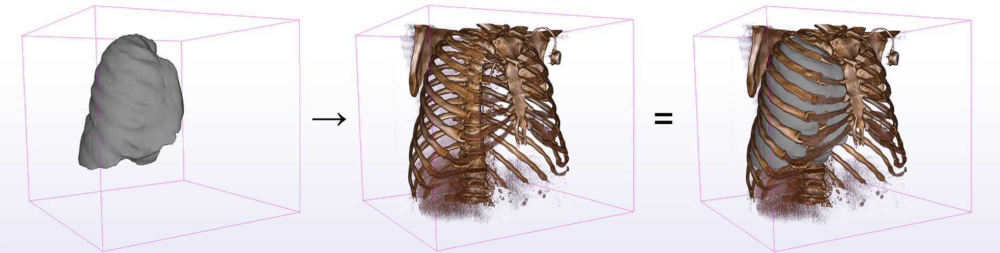

💡 It's strictly recommended to store whole `data` into NRRD files.

👉 To learn how to create Mask3D from NRRD files using our SDK you can read [this article](https://developer.supervisely.com/getting-started/python-sdk-tutorials/volumes/spatial-labels-on-volumes).

Below is an example of what the object looks like in the annotation file:

```json
{
  "key": "daff638a423a4bcfa34eb12e42243a87",
  "objectKey": "6c1587f381bf419e9d5c2ebd5967e28f",
  "geometryType": "mask_3d",
  "geometry": {
    "mask_3d": {
      "data": "H4sIAGW9OmUC ... CYAE1Nj5QMACwC"
    },
    "shape": "mask_3d",
    "geometryType": "mask_3d"
  },
  "labelerLogin": "username",
  "updatedAt": "2021-11-13T08:05:28.771Z",
  "createdAt": "2021-11-13T08:05:28.771Z"
}
```

Fields definitions:

- `key` -
- `objectKey` -
- `geometryType: "mask_3d"` - class shape
- `geometry` - describes geometry of the object, consist of:
  - `mask_3d` - object with one field:
    - `data`- string - encoded representation of a string.
  - `shape: "mask_3d"` - geometry name
  - `geometryType": "mask_3d"` geometry type

If the geometry data is stored in NRRD files, `mask_3d` → `data` will store an empty array represented as base64 encoded string.
