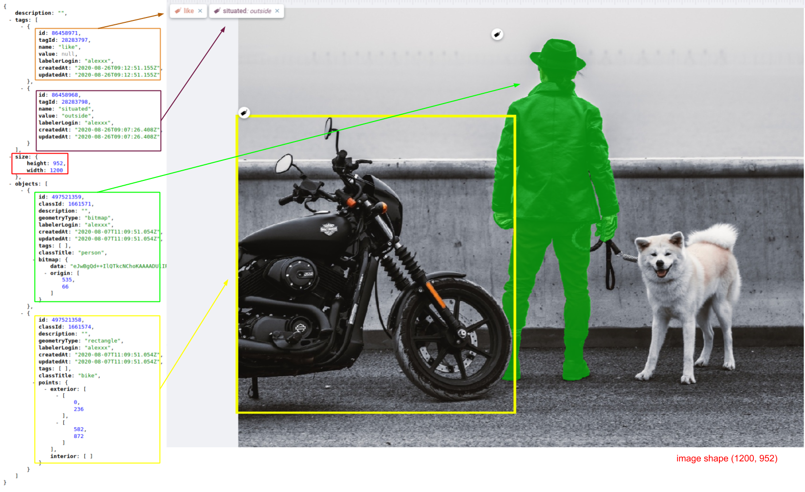
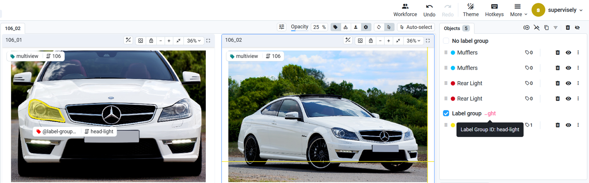

# Single-Image Annotation JSON

### Structure

For each image, we store the annotations in a separate json file named `image_name.image_format.json` with the following file structure: 

```json
{
    "description": "food",
    "name": "tomatoes-eggs-dish.jpg",
    "size": {
        "width": 2100,
        "height": 1500
    },
    "tags": [],
    "objects": []
}
```

Fields definitions:

- `name` - string - image name
- `description` - string - (optional) - This field is used to store the text we want to assign to the image. In the labeling intrface it corresponds to the 'data' filed. 
- `size` - stores image size. Mostly, it is used to get the image size without the actual image reading to speed up some data processing steps.
  - `width` - image width in pixels
  - `height` - image height in pixels
- `tags` - list of strings that will be interpreted as image [tags](./03_Supervisely_format_tags.md)
- `objects` - list of [objects on the image](./04_Supervisely_Format_objects.md)


## Full image annotation example with objects and tags




Example:

```json
{
    "description": "",
    "tags": [
        {
            "id": 86458971,
            "tagId": 28283797,
            "name": "like",
            "value": null,
            "labelerLogin": "alexxx",
            "createdAt": "2020-08-26T09:12:51.155Z",
            "updatedAt": "2020-08-26T09:12:51.155Z"
        },
        {
            "id": 86458968,
            "tagId": 28283798,
            "name": "situated",
            "value": "outside",
            "labelerLogin": "alexxx",
            "createdAt": "2020-08-26T09:07:26.408Z",
            "updatedAt": "2020-08-26T09:07:26.408Z"
        }
    ],
    "size": {
        "height": 952,
        "width": 1200
    },
    "objects": [
        {
            "id": 497521359,
            "classId": 1661571,
            "description": "",
            "geometryType": "bitmap",
            "labelerLogin": "alexxx",
            "createdAt": "2020-08-07T11:09:51.054Z",
            "updatedAt": "2020-08-07T11:09:51.054Z",
            "tags": [],
            "classTitle": "person",
            "bitmap": {
                "data": "eJwBgQd++IlQTkcNChoKAAAADUlIRF",
                "origin": [
                    535,
                    66
                ]
            }
        },
        {
            "id": 497521358,
            "classId": 1661574,
            "description": "",
            "geometryType": "rectangle",
            "labelerLogin": "alexxx",
            "createdAt": "2020-08-07T11:09:51.054Z",
            "updatedAt": "2020-08-07T11:09:51.054Z",
            "tags": [],
            "classTitle": "bike",
            "points": {
                "exterior": [
                    [
                        0,
                        236
                    ],
                    [
                        582,
                        872
                    ]
                ],
                "interior": []
            }
        }
    ]
}
```

### How the Label Group Is Described in Project Files



1. **Project Meta**

    In the **tags** section of project `meta.json`, you must include a tag named **`@label-group-id`** with the following properties:
    - **`name`**: `"@label-group-id"`  
    - **`value_type`**: `"any_string"` (allows flexible naming for groups)  
    - **`applicable_type`**: `"objectsOnly"` (ensures the tag is only assigned to labeled objects)  

    This tag is essential for defining and managing label groups within the project, allowing grouped labels to be linked and organized effectively.

    ```json
    {        
        "tags": [
            {
                "name": "@label-group-id",
                "value_type": "any_string",
                "color": "#FF0000",
                "id": 222,
                "hotkey": "",
                "applicable_type": "objectsOnly",
                "classes": [],
                "target_type": "all"
            }
        ],
        ... // more elements here
    }
    ```

2. **Image Annotation**

    To add an object to a label group, you must assign the `@label-group-id` tag with the corresponding group name as its value.

    - This ensures that all objects with the same tag value are recognized as part of the same group.
    - Grouped labels will be visually linked and managed together in the annotation interface.

    ```json
    "objects": [
            {
                "classTitle": "Head Light",
                "description": "",
                "tags": [
                    {
                        "name": "@label-group-id",
                        "value": "head-light",
                        "labelerLogin": "supervisely",
                        ... // more elements here
                    }
                ],
                ... // more elements here
            }
        ]
    ```


