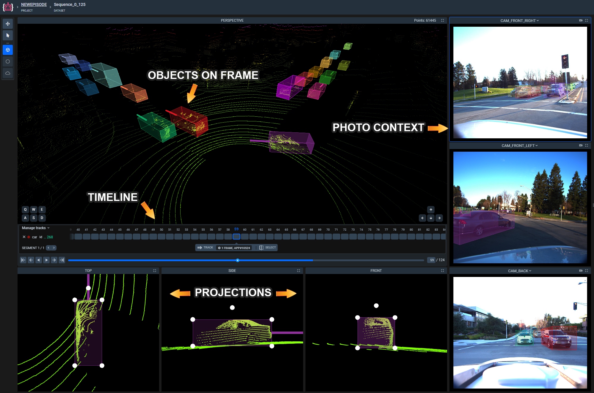

# Point cloud Episode Project and Annotations


## Project Structure Example
Root folder for the project named `project name`
  - `meta.json` file 
  - `key_id_map.json` file
  - Dataset folders, that represents single episode. Each named `dataset_name`, which contains:
    - `annotation.json` - file with whole episode annotation
    - `frame_pointcloud_map.json` - file with pointcloud to episode frame mapping
    - `pointcloud` folder,  contains source point cloud files, for example `frame1.pcd, frame2.pcd`
    - `related_images` optional folder, contains photo-context data:
        - Frame folder, each named according to pointcloud (`/related_images/frame1/`), which contains:
            - image files (`.png \ .jpg`)
            - image ann files (`.json`) - json files, named according to image name (`1.png -> 1.png.json`)
            - image figure files - optional files with image's 2d figures, named according to image name (`1.png -> 1.png.figures.json`). Only exists if photo-context has 2d annotation figures.
   
## Main concepts
**Point cloud Episode Project Folder**

On the top level are stored Project folders, these are the elements visible on the main Supervisely dashboard. Inside them they can contain only Datasets and Poject Meta information, all other data has to be stored a level below in a Dataset (Sequence). All datasets within a project have to contain content of the same cathegory.

**Project Meta**

Project Meta contains the essential information about the project - Classes and Tags. These are defined project-wide and can be used for labeling in every dataset inside the current project. 

**Datasets (Sequences)**

Datasets are the second level folders inside the project, they host the individual data files (pointclouds), photo context (images) and their annotations.

**Items (Point clouds)**

Every `.pcd` file in sequence has to be stored inside a `dataset/pointcloud` folder. Each file has file name and order number, that defined inside `frame_pointcloud_map.json`.

The PCD file format description can be found [here](https://pointclouds.org/documentation/tutorials/pcd_file_format.html)

**Items Annotation**

A sequence of frames has a list of `objects` that are shared between frames.
For example, sequence might have 10 cars objects represented by theirs `figures` in 100 frames.

The list of `objects` is defined for the entire sequence, even if the object's figure occurs in only one frame. 

Figures - represents individual cuboids, attached to one single frame and its object.

    Example:
    The sequence contains 3 objects: (car1, car2, pedestrian1) and 10 frames.

    Each frame in the sequence might have a figure for every object.
    Then it will be 30 figures (10 figures for each object per sequence; 1 figure for the object per frame).

**Linking between point clouds , Objects and Figures** 

In Supervisely Annotation Format each point cloud is a frame. 
Frame contain `figures` and `index`: sequence number, that have relation to point cloud name in `frame_pointcloud_map.json`.

In the example below, created one Car object (with key "6663ca1d20c74bea83bd48c24568989d") for the entire sequence. (Means that this object can appear in any frame of the sequence) 

Then, on frames (with indices 0 and 1) figures are placed, and each figure correspond to the Car object by the `objectKey` field.

## Format of `annotation.json`
```json
[
    {
    "description": "",
    "key": "e9f0a3ae21be41d08eec166d454562be",
    "tags": [],
    "objects": [
        {
            "key": "6663ca1d20c74bea83bd48c24568989d",
            "classTitle": "car",
            "tags": []
        }],
    "framesCount": 48,
    "frames": [
         {
            "index": 0,
            "figures": [
               {
                "key": "cb8e067dadfc423aa8575a0c4e62de33",
                "objectKey": "6663ca1d20c74bea83bd48c24568989d",
                "geometryType": "cuboid_3d",
                "geometry": {
                    "position": {
                        "x": -10.863547325134277,
                        "y": -93.57706451416016,
                        "z": -4.598618030548096
                    },
                    "rotation": {
                        "x": 0,
                        "y": 0,
                        "z": 3.250733629393711
                    },
                    "dimensions": {
                        "x": 1.978,
                        "y": 4.607,
                        "z": 1.552
                        }
                      }
                    }
            ]
         },
         {
            "index": 1,
            "figures": [               
               {
                "key": "71e0fe52dc4f4f6aaf059ad095f43c1f",
                "objectKey": "6663ca1d20c74bea83bd48c24568989d",
                "labelerLogin": "username",
                "updatedAt": "2021-11-11T17:19:11.448Z",
                "createdAt": "2021-11-11T16:53:03.670Z",
                "geometryType": "cuboid_3d",
                "geometry": {
                    "position": {
                        "x": -11.10418701171875,
                        "y": -91.33098602294922,
                        "z": -4.5446248054504395
                    },
                    "rotation": {
                        "x": 0,
                        "y": 0,
                        "z": 3.24780199600921
                    },
                    "dimensions": {
                        "x": 1.978,
                        "y": 4.607,
                        "z": 1.552
                    }
                }
              }
            ]
         }
    ]
    }
]
```
**Optional fields and loading**
These fields are optional and are not needed when loading the project.
The server can automatically fill in these fields while project is loading.

- `id` - unique identifier of the current object
- `classId` - unique class identifier of the current object
- `labelerLogin` - string - the name of user who created the current figure
- `createdAt` - string - date and time of figure creation
- `updatedAt` - string - date and time of the last figure update

Main idea of `key` fields and `id` you can see below in [Key id map file](#key-id-map-file) section.

**Fields definitions:**
- `description` - string - (optional) -  this field is used to store the text to assign to the sequence.
- `key` - string, unique key for a given sequence (used in key_id_map.json to get the sequence ID)
- `tags` - list of strings that will be interpreted as episode tags
- `objects` - list of objects that may be present on the episode
- `frames` - list of frames of which the episode consists. List contains only frames with an object from the 'objects' field
  - `index` - integer - number of the current frame
  - `figures` -  list of figures in the current frame. 
- `framesCount` - integer - total number of frames in the episode
- `geometryType` - "cuboid_3d" - class shape

**Fields definitions for `objects` field:**
- `key` - string - unique key for a given object (used in key_id_map.json)
- `classTitle` - string - the title of a class. It's used to identify the class shape from the `meta.json` file
- `tags` - list of strings that will be interpreted as object tags (can be empty)

**Fields description for `figures` field:**
- `key` - string - unique key for a given figure (used in key_id_map.json) 
- `objectKey` - string - unique key to link figure to object (used in key_id_map.json) 
- `geometryType` - "cuboid_3d" -class shape
- `geometry` - geometry of the object

**Description for `geometry` field:**


- `position` 3D vector X, Y, Z values matches the axes on world coordinates, defined in global frame of reference as:
    - **+x** - forward in the direction of travel ego vehicle
    - **+y** - left
    - **+z** - up

- `dimensions` is 3D vector with:
    - **x** - width
    - **y** - length
    - **z** - height

- `rotation`is 3D Vector with: 
    - **x** - pitch
    - **y** - roll
    - **z** - yaw (direction)
    
Rotation values bound inside \[**-pi** ; **pi** ]
When `yaw = 0` box direction will be strict `+y`

## Key id map file

You can avoid using key-id-map directly with API and SDK to create your own file structure. An example will be shown below in the [SDK section](#sdk).

The basic idea behind key-id-map is that it maps the unique identifiers of the object to the frame on which the shape is located. The server works with an identifier, but the file system of the loaded project stores these identifiers and object keys on disk, which is necessary for navigation and use of the high-level API and applications.

When loading a `dataset` (sequence), the system returns its identifier, after which it is saved to a file on disk, along with the key of the loaded sequence in key-id-map file.

When uploading `objects` to the server, a sequence ID is required (to determine which sequence the object belongs to), and it can be read from the key-id-map file by key. The system then returns the IDs of the successfully loaded objects.

Then, while `figures` uploading to the server, an object identifier is required (which loaded object the shape belongs to), which can again be read from the key-id-map file.


While annotating the episode inside Supervisely interface key-id-map file is created automatically, and will be downloaded with entire project.
Json format of key_id_map.json:

```json
{
    "tags": {},
    "objects": {
        "198f727d40c749eebcacc4aed299b39a": 20520
    },
    "figures": {
        "65f21690780e43b49863c3cbd07eab3a": 503130811
    },
    "videos": {
        "e9f0a3ae21be41d08eec166d454562be": 42656
    }
}
```
- `objects` - dictionary, where the key is a unique string, generated inside Supervisely environment to set correspondence of current object in annotation, and values are unique integer ID corresponding to the current object
- `figures` - dictionary, where the key is a unique string, generated inside Supervisely environment to set correspondence of object on current frame in annotation, and values are unique integer ID corresponding to the current frame
- `videos` - dictionary, where the key is unique string, generated inside Supervisely environment to set correspondence of sequence (dataset) in annotation, and value is a unique integer ID corresponding to the current sequence
- `tags` - dictionary, where the keys are unique strings, generated inside Supervisely environment to set correspondence of tag on current frame in annotation, and values are a unique integer ID corresponding to the current tag

- **Key** - [generated by python3 function `uuid.uuid4().hex`](https://docs.python.org/3/library/uuid.html#uuid.uuid4). The unique string. All key values and id's should be unique inside single project and can not be shared between frames\sequences.
- **Value** - returned by server integer identifier while uploading object / figure / sequence / tag
 
## Format of frame_pointcloud_map.json
This file create for mapping between pointcloud files and annotation frames in the correct order.  

```json
{
    "0" : "frame1.pcd",
    "1" : "frame2.pcd",
    "2" : "frame3.pcd" 
}
```

**Keys** - frame order number\
**Values** - point cloud name (with extension)

## Photo context image annotation file

This file is optional and only exists if the photo context image has figures on it. It is created upon downloading a pointclouds/pointcloud episodes project. You can also provide this file upon photocontext upload to load the figures to the server.

```json 
    {
        "name": "host-a005_cam4_1231201437716091006.jpeg"
        "entityId": 2359620,
        "meta": {
            "deviceId": "CAM_BACK_LEFT",
            "timestamp": "2019-01-11T03:23:57.802Z",
            "sensorsData": {
                "extrinsicMatrix": [
                    -0.8448329028461443,
                    -0.5350302199120708,
                    0.00017334762588639086,
                    -0.012363736761232369,
                    -0.0035124448582330757,
                    0.005222293412494302,
                    -0.9999801949951969,
                    -0.16621728572112304,
                    0.5350187183638307,
                    -0.8448167798004226,
                    -0.006291229448121315,
                    -0.3527897896721229
                ],
                "intrinsicMatrix": [
                    882.42699274,
                    0,
                    602.047851885,
                    0,
                    882.42699274,
                    527.99972239,
                    0,
                    0,
                    1
                ]
            }
        }
    }
```
**Fields description:**
- name - string - Name of image file 
- Id - (OPTIONAL) - integer >= 1 ID of the photo in the system.  It is not required when upload and is filled in automatically when the project is loaded.  
- entityId  (OPTIONAL) - integer >= 1 ID of the Point Cloud in the system, that photo attached to. Doesn't required while uploading.
- deviceId - string- Device ID or name.
- timestamp - string <date-time> - Time when the frame occurred in ISO 8601 format
- sensorsData - Sensors data such as Pinhole camera model parameters. See wiki: [Pinhole camera model](https://en.wikipedia.org/wiki/Pinhole_camera_model) and [OpenCV docs for 3D reconstruction](https://docs.opencv.org/2.4/modules/calib3d/doc/camera_calibration_and_3d_reconstruction.html).
    - intrinsicMatrix - Array of number <float> - 3x3 flatten matrix (dropped last zeros column) of intrinsic parameters in row-major order, also called camera matrix. It's used to denote camera calibration parameters. See [Intrinsic parameters](https://en.wikipedia.org/wiki/Camera_resectioning#Intrinsic_parameters).
    - extrinsicMatrix - Array of number <float> - 4x3 flatten matrix (dropped last zeros column) of extrinsic parameters in row-major order, also called joint rotation-translation matrix. It's used to denote the coordinate system transformations from 3D world coordinates to 3D camera coordinates. See [Extrinsic_parameters](https://en.wikipedia.org/wiki/Camera_resectioning#Extrinsic_parameters).


## Photo context 2D figures file

```json
[
    {
        "id": 8120872,
        "classId": null,
        "updatedAt": "2025-06-16T14:57:06.250Z",
        "createdAt": "2025-06-16T14:56:51.786Z",
        "entityId": 1018554,
        "projectId": 1553,
        "datasetId": 10812,
        "meta": {},
        "geometryType": "bitmap",
        "geometry": {
            "bitmap": {
                "data": "eNpNWHk8lPv3N49nNGN9zAgVeTCWKMvtezP2B5OlorQqskxXKjuFss1TmhmU...",
                "origin": [
                    135,
                    175
                ]
            }
        },
        "geometryMeta": {
            "bbox": [
                175,
                135,
                374,
                782
            ]
        },
        "tags": [],
        "area": "71589",
        "priority": 1,
        "objectKey": "bd5680d6-76b6-4f13-a2ff-6da001144b27"
    }
]
```

**Fields description:**
- id - integer - ID of the figure in the Supervisely platform.
- classId - integer - ID of the annotation class figure corresponds to. 
- entityId - integer - ID of the Point Cloud in the system, that photo is attached to.
- projectId - integer - ID of the project figure is created in.
- datasetId - integer - ID of the dataset figure is created in.
- geometryType - string - geometry shape name.
- geometry - data of the geometry, depends on the geometry shape.
- geometryMeta - field used to store geometry-related metadata, such as a bounding box of a bitmap.
- area - string - area of the geometry.
- priority - integer - priorty order of the geometry used for overlaying bitmaps.
- tags - list of tags attached to the figure.
- objectKey - string - UUID identifier of the object in a KeyMapID.


## SDK
Work with Supervisely projects involves two ways:
1) Labeling within the interface and use of default download / upload applications.
2) Using the API and SDK for manual labeling and data management.

Trying API and SDK is possible in the documented step-by-step [example repository](https://github.com/supervisely-ecosystem/sdk_pointcloud_episode_example).

```bash
$ git clone https://github.com/supervisely-ecosystem/sdk_pointcloud_episode_example.git
$ cd sdk_pointcloud_episode_example  
$ pip -r requirements.txt
```
This repo stores some test files, the main script `main.py` and `requirements.txt`
After clone the repository, install the supervise library sdk from the requirements file.

Then, you can run the code, after specifying your token, server address and workspace id.

If you do not have the necessary credentials for connection, please contact technical support via [website](https://supervisely.com/contact) or [slack channel](https://supervisely.com/slack). 