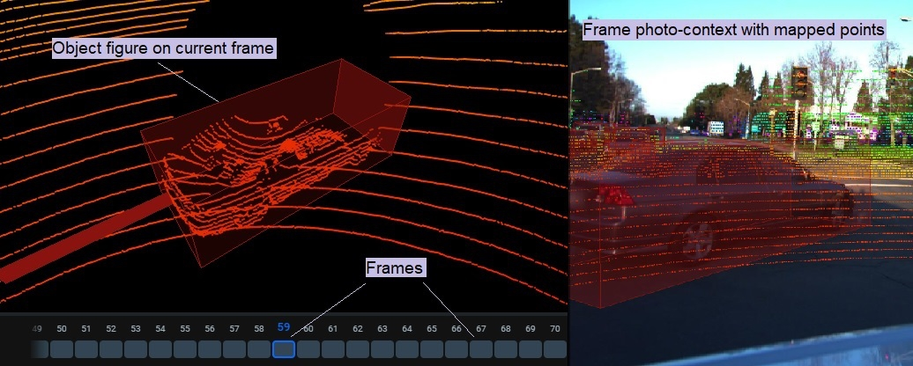

# Point cloud Episode Project and Annotations

##Project Structure Example

Root folder for the project named `project name`
  - `meta.json` file 
  - `key_id_map.json` file (optional)
  - Dataset folders, that represents single episode. Each named `dataset_name`, which contains:
    - `annotation.json` - file with whole episode annotation
    - `frame_pointcloud_map.json` - file with pointcloud to episode frame mapping
    - `pointcloud` folder,  contains source point cloud files, for example `frame1.pcd, frame2.pcd`
    - `related_images` optional folder, contains photo-context data:
        - Frame folder, each named according to pointcloud (`/related_images/frame1/`), which contains:
            - image files (`.png \ .jpg`)
            - image ann files (`.json`) - json files, named according to image name (`1.png -> 1.json`)
   

## Format of `annotation.json` for point clouds episode:

```.json
[
    {
        "description": "",
        "tags": [],
        "objects": [
            {
                "id": 5344,
                "classId": 3473,
                "labelerLogin": "admin",
                "createdAt": "2021-05-18T13:19:45.291Z",
                "updatedAt": "2021-05-18T13:19:45.291Z",
                "tags": [],
                "classTitle": "Car"
            },
        ],
        "framesCount": 48,
        "frames": [
             {
                "index": 0,
                "figures": [
                    {
                        "id": 20842,
                        "imageId": 184217,
                        "classId": 3473,
                        "datasetId": 1582,
                        "objectId": 5344,
                        "description": "",
                        "priority": 1,
                        "points": {
                            "position": {
                                "x": 7.637698173421171,
                                "y": -0.5602728962300387,
                                "z": -1.6462576735977272
                            },
                            "rotation": {
                                "x": 0,
                                "y": 0,
                                "z": 0
                            },
                            "dimensions": {
                                "x": 0.5,
                                "y": 0.5,
                                "z": 0.5
                            }
                        },
                        "bitmap": null,
                        "meta": {},
                        "geometryType": "cuboid_3d",
                        "labelerLogin": "admin",
                        "createdAt": "2020-07-02T10:53:26.038Z",
                        "updatedAt": "2020-07-02T10:53:26.038Z"
                    }
                ]
            }
         ]
```


**Fields definitions:**
- `description` - string - (optional) -  this field is used to store the text we want to assign to the video. In the labeling intrface it corresponds to the 'data' filed.
- `tags` - list of strings that will be interpreted as episode tags
- `objects` - list of objects that may be present on the episode
- `frames` - list of frames of which the episode consists. List contains only frames with an object from the 'objects' field
  - `index` - integer - number of the current frame
  - `figures` -  list of figures in the current frame. 
- `framesCount` - integer - total number of frames in the episode
- `labelerLogin` - string - the name of a user who created the current figure
- `geometryType` - "cuboid_3d" - class shape

**Fields definitions for objects field:**

- `id` - int, an unique identifier of given object (used in key_id_map.json to get the object KEY
- `classTitle` - string - the title of a class. It's used to identify the class shape from the `meta.json` file
- `tags` - list of strings that will be interpreted as object tags
- `labelerLogin` - string - the name of the user that added this figure to the project

**Fields description for figures field:**

- `id` - int, an unique identifier of given figure (used in key_id_map.json to get the object KEY)
- `geometryType` - "rectangle" -class shape
- `points` - geometry of the object
- `classTitle` - string - the title of a class. It's used to identify the class shape from the `meta.json` file
- `labelerLogin` - string - the name of the user that added this figure to the current frame


## Key id map file

Key_id_map.json file is optional. It is created when annotating the episode inside Supervisely interface and sets the correspondence between the unique identifiers of the object and the frame on which the figure is located.  If you annotate manually, you do not need to create this file. This will not affect the work being done.

Json format of key_id_map.json:

```json
{
    "tags": {},
    "objects": {
        "198f727d40c749eebcacc4aed299b39a": 20520
    },
    "figures": {
        "65f21690780e43b49863c3cbd07eab3a": 503130811
    }
}
```
## Format of frame_pointcloud_map.json
This file create for mapping between pointcloud files and annotation frames in the correct order.  

```json
{
    "0" : "frame1",
    "1" : "frame2",
    "2" : "frame3" 
}
```

**Keys** - frame order number
**Values** - point cloud name

#### Photo context image annotation file
```json 
    {
        "name": "host-a005_cam4_1231201437716091006.jpeg"
        "entityId": 2359620,
        "meta": {
            "deviceId": "CAM_BACK_LEFT",
            "timestamp": "2019-01-11T03:23:57.802Z",
            "sensorsData": {
                "extrinsicMatrix": [
                    -0.8448329028461443,
                    -0.5350302199120708,
                    0.00017334762588639086,
                    -0.012363736761232369,
                    -0.0035124448582330757,
                    0.005222293412494302,
                    -0.9999801949951969,
                    -0.16621728572112304,
                    0.5350187183638307,
                    -0.8448167798004226,
                    -0.006291229448121315,
                    -0.3527897896721229
                ],
                "intrinsicMatrix": [
                    882.42699274,
                    0,
                    602.047851885,
                    0,
                    882.42699274,
                    527.99972239,
                    0,
                    0,
                    1
                ]
            }
        }
    }
```
**Fields description:**
- name - string - Name of image file 
- entityId  - integer >= 1 ID of the Point Cloud
- deviceId - string- Device ID or name 
- timestamp - string <date-time> - Time when the frame occurred in ISO 8601 format
- sensorsData - Sensors data such as Pinhole camera model parameters. See https://en.wikipedia.org/wiki/Pinhole_camera_model and https://docs.opencv.org/2.4/modules/calib3d/doc/camera_calibration_and_3d_reconstruction.html
    - intrinsicMatrix - Array of number <float> - Matrix of intrinsic parameters in row-major order, also called camera matrix. It's used to denote camera calibration parameters. See https://en.wikipedia.org/wiki/Camera_resectioning#Intrinsic_parameters
    - extrinsicMatrix - Array of number <float> - Matrix of extrinsic parameters in row-major order, also called joint rotation-translation matrix. It's used to denote the coordinate system transformations from 3D world coordinates to 3D camera coordinates. See https://en.wikipedia.org/wiki/Camera_resectioning#Extrinsic_parameters


