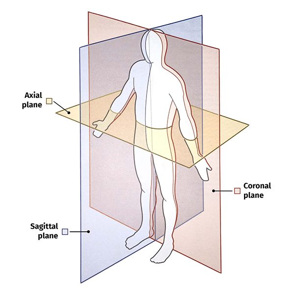

# Volumes Annotation


## Project Structure Example

Root 📁 `project_name` folder named with the project name

* 📄 `meta.json` file
* 📄 `key_id_map.json` file (optional)
* 📁 `dataset_name` folders, each named with the dataset name and containing:
  * 📁 `volume` folder, contains source volume files in [NRRD file-format](https://teem.sourceforge.net/nrrd/index.html), for example `CTChest.nrrd`
  * 📁 `ann` - folder, with annotations for volumes. (named as volume + `.json`) for example `CTChest.nrrd.json`
  * 📁 `mask` optional folder, created automatically while downloading project.
    * 📁 folders, named according to volume (`CTChest.nrrd`), which contains an additional data files with geometries for annotation objects of class type `Mask3D` stored in [NRRD file format](https://teem.sourceforge.net/nrrd/index.html), named with hex hash code of objects from key\_id\_map. For example: `daff638a423a4bcfa34eb12e42243a87.nrrd`
  * 📁 `interpolation` ℹ️ optional folder, created automatically while downloading project.
    * 📁 folders, named according to volume (`CTChest.nrrd`), which contains an additional data files in [STL file format](https://en.wikipedia.org/wiki/STL_\(file_format\)), named with hex hash code of objects from key\_id\_map. For example: `24a56a26ed784e648d3dd6c5186b46ca.stl`

ℹ️ - It is recommended to upload 3D objects as Mask3D and not to use STL. But if you already have a prepared STL file, all STL interpolations will be automatically converter to a Mask3D object during project upload.

## Format of Annotations

**Example:**

annotation JSON file - `/project_name/dataset_name/ann/CTChest.nrrd.json`

```json
{    
    "volumeMeta": {
        "ACS": "RAS",
        "intensity": {"max": 3071, "min": -3024},
        "windowWidth": 6095,
        "rescaleSlope": 1,
        "windowCenter": 23.5,
        "channelsCount": 1,
        "dimensionsIJK": {"x": 512, "y": 512, "z": 139},
        "IJK2WorldMatrix": [
                            0.7617189884185793, 0,                  0,    -194.238403081894,
                            0,                  0.7617189884185793, 0,    -217.5384061336518,
                            0,                  0,                  2.5,  -347.7500000000001,
                            0,                  0,                  0,    1
                        ],
        "rescaleIntercept": 0
    },
    "key": "bfed5ee444d849118d7aabc350248cb8",
    "tags": [],
    "objects": [
        {
            "key": "f1f495a8e0a64fd7a63efbd78af8ef56",                                
            "classTitle": "lung_bitmap",
            "tags": [],
            "labelerLogin": "username",
            "createdAt": "2021-11-13T08:05:28.771Z",
            "updatedAt": "2021-11-13T08:05:28.771Z"
        },
        {
            "key": "9a0367647d6c48a6bc104a8b8b276adb",
            "classTitle": "lung_rectangle",
            "tags": []
        },
        {
            "key": "6c1587f381bf419e9d5c2ebd5967e28f",
            "classTitle": "lung_mask3d",
            "tags": [],
            "labelerLogin": "username",
            "createdAt": "2021-11-13T08:05:28.771Z",
            "updatedAt": "2021-11-13T08:05:28.771Z"
        }
    ],
    "planes": [
        {
            "name": "axial",
            "normal": {
                "x": 0,
                "y": 0,
                "z": 1
            },
            "slices": [
                {
                    "index": 51,
                    "figures": [
                        {
                            "key": "4c68e29372ef4e3a9c87a233ffabd3dd",
                            "objectKey": "f1f495a8e0a64fd7a63efbd78af8ef56",
                            "geometryType": "bitmap",                            
                            "geometry": {
                                "bitmap": {
                                    "data": "eJwBp ... AADUlIRFIAAACeA==",
                                    "origin": [156, 275]
                                }
                            },
                            "labelerLogin": "username",
                            "createdAt": "2021-11-13T08:05:28.771Z",
                            "updatedAt": "2021-11-13T08:05:28.771Z"
                        }
                    ]
                },
                {
                    "index": 68,
                    "figures": [
                        {
                            "key": "9bddbbceaa6646cf894e80d3bffd7a55",
                            "objectKey": "9a0367647d6c48a6bc104a8b8b276adb",
                            "description": "",
                            "geometryType": "rectangle",
                            "geometry": {
                                "points": {
                                    "exterior":[[305, 380], [167, 256]],
                                    "interior": []
                                }
                            }
                        }
                    ]
                }

            ]
        }
    ],
    "spatialFigures": [
        {
            "key": "daff638a423a4bcfa34eb12e42243a87",
            "objectKey": "6c1587f381bf419e9d5c2ebd5967e28f",
            "geometryType": "mask_3d",
            "geometry": {
                "mask_3d": {
                    "data": "H4sIAGW9OmUC ... CYAE1Nj5QMACwC",
                    "space_origin": [194, 218, -348]
                },
                "shape": "mask_3d",
                "geometryType": "mask_3d"
            },            
            "labelerLogin": "username",
            "updatedAt": "2021-11-13T08:05:28.771Z",
            "createdAt": "2021-11-13T08:05:28.771Z"
        }
    ]
}
```

### Annotation JSON fields definitions:

* `volumeMeta` - metadata for 3D reconstruction of volume
* `key` - string - a unique identifier of given object represented as `UUID.hex` value (used in `key_id_map.json` to get the object ID)
* `tags` - list of strings that will be interpreted as volume tags
* `objects` - list of objects that may be present on the volume
* `planes` - a list of figures that defined in these planes: [`coronal, sagittal, axial`](https://www.slicer.org/wiki/Coordinate_systems#Anatomical_coordinate_system)
* `spatialFigures` - list of 3D figures may be present as the volume annotation

#### `volumeMeta` fields description:

* `ACS` - string - "RAS" or "LPS" - name of type of [Anatomical coordinate system](https://www.slicer.org/wiki/Coordinate_systems#Anatomical_coordinate_system) i.e. RAS means is Right-Anterior-Superior

```
╔════════╦════════════╗
║ Common ║ Anatomical ║
╠════════╬════════════╣
║ Left   ║ Left       ║
║ Right  ║ Right      ║
║ Up     ║ Superior   ║
║ Down   ║ Inferior   ║
║ Front  ║ Anterior   ║
║ Back   ║ Posterior  ║
╚════════╩════════════╝
```

* `intensity` - `{"min": int, "max": int}` - intensity range. Depends on the device getting the data
* `windowWidth` - float - Specify a linear conversion. Window Width contains the width of the window
* `windowCenter` - float - Specify a linear conversion. Window Center contains the value that is the center of the window
* `channelsCount` - float - channel count of your image data. Default: 1
* `dimensionsIJK` - dict {"x": int, "y": int, "z": int} - dimensions of volume described as vector in [IJK notation](https://en.wikipedia.org/wiki/Unit_vector)
* `IJK2WorldMatrix` - matrix to transform coordinates from IJK to world (cartesian). See [here](https://www.slicer.org/wiki/Coordinate_systems#Image_transformation)

Grayscale transformations to be applied to Pixel Data are defined by the equivalent of the Modality LUT and Rescale Intercept, Value of Interest Attributes, Photometric Interpretation and the equivalent of the Presentation LUT.

`units = m*SV + b`

* `rescaleSlope` - float - m in the equation specified by Rescale Intercept
* `rescaleIntercept` - float - The value "b" in the relationship between stored values (SV) in Pixel Data and the output units specified in Rescale Type.

#### `objects` fields description:

* `key` - string - a unique identifier of given object represented as `UUID.hex` value (used in `key_id_map.json` to get the object ID)
* `classTitle` - string - the title of a class. It's used to identify the class shape from the `meta.json` file
* `tags` - list of strings that will be interpreted as object tags
* `labelerLogin` - string - the name of the user that added this figure to the project
* `updatedAt` - string - the date and time when the `object` was updated (ISO 8601 format)
* `createdAt` - string - the date and time when the `object` was updated (ISO 8601 format)

#### `planes` fields description:

*   `name` - string - the name of the plane, where the figures are placed. Can be [coronal, sagittal or axial](https://www.slicer.org/wiki/Coordinate_systems#Anatomical_coordinate_system)

    

`normal` - dict with x, y, z as keys and 0/1 as values - normal is direction by axis, chosen according to plane name

```
* sagittal - x
* coronal - y
* axial - z

The value is binary `(int 0 or 1)` and one plane must be selected.
```

* `slices` - list of slices on the plane. Each list contain index and may contain figures.

#### `slices` fields description:

* `index` - int value of slice index
* `figures` - list of figures placed on slice. It can be [bitmap](04_Supervisely_Format_objects.md#bitmap) or [rectangle](04_Supervisely_Format_objects.md#rectangle).

#### `spatialFigures` fields description

This list contains 3D objects of type [Mask3D](04_Supervisely_Format_objects.md#mask3d-3d-annotation)

* `key` - string - unique key for a given figure (used in `key_id_map.json`)
* `objectKey` - string - unique key to link figure to object (used in `key_id_map.json`)
* `geometryType` - `mask_3d` or other 3D geometry-class shape
* `geometry` - geometry of the object

## NRRD files in `mask` folder

These files contain geometry for 3D annotation objects, every file name must be the same as figure key to which it belongs.

Example:

`/project_name/dataset_name/mask/CTChest.nrrd/daff638a423a4bcfa34eb12e42243a87.nrrd` connected with spatial figure `"key": "daff638a423a4bcfa34eb12e42243a87"`

Definitions for its fields can be found [here](https://teem.sourceforge.net/nrrd/format.html)

## Key id map file

`/project_name/key_id_map.json` file is optional. It is created when annotating the volume inside Supervisely interface and sets the correspondence between the unique identifiers of the object and the volume on which the figure is located. If you annotate manually, you do not need to create this file. This will not affect the work being done.

JSON file format of `key_id_map.json`:

```json
{
    "tags": {},
    "objects": {
        "198f727d40c749eebcacc4aed299b39a": 20520
    },
    "figures": {
        "65f21690780e43b49863c3cbd07eab3a": 503130811
    },
    "videos": {
        "e9f0a3ae21be41d08eec166d454562be": 42656
    }
}
```

* `objects` - dictionary, where the key is a unique string, generated inside Supervisely environment to set mapping of current object in annotation, and value is unique integer ID related to the current object
* `figures` - dictionary, where the key is a unique string, generated inside Supervisely environment to set mapping of object on volume in annotation, and value is unique integer ID related to the current volume
* `videos` - dictionary, where the key is unique string, generated inside Supervisely environment to set mapping of volumes in annotation, and value is a unique integer ID related to the current volume
* `tags` - dictionary, where the keys are unique strings, generated inside Supervisely environment to set mapping of tag on current volume in annotation, and value is a unique integer ID related to the current tag
* **Key** - generated by [python3 function `uuid.uuid4().hex`](https://docs.python.org/3/library/uuid.html#uuid.uuid4). The unique string. All key and ID values should be unique inside single project and can not be shared between entities.
* **Value** - returned by server integer identifier while uploading object / figure / volume / tag.
