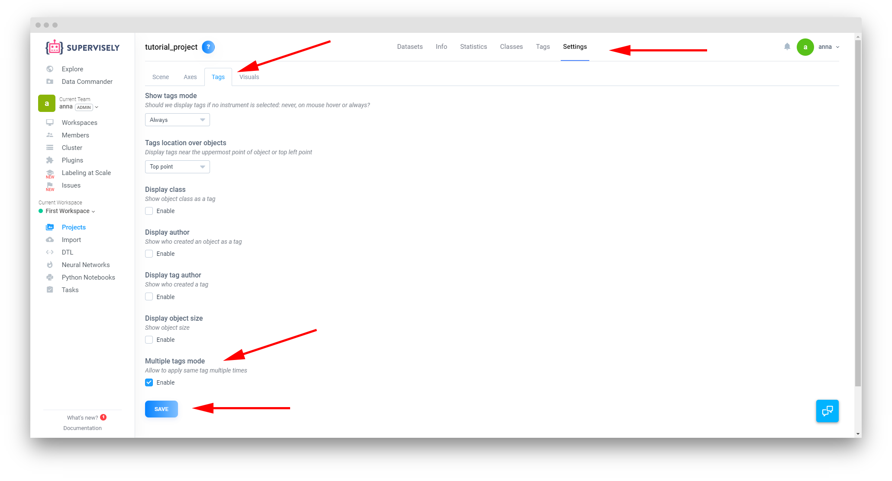

# Multiple Tags

While the default Supervisely behavior regarding tags allows only unique tags for objects and images, sometines you need to allow for mutitudes of each unique tag, such in consensus labeling cases.   

## How does it work?

For tags added by different users, multiple instances of the same tag are distinguished between themselves by the associated LabelerLogin. Several instances of the same tag added by the same user are identified by a unique TagID, assigned to each of them. 

## Enabling Multiple Tags

You can enable multiple tags for the current project on the Tags tab of the project Settings. Press Save to apply the changes. 

## Adding and managing multiple instances of the same tag

Once you enabled Multple Tags for the current project, you can start utilizing the feature. You can use checkmarks in the image/object properties menus on the right or hotkeys to add tags. Each click/hotkey press adds one instance of the selected tag to the image/object. 

To remove tags, either unmark the corresponding checkbox or switch to the Tag too (the default hotkey is 4) and remove extra tags by clicking on the x next to them.

## Usage of Multiple Tags functionality in Labeling Jobs

As we mentioned before, this functionality is useful for the purposes of consensus labeling. to utilize that, we've added a new setting to our Labeling Jobs functionality:

**Labeler sees tags** 
  - All. Selecting this option allows labeler to see and modify tags created by other users
  - Only own. In this mode the current labeler doesn't see any tags other than the ones they added themselves. 
  
These settings don't affect reviewers, these users always see all tags added to the current image/object.   
