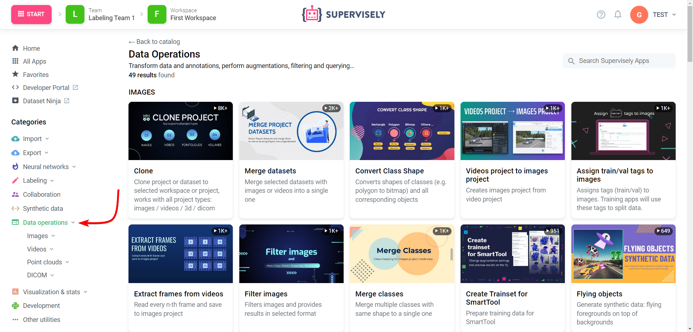

# Overview

The "Operations with Data" section is a dedicated area within our platform where you can perform a variety of data-related tasks and operations. It provides a range of tools and features to streamline your data management processes, ensuring efficiency and organization in handling your valuable data assets.

It's also your hub for efficient data handling, from data import to export, annotation, and analysis. It empowers you to manage your data assets effectively and enhance your data-driven workflows.

Details about your data and the operations performed on it can be accessed by following our [link](https://app.supervisely.com/ecosystem/data-operations) and utilizing the tools within the "data operations" section. This section provides data management capabilities from import to export, annotation, and analysis. It empowers you to efficiently handle your data and enhance your data-driven workflows.

