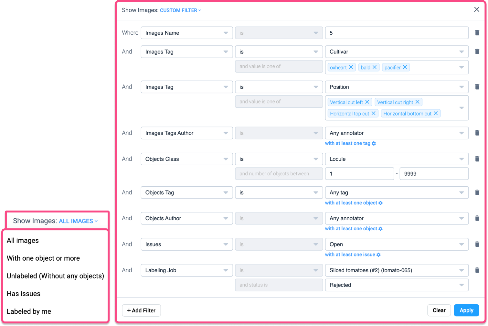

# Data Filtration

Advanced filters are designed to improve the management, searching, and querying of your custom vision training datasets. This guide will help you understand how to set up and use advanced filters to streamline your data preparation and annotation workflows.

#### Key Features

1. **Ease of use:** Suitable for all levels, from beginners to advanced data scientists.
2. **Real-time operation:** Instant results for datasets of any size.
3. **Optimized for large datasets:** Handles datasets with millions of images and annotations.
4. **Quick data preview:** Offers main statistics for quick insights.
5. **Flexible filtering:** Allows filtering based on various criteria like annotation classes, tags, image statuses, and more.
6. **Predefined presets:** Quickstart with predefined filters for common tasks.
7. **Actionable results:** Perform actions on filtered results such as copy, move, delete, create labeling jobs, and annotate.

## How to use Advanced Filters

First, you need to access **Filters**! Navigate to the project you are working on. Then locate and click the **Filters** tab to begin configuring your filters.

<figure><figcaption></figcaption></figure>

### Sorting and Filtering

**Sort by Last Update:** Identify recently modified images.

**Sort by Object Number:** Find images with a large number of objects or none at all.

**Filter by Dataset:** Preview images from specific datasets.

**Search by Name:** Use regular expressions to search for images by name.

#### Now let's create Custom Filters

1. **Open filter configuration**: Click the `Filter` button to open the filter configuration modal.
2. **Set criteria**: Choose criteria based on datasets, names, image tags, object classes, assignees, issues, or labeling job status.
3. **Fine-tune filters:** Include or exclude specific conditions, such as the number of objects within a specified range.
4. **Apply filters:** Click the `Apply` button to retrieve and preview the data that meets your specified conditions.

<figure><figcaption></figcaption></figure>

## What do filters include?

### Custom Filters

**Images Name**: Find images whose names begin with specific characters.

**Images Tag:** Search for images that include specific tags.

**Images Tags Author:** Find images tagged by a particular author.

**Images Without Annotations:** Locate images without annotations or labels.

**Objects Class:** Search for objects by their classes.

**Objects Tag:** Find objects that include specific tags.

**Objects Author:** Locate objects labeled by a specific author.

**Issues:** Find images with annotation problems.

**Labeling Job:** Search for images involved in labeling jobs with specific statuses.

### Predefined Filters

**All Images**: Display all images in the project.

**With One Object or More:** Find images with at least one object.

**Unlabeled:** Locate images without annotations.

**Has Issues:** Find images with annotation problems.

**Labeled by Me:** Find images labeled by the current user.

***

### Data Operations

**Copy and Move:** Transfer images with annotations to other datasets.

**Labeling Job Management:** Create labeling jobs or delete unnecessary data.

***

Also using apps, you can set up filtering quickly and easily, ensuring accuracy when working with a variety of information.

## Example apps:

* [Filter images.](https://app.supervisely.com/ecosystem/apps/filter-images?id=187) App filters images from a project and allows you to copy, move, delete images and assign or remove tags.
* [Prompt-based Image Filtering with CLIP.](https://app.supervisely.com/ecosystem/apps/prompt-based-image-filtering?id=249) This app allows you to quickly and easily filter and rank images in Supervisely datasets by text prompts. It uses CLIP model to predict the relevance of images to the given text prompt. This app can be useful for filtering or ranking images in a dataset by their content. The relevance (CLIP score) of each image to the given prompt will be shown in a table. The user can choose to filter or sort images by relevance or do both at the same time and then upload images to a new dataset.&#x20;
