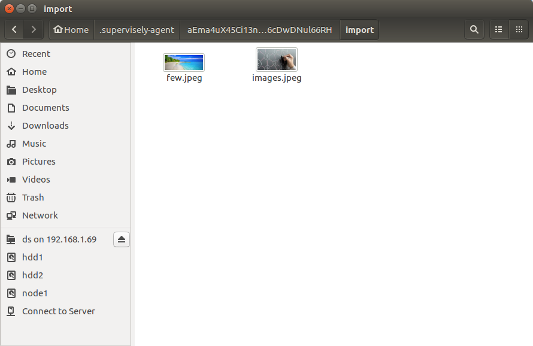
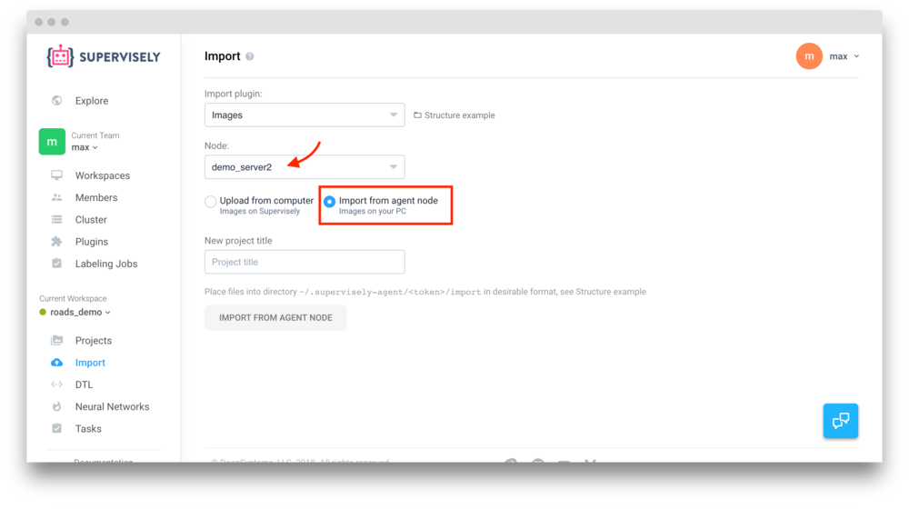

# Import via Agent

You can also upload your files via agent. To do this you have to [add new agent](../../../customization/agents/add_delete_node/add_delete_node.md) to the cluster (if you don't have it yet).

## How to use

### Step 1. Place files in the `import` folder 

Open agent directory on your node. By default agent expects files to be imported in folder `~/.supervisely-agent/<agent-token>/import`.

Place your files here.

### Step 2. Go to import and setup settings

Go to Import page and select "Import from agent node" option.

Choose a name for your future project and select the node that stores your files. Don't forget to choose the correct "Import preset".

Click "Import from node" to start import.


You must add at least one node on the Cluster page


### Step 3. Wait till the task completes

You will be moved to the "Task status" page. It has a progress bar. A new project will be added after the import process is finished. No images are being uploaded, only meta information.


Import doesn't automatically remove files from the `import` folder even after the successful import. You can delete those files anytime - your files are now in `~/.supervisely-agent/<agent-token>/storage`.

