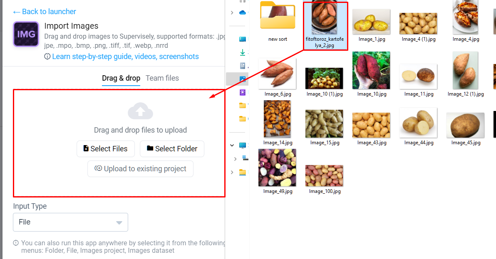

# 🫱 Drag-and-Drop 

"Drag-and-Drop" is one of the simplest and most intuitive methods for importing data in our system. This method simplifies the process of moving files and managing data, making it as easy as dragging and dropping objects from one application to another.

## Advantages of "Drag-and-Drop":

- Ease of Use: To import data, you simply need to drag and drop files from one window or application and release them in the target application or location. This method doesn't require complex configurations or additional steps.

- Intuitive Interface: "Drag-and-Drop" provides users with an intuitive interface that doesn't require special skills or instructions.

- Fast and Convenient: This method allows for fast and convenient data management, making the resource management process more efficient.

## How to Use "Drag-and-Drop":
1. Open app [Import Images](https://app.supervisely.com/ecosystem/apps/supervisely-ecosystem/import-images)

2. Select the files or resources you want to import.

3. Simply drag the selected items and release them in the target application

